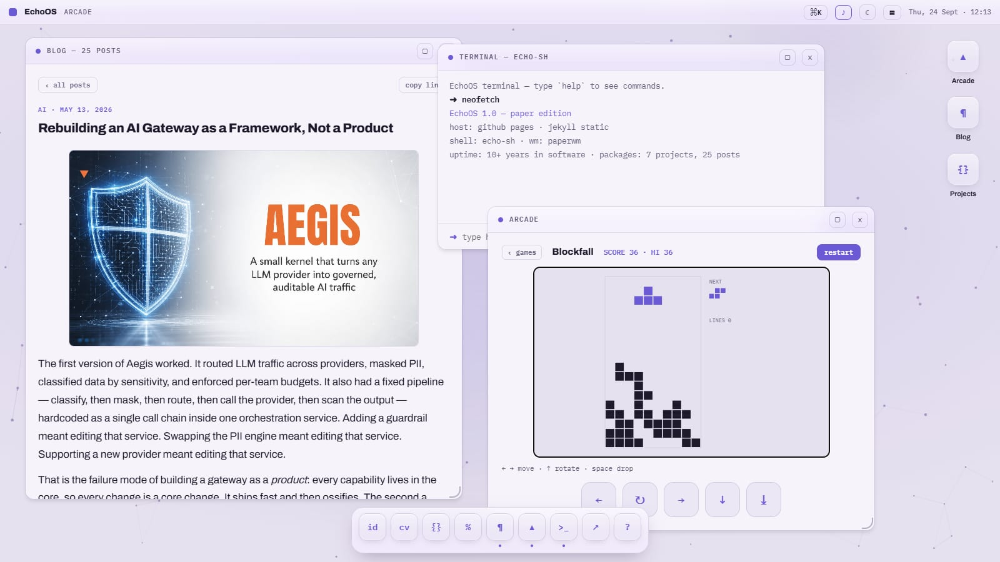
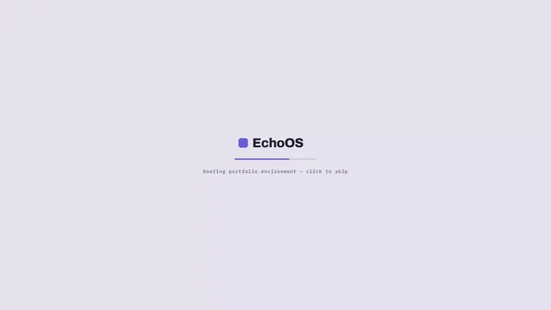
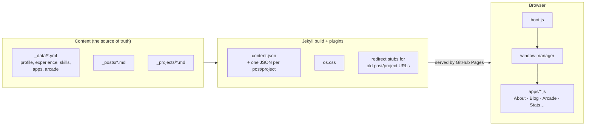
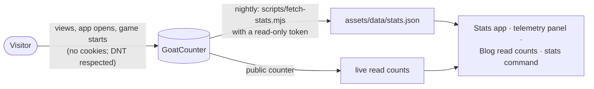

<div align="center">

<a href="https://e-choness.github.io/portfolio-site/">
  <picture>
    <source media="(prefers-color-scheme: dark)" srcset=".github/readme/banner-dark.jpg">
    
  </picture>
</a>

# EchoOS

**Echo Yin's portfolio, built as a desktop operating system that runs in your browser.**

<a href="https://e-choness.github.io/portfolio-site/">
  
</a>

<!-- Live telemetry: read from the deployed site and GoatCounter on every view -->
[](https://e-choness.github.io/portfolio-site/#/blog)
[](https://e-choness.github.io/portfolio-site/#/proj)
[](https://e-choness.github.io/portfolio-site/#/blog)
[](https://e-choness.github.io/portfolio-site/#/blog)
[](https://e-choness.github.io/portfolio-site/#/stats)

[](https://github.com/e-choness/portfolio-site/actions/workflows/pages.yml)
[](https://github.com/e-choness/portfolio-site/commits/main)
[](https://jekyllrb.com/)
[](#how-it-works)
[](#license)

**[Boot EchoOS →](https://e-choness.github.io/portfolio-site/)** &nbsp;·&nbsp; [Latest writing](#latest-writing) &nbsp;·&nbsp; [Projects](#featured-projects) &nbsp;·&nbsp; [How it works](#how-it-works) &nbsp;·&nbsp; [Report a bug](https://github.com/e-choness/portfolio-site/issues)

</div>

---

## A quick tour

<div align="center">
  
</div>

The home page is a desktop: a menu bar, a dock, draggable windows, an animated wallpaper and a command palette. Each window is an app, and every app deep-links, so `…/#/blog/<post>` or `…/#/arcade/tetris` opens straight to it. Nothing reloads the page. It works on phones too, where windows become full-screen sheets with a tab bar.

## Inside the OS

| | App | What's in it |
|:-:|---|---|
| `id` | **About** | Profile, education and contact links |
| `cv` | **Experience** | Roles and dates, plus a **Resume** tab that is the résumé: print it, or download the PDF generated from it |
| `{}` | **Projects** | Project cards, write-ups, links, gameplay video |
| `%` | **Skills** | A "system monitor" of skills by years used |
| `¶` | **Blog** | Posts with Mermaid diagrams, code highlighting, read counts and in-window links between posts |
| `▲` | **Arcade** | Canvas games (Blockfall, Snake, Invaders, a raycast Labyrinth, a pixel-shaded Orrery, all nine stages of Cat Mario, Gemfall…) with hi-scores and a museum plaque for each |
| `>_` | **Terminal** | `echo-sh`: `help`, `open`, `stats`, `neofetch`, `theme`, `games`, and a few easter eggs |
| `↗` | **Stats** | An activity monitor: visits, most-read posts, windows opened, Arcade runs, where visitors come from |
| `?` | **Guide** | A first-run tour |

Also on the desktop:

- **Spotlight** (⌘K / Ctrl+K) searches apps, posts and projects.
- **A telemetry panel** under the desktop icons scrolls live site numbers.
- **Light and dark themes**, with a glass UI that respects reduced motion and reduced transparency.
- **A "Not found" window** in the OS itself answers mistyped URLs.
- **Installable as an app (PWA)** on desktop and mobile.

## Latest writing

<!-- Rewritten automatically from _posts/ by scripts/update-readme.mjs (.github/workflows/readme.yml) -->
<!-- LATEST-POSTS:START -->
- **[The Clean Envelope: Debugging Production Pipelines Without Touching PII](https://e-choness.github.io/portfolio-site/#/blog/PII-masking)**  
  <sub>Jul 14, 2026 · AI</sub>
- **[The Honest Parts: Residency, Tenancy, and Saying No](https://e-choness.github.io/portfolio-site/#/blog/the-honest-parts-residency-tenancy-scope)**  
  <sub>May 27, 2026 · AI</sub>
- **[Guardrails That Tell You the Truth About Streaming](https://e-choness.github.io/portfolio-site/#/blog/guardrails-that-tell-you-the-truth)**  
  <sub>May 20, 2026 · AI</sub>
- **[Rebuilding an AI Gateway as a Framework, Not a Product](https://e-choness.github.io/portfolio-site/#/blog/rebuilding-aegis-as-a-framework)**  
  <sub>May 13, 2026 · AI</sub>
- **[Advanced RAG: Hybrid Search with Sparse and Dense Retrieval Plus Cross Encoder Reranking](https://e-choness.github.io/portfolio-site/#/blog/advanced-rag)**  
  <sub>Dec 28, 2025 · AI</sub>
<!-- LATEST-POSTS:END -->

**[All posts in the Blog window →](https://e-choness.github.io/portfolio-site/#/blog)**

## Featured projects

<!-- Rewritten automatically from _projects/ (featured: true, by order) -->
<!-- PROJECTS:START -->
| Project | What it is | Stack | Links |
|---|---|---|---|
| **CUDA ELM Feature Extraction Benchmark** | GPU-accelerated Extreme Learning Machine feature-extraction and benchmarking toolkit. | C++, CUDA, CMake, GoogleTest | [open in EchoOS](https://e-choness.github.io/portfolio-site/#/proj/feature-extraction) · [code](https://github.com/e-choness/feature_extraction_cuda_elm) · [live](https://e-choness.github.io/feature_extraction_cuda_elm) |
| **Aegis AI Gateway** | A plugin-first AI gateway framework. | Python, FastAPI, LangGraph, Docker | [open in EchoOS](https://e-choness.github.io/portfolio-site/#/proj/aegis) · [code](https://github.com/e-choness/aegis) · [live](https://huggingface.co/spaces/echoness/aegis-server) |
| **EcoManage** | A full-stack renewable energy and resource management dashboard to monitor, analyze, and optimize consumption. | TypeScript, React, Node.js, MongoDB | [open in EchoOS](https://e-choness.github.io/portfolio-site/#/proj/eco-manage) · [code](https://github.com/e-choness/eco-manage) |
| **NeighborIQ** | Rental-property analysis for small investors in Canadian cities: fair value from comparable listings, cash flow under Canadian mortgage rules, and neighbourhood open data. | FastAPI, Vue 3, PostgreSQL, PostGIS | [open in EchoOS](https://e-choness.github.io/portfolio-site/#/proj/neighbor-iq) · [docs](https://e-choness.github.io/NeighborIQ/) · [code](https://github.com/e-choness/NeighborIQ) |
| **PDF Sanitizer** | An offline Windows desktop app that strips scripts, attachments, outbound links and metadata from PDF files, verifying every result before replacing the original. | Rust, Tauri, Svelte, JavaScript | [open in EchoOS](https://e-choness.github.io/portfolio-site/#/proj/pdf-sanitizer) · [code](https://github.com/e-choness/pdf-sanitizer) · [live](https://e-choness.github.io/pdf-sanitizer/) |
<!-- PROJECTS:END -->

## How it works

EchoOS is a static site: Jekyll turns YAML and Markdown into a handful of JSON files and one stylesheet, GitHub Pages serves them, and a set of plain ES modules turns them into a desktop in the browser. There's no framework, no bundler and no server.



A few design choices hold it together:

- **One source for everything.** The profile, résumé, SEO tags, feed, manifest and page titles all read `_data/profile.yml`. The dock, desktop icons, Spotlight and terminal all read `_data/apps.yml`.
- **Posts and projects live in windows.** Their old URLs (`/blog/…/slug/`, `/projects/slug/`) are tiny redirect stubs. They keep shared links and link previews working, and forward into the right window. Links between posts open in place.
- **Games cost nothing until played.** Each game is its own ES module, imported the first time someone opens it.
- **Privacy-friendly numbers.** Visits are counted with GoatCounter, with no cookies. A nightly job turns them into the Stats app, the telemetry panel and the read counts:



### Stack

| Layer | Choice |
|---|---|
| Static site | Jekyll 4.4.1 + six small Ruby plugins (`_plugins/`) |
| Styles | Dart Sass (`sass-embedded`) via `jekyll-sass-converter` 3.1 |
| OS shell | Vanilla ES modules, no framework and no bundler |
| Diagrams | Mermaid 11 and Markmap, loaded only when a post needs them |
| Analytics | GoatCounter (cookieless) + a nightly stats job |
| Hosting | GitHub Pages, deployed by GitHub Actions |
| Local dev | Docker Compose, or `bundle exec jekyll serve` |

## Project structure

```text
├── _config.yml / _config_dev.yml   # site settings; dev clears baseurl and analytics
├── _data/                          # content as YAML: profile, experience, skills, education,
│                                   #   apps (dock/registry), arcade (games), solar (Orrery)
├── _posts/                         # blog posts (Markdown; Mermaid and Markmap supported)
├── _projects/                      # projects (front matter + write-up)
├── _layouts/                       # os.html (the desktop) · redirect.html (old-URL stubs)
├── _plugins/                       # profile_config · site_stats · apps_titles ·
│                                   #   echoos_filters · post_json · project_json
├── _sass/                          # abstracts (tokens) · base (post typography) · os/ (the UI)
├── assets/
│   ├── js/echoos/                  # the OS (module map below)
│   ├── js/games.js, js/games/      # Arcade runner + one module per game
│   ├── data/content.json           # everything the OS needs, generated at build time
│   ├── images/, resume.pdf, manifest.webmanifest
├── scripts/                        # fetch-stats.mjs (nightly stats) · update-readme.mjs
├── index.html · 404.html · feed.xml
└── .github/                        # workflows (deploy, README refresh) · readme/ (banner, tour)
```

### Module map (`assets/js/echoos/`)

| Module | Responsibility |
|---|---|
| `boot.js` | Entry point: boot animation, loads `content.json`, wires everything, routes old URLs into windows |
| `wm.js` | Window manager: open, close, focus, drag, resize, maximize, remembered geometry |
| `shell.js` | Menu bar, dock, desktop icons, mobile tab bar and home grid |
| `router.js` | `#/app/item` deep links; notifies when a post, project or game changes |
| `wallpaper.js` | Animated canvas wallpaper (static under reduced motion) |
| `spotlight.js` | ⌘K palette over apps, posts and projects |
| `terminal.js` | `echo-sh` command interpreter |
| `ticker.js` | The desktop telemetry panel |
| `analytics.js` | GoatCounter counting (production only; skipped under Do Not Track) |
| `stats-data.js` | Loads the nightly `stats.json` for the Stats app, Blog and terminal |
| `notifications.js`, `sound.js`, `store.js`, `guide.js`, `base.js` | Toasts, UI sounds, persisted settings, the first-run tour, base-URL helper |
| `apps/*.js` | One renderer per window: `about`, `experience`, `projects`, `skills`, `blog`, `arcade`, `stats`, `notfound` |

## Local development

```bash
docker compose up
# → http://localhost:4000 (live reload)
```

or, with Ruby installed:

```bash
bundle install
bundle exec jekyll serve --config _config.yml,_config_dev.yml
```

`_config_dev.yml` serves the site at `/` and switches analytics off, so local browsing is never counted. The live site uses the `/portfolio-site/` base URL. A production build should finish with zero warnings:

```bash
JEKYLL_ENV=production bundle exec jekyll build --trace
```

The custom plugins mean the site can't use GitHub Pages' built-in Jekyll builder. It's built by the Actions workflow, so keep Pages set to **GitHub Actions** as the source.

## Making changes

### Content

- **Profile**: `_data/profile.yml` is the one place for name, title, bio, headline stats and social links.
- **Experience / Skills / Education**: `_data/experience.yml`, `skills.yml`, `education.yml`.
- **Projects**: one file per project in `_projects/`:
  - `title`, `description`, `technologies`, `categories`
  - links: `github_url`, `docs_url`, `live_url` + `live_label` (or `live_pending: true` for a greyed-out demo link), `website_url`
  - media: `image` or `video`
  - `featured` and `order` control the Projects window and this README.
- **Posts**: `_posts/YYYY-MM-DD-slug.md` with `title`, `date`, `category`, `tags`, `excerpt` and an optional 16:9 `image`. Link to another post with ``; inside the OS it opens in the same window.

### Regenerating the résumé PDF

`assets/resume.pdf` is printed from the Experience → Resume tab, so the tab and the PDF can't disagree. After changing profile, experience, education, skills or featured projects:

1. Build and serve the site (production build).
2. Open `…/#/exp/resume` in Chrome and print to PDF: **Letter**, margins **None**, background graphics **on**. The print stylesheet (`_sass/os/_print.scss`) lays it out as one page. Headless: dispatch `beforeprint`, then `page.pdf({ format: 'Letter', margin: 0 })`.
3. Check it's still one page, then replace `assets/resume.pdf`.

### Adding an app

1. **Register it** in `_data/apps.yml`. The file order is the dock order. `system: true` keeps an app out of the dock, Spotlight and terminal (the 404 window works this way).

   ```yaml
   - id: myapp
     label: My App
     glyph: "µ"
     title: "myapp"
     w: 640
     h: 480
     desktop_icon: true
   ```

2. **Write the renderer**, `assets/js/echoos/apps/myapp.js`, exporting `renderMyApp(bodyEl, ctx)`. `ctx.content` is the parsed `content.json`. `apps/about.js` is the simplest template.
3. **Wire it up** in `boot.js`: import it and add `myapp: renderMyApp` to the `renderers` map.
4. **Style it** in `_sass/os/_apps.scss` with the design tokens (`--ink`, `--muted`, `--accent`, `--surface2`, `--line`, `--r-ctl`…).

The dock icon, window title, desktop icon and Spotlight entry all follow from `apps.yml`.

### Adding a game

1. **Write the module**, `assets/js/games/<id>.js`. It default-exports a factory that receives the runner's environment and returns handlers:

   ```js
   import { R, clear } from './common.js';

   export default function mygame(env){
     const {ctx,W,H,T,beep,addScore,gameOver,isOver}=env;
     return {
       key(k,down){ /* optional */ },
       pointer(x,y,type){ /* optional: 'down', 'move' or 'up' */ },
       tick(dt){ clear(ctx,W,H,T); /* update + draw one frame */ }
     };
   }
   ```

   `T` is the live theme (`bg`, `ink`, `muted`, `accent`, `soft`, `line`, `overlay`), so games never hard-code a colour. The canvas is 620×400. There are no art or audio files: everything is drawn and synthesised.

2. **Add one entry to `_data/arcade.yml`**, in card order:

   ```yaml
   - id: mygame            # must match assets/js/games/<id>.js
     name: "My Game"
     tag: "genre"
     glyph: "◆"
     hint: "arrows to move"
     pad: [{ key: "ArrowLeft", label: "←" }]   # touch buttons; omit if pointer-only
     data: mydata          # optional: _data/mydata.yml, passed to the game as env.data
     credit: Someone · 1979
     origin: >-
       Two or three sentences for the exhibit plaque.
     fact: >-
       The one detail worth knowing.
     sources:
       - label: Wikipedia
         url: https://en.wikipedia.org/wiki/...
   ```

That's the whole job. The grid card, HUD, touch pad, exhibit plaque, terminal launcher and Stats labels all come from that entry, and the module is only downloaded the first time someone plays it.

## Visit statistics

1. **Counting** (`analytics.js`) runs only on the production site, and only when the browser doesn't send Do Not Track or Global Privacy Control.
   - Page views: desktop loads, posts, projects and 404s.
   - Events: windows opened (`app:<id>`), games started (`game:<id>`), résumé views and downloads.
2. **Nightly aggregates**: `scripts/fetch-stats.mjs` runs in the deploy workflow (every push, and nightly at 07:17 UTC) and writes `assets/data/stats.json`, which isn't committed. Without a token it skips, and the OS shows a "pending" state.
3. **Setup:**
   - Create a GoatCounter API token with only the **Read statistics** permission, and save it as the repository secret `GOATCOUNTER_TOKEN`.
   - For live per-post counts and the visits badge, enable *Settings → "Allow adding visitor counts on your website"* in GoatCounter.

## Deployment

| Workflow | When | What |
|---|---|---|
| `pages.yml` | push to `main`, nightly, manual | fetch visit stats → Jekyll build → sanity checks → deploy to GitHub Pages |
| `readme.yml` | posts or projects change on `main`, manual | regenerate this README's *Latest writing* and *Featured projects* and commit them if they changed |

## License

[CC BY-NC-ND 4.0](https://creativecommons.org/licenses/by-nc-nd/4.0/), see [LICENSE](LICENSE): share with attribution, no commercial use, no modified versions.

- The résumé, profile photos and personal information are **all rights reserved**.
- Third-party libraries, logos and brand icons keep their owners' terms.
- Revisions before the license change were released under MIT and remain available under those terms.
