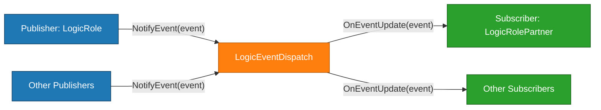
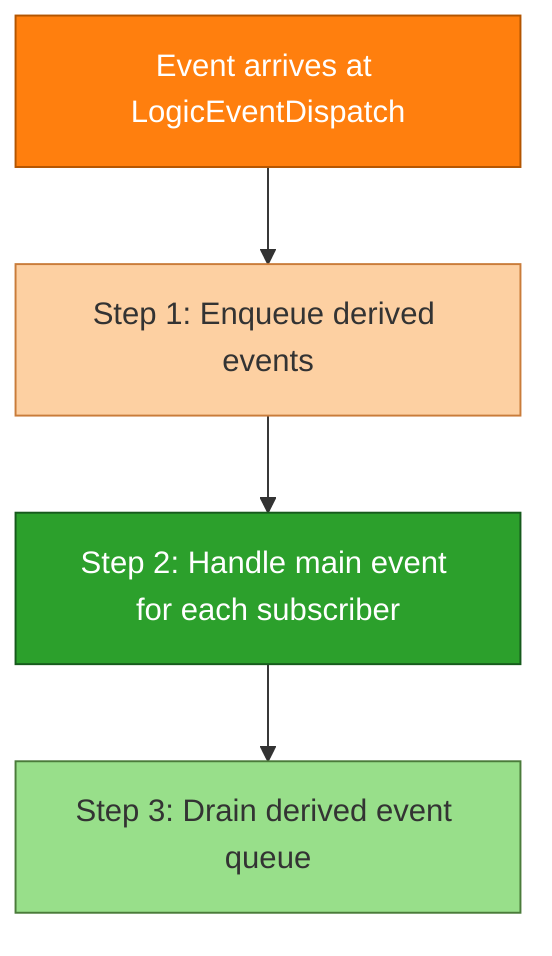

> The publish-subscribe (event listener) pattern is one of the most effective tools I have used to decouple game backend modules and keep business code maintainable under heavy change pressure.

## Why decoupling matters in game backends

After years of writing game backend business logic, one thing became obvious: some code paths feel smooth and straightforward to work with, while others feel mentally exhausting.
The difference usually comes down to coupling.
When a module is loosely coupled to others, developers can focus almost entirely on local behavior instead of constantly loading the rest of the system into their heads.

In fast-moving game projects, especially as testing ramps up, designers frequently add last-minute requirements and QA uncovers missing behavior that must be implemented quickly.
Under tight deadlines, heavily coupled code pushes developers to sprinkle more `if` statements into already complex call chains, increasing the risk of bugs and making future changes even harder.

## What is the publish-subscribe pattern?

The publish-subscribe (or event listener / event dispatch) pattern introduces a dedicated event dispatcher that sits between publishers and subscribers.
Publishers do not call subscribers directly; instead, they throw events into the dispatcher, and the dispatcher invokes the appropriate subscribers.
This small indirection dramatically reduces coupling: modules only need to know about events, not about each other.

A typical setup in a C++ game backend might look like this:

```cpp
// Triggering an event, e.g., LogicRole triggers an event:
class LogicRole {
    int HandleServiceA(EventPara* event_para) {
        return LogicEventDispatch::Instance().NotifyEvent(event_para);
    }
};

// Event dispatch:
class LogicEventDispatch {
public:
    int NotifyEvent(EventPara* event_para) {
        for (auto handler : handlerList) {
            // Step 1: enqueue derived events
            // Step 2: handle main event
            handler->OnEventUpdate(event_para);
            // Step 3: handle derived event queue
        }
        return 0;
    }
};

// Event handling: developers focus on registration and OnEventUpdate, then write business logic.
class LogicRolePartner {
public:
    int init() {
        LogicEventDispatch::Instance().RegisterEventHandler(event_a, this);
        LogicEventDispatch::Instance().RegisterEventHandler(event_b, this);
        return 0;
    }

    int OnEventUpdate(EventPara* event_para) {
        switch (event_para->type) {
        case event_a:
            HandleEventA(event_para);
            break;
        case event_b:
            HandleEventB(event_para);
            break;
        // ...
        }
        return 0;
    }
};
```

### Pub-sub architecture at a glance



Each module subscribes only to the events it cares about and implements its own `OnEventUpdate` logic.
Developers can often ignore the internal details of other modules and focus purely on the events they emit and consume.

## Why use publish-subscribe in game backends?

The biggest benefit of the publish-subscribe pattern is decoupling between modules.
Rather than one module calling deep into another module's internals, modules communicate through clearly defined events.
This helps in several ways:

- Developers can focus on the modules they own instead of constantly reasoning about a long call chain.
- New requirements can often be implemented by subscribing to existing events or adding new events, without modifying multiple modules at once.
- Ownership boundaries become clearer, reducing conflicts when several developers work on the same codebase under time pressure.

### Tangled dependencies: a cautionary tale

Without pub-sub (or similar decoupling), dependencies can quickly become tangled.
Consider a simplified example where each class corresponds to a backend module:

```cpp
// Pseudo-code to illustrate a circular call chain
ClassA::UseItem() {
    ClassB::ApplyEffect();
}

ClassB::ApplyEffect() {
    ClassC::ApplyEffect();
}

ClassC::ApplyEffect() {
    ClassA::UpdateStats();
}

ClassA::UpdateStats() {
    // To prevent recursion, someone added:
    if (!inUpdateStats) {
        inUpdateStats = true;
        ClassA::UseItem();
        inUpdateStats = false;
    }
}
```


This circular chain is stressful to change: adding a feature to `ClassA::UseItem()` means understanding the entire loop and relying on fragile guard flags.
In real projects, such patterns often emerge under schedule pressure and are refactored only when things break badly enough.

The publish-subscribe pattern helps by moving cross-module reactions into event handlers, so modules no longer call each other in a tight loop.

### Human factors and ownership conflicts

Coupling also creates social friction.
Imagine a character module owned by one developer and a companion module owned by another.
If initialization no longer meets new requirements, the two developers may disagree on where to put the fix.
Under time pressure, the result is often more temporary `if` checks layered onto already complex code.
With pub-sub, each owner can handle their own events and responsibilities more cleanly, reducing the need to modify someone else's module.

## Designing a publish-subscribe system for game backends

When designing an event system, think from the developer's point of view.
If the API is simple and predictable, it will be used correctly and consistently.
The snippet above shows one design centered on a unified `EventPara` type, where events flow through a central dispatcher and handlers implement `OnEventUpdate`.

A typical event dispatch cycle might look like this:



Developers working on business logic mostly care about:

- Which events to register for.
- How to write clear `OnEventUpdate` handlers.
- How to use event parameters (`EventPara`) to pass the data they need.

The framework code takes care of managing handler lists, dispatching, and processing derived events safely.

## Pitfalls and things to watch out for

Even with a good design, there are important details to get right.

### 1. Prevent event recursion

In real game logic, it is common for an event handler to trigger the same event again.
For example:

- Adding an item triggers an item-change event; if the item auto-uses itself, it may trigger another item-change event.
- Completing a quest may chain into another quest completion event.

To avoid unbounded recursion, follow a strict order inside your dispatcher:

1. Enqueue any derived events instead of handling them immediately.
2. Handle the current (main) event.
3. Process the derived event queue afterward.

Also, consider limiting the maximum queue depth for derived events.
If the limit is exceeded, log and alert early in test environments to detect accidental infinite event chains.

### 2. Unordered handler execution

The publish-subscribe pattern does not guarantee any particular order among subscribers.
For example, if both the skill module and the character module subscribe to a "character created" event, you cannot assume which one runs first.
If the skill module assumes character data is already initialized but runs before the character module, you can get subtle errors.

In practice, this is rare but should be considered in your business design.
If strict ordering is required, pub-sub may not be the right tool, or you need a higher-level orchestration mechanism on top.

## When publish-subscribe is not a good fit

The publish-subscribe pattern is powerful but not universal.
There are important scenarios where a more direct, sequential design is better.

### 1. Strictly ordered initialization

Some initialization paths must run in a specific order.
For example, character initialization might require:

1. Initialize basic character data.
2. Initialize skills.
3. Initialize companions.
4. Initialize attributes.

In such cases, it is clearer and safer to call each module in a well-defined sequence rather than hoping event ordering behaves as expected.

### 2. Asynchronous processes tied to object lifetimes

Event handling code should generally avoid long-running asynchronous operations that depend on object lifetimes.
Consider an event handler that starts an async database request and depends on a `Player` object.
If the `Player` object is destroyed while the coroutine is suspended, when the database result arrives and the coroutine resumes, the object no longer exists.
This can cause crashes or data inconsistencies.

For asynchronous behavior, use patterns that explicitly model lifetime and ownership rather than hiding it behind event handlers.

### 3. Cross-machine events (future work)

In some projects, there is little need for cross-process or cross-machine events, so the initial framework can stay single-process.
However, as complexity grows, you might want to extend the event system across servers—for example:

- A single battle instance talking to a `GameServer` that owns the player.
- A `GameServer` communicating with an activity or world server.

Cross-machine events can be a natural extension of the publish-subscribe idea, but they require careful design around networking, reliability, and serialization.

## Conclusion

Overall, the publish-subscribe (event listener) pattern is a highly effective decoupling tool for game backend development.
It eliminates many tangled dependencies between modules, allowing developers to focus on the modules they own instead of constantly reasoning about other people's code.

In environments with frequent requirement changes, heavy testing pressure, and lots of last-minute features, this pattern significantly reduces mental burden and the proliferation of temporary code caused by tight coupling.
At the same time, it is important to recognize its boundaries: scenarios requiring strict sequential execution or delicate asynchronous flows tied to object lifetimes are usually better served by more explicit designs.

The goal of sharing this pattern is to help fellow game developers improve development efficiency, code quality, and maintainability.
If this sparks new ideas or you have your own experiences applying pub-sub in game backends, I would love to discuss them—so that we can all write more elegant and sustainable code.
