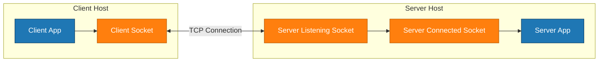
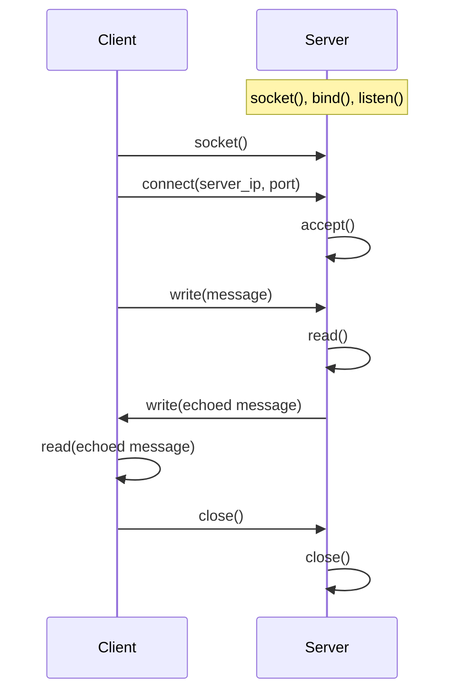

> When developing networked applications in C/C++, understanding the fundamentals of sockets is crucial. A socket is an endpoint for communication between two machines, identified by an IP address, a port, and a transport protocol (TCP or UDP).

## Understanding the basic socket model

To communicate over a network, three key pieces must be defined:

- **Destination address (IP)** – where to send data.
- **Port number** – which application or service on that host should receive the data (for example, HTTP uses port 80, SMTP uses 25).
- **Transport protocol** – typically TCP (reliable, connection-oriented) or UDP (connectionless, best-effort).

You can use tools like `nslookup` to resolve a hostname to an IP address:

```bash
nslookup www.example.com
```

A typical socket communication scenario involves a **server** listening on a port and a **client** connecting to that server.
Developers often use `telnet ip_address port` during development to manually test connectivity between hosts.

### High-level server–client architecture

Below is a simple conceptual diagram of how a TCP client and server interact via sockets.



The client uses its socket to connect to the server's listening socket.
Once the server accepts the connection, it obtains a new **connected** socket that represents a dedicated channel between that client and the server.

## Example: TCP echo server in C

The following server code demonstrates a minimal TCP echo server on Linux.
It creates a TCP socket, binds it to a port, listens for connections, accepts clients, and echoes back whatever data it receives.

```c
#include <stdio.h>
#include <unistd.h>
#include <sys/types.h>
#include <sys/socket.h>
#include <ctype.h>
#include <arpa/inet.h>
#include <strings.h> // For bzero

#define SERVER_PORT 666

int main(void) {
    int sock;
    struct sockaddr_in server_addr;

    // Create a socket using IPv4 and TCP
    sock = socket(AF_INET, SOCK_STREAM, 0);
    if (sock == -1) {
        perror("socket creation failed");
        return -1;
    }

    // Clear the server address structure
    bzero(&server_addr, sizeof(server_addr));

    server_addr.sin_family = AF_INET;               // IPv4
    server_addr.sin_addr.s_addr = htonl(INADDR_ANY); // Accept any IP address
    server_addr.sin_port = htons(SERVER_PORT);      // Port number

    // Bind the socket to the specified IP and port
    if (bind(sock, (struct sockaddr *)&server_addr, sizeof(server_addr)) == -1) {
        perror("bind failed");
        close(sock);
        return -1;
    }

    // Listen for incoming connections
    if (listen(sock, 128) == -1) {
        perror("listen failed");
        close(sock);
        return -1;
    }
    printf("Server is waiting for client connections...\n");

    while (1) {
        struct sockaddr_in client;
        int client_sock, len;
        char client_ip[64];
        char buf[256];

        socklen_t client_addr_len = sizeof(client);

        // Accept an incoming connection
        client_sock = accept(sock, (struct sockaddr *)&client, &client_addr_len);
        if (client_sock == -1) {
            perror("accept failed");
            continue;
        }

        // Convert client IP to readable format
        printf("Client connected: %s:%d\n",
               inet_ntop(AF_INET, &client.sin_addr.s_addr, client_ip, sizeof(client_ip)),
               ntohs(client.sin_port));

        // Read data from client
        len = read(client_sock, buf, sizeof(buf) - 1);
        if (len > 0) {
            buf[len] = '\0';
            printf("Received [%d]: %s\n", len, buf);

            // Echo the data back to the client
            write(client_sock, buf, len);
            printf("Data echoed back to client.\n");
        }

        close(client_sock); // Close client connection
    }

    close(sock); // Close server socket
    return 0;
}
```

This program uses the following system calls:

- `socket()` – create a TCP socket.
- `bind()` – associate the socket with a local IP address and port.
- `listen()` – mark the socket as passive, ready to accept new connections.
- `accept()` – block until a client connects, returning a new connected socket.
- `read()` / `write()` – receive and send data over the connection.

The server behaves as a simple **echo server**: it reads whatever the client sends and writes the same bytes back.

## Example: TCP echo client in C

The client connects to the server, sends a single message, and prints the echoed response.

```c
#include <stdio.h>
#include <stdlib.h>
#include <string.h>
#include <unistd.h>
#include <sys/socket.h>
#include <netinet/in.h>
#include <arpa/inet.h>

#define SERVER_PORT 666
#define SERVER_IP "127.0.0.1"

int main(int argc, char *argv[]) {
    int sockfd;
    char *message;
    struct sockaddr_in servaddr;
    int n;
    char buf[64];

    if (argc != 2) {
        fprintf(stderr, "Usage: ./echo_client message\n");
        exit(1);
    }

    message = argv[1];
    printf("Message to send: %s\n", message);

    // Create a socket using IPv4 and TCP
    sockfd = socket(AF_INET, SOCK_STREAM, 0);
    if (sockfd == -1) {
        perror("socket creation failed");
        exit(1);
    }

    // Initialize the server address structure
    memset(&servaddr, 0, sizeof(servaddr));
    servaddr.sin_family = AF_INET;
    inet_pton(AF_INET, SERVER_IP, &servaddr.sin_addr); // Convert IP address
    servaddr.sin_port = htons(SERVER_PORT);

    // Connect to the server
    if (connect(sockfd, (struct sockaddr *)&servaddr, sizeof(servaddr)) == -1) {
        perror("connect failed");
        close(sockfd);
        exit(1);
    }

    // Send the message
    write(sockfd, message, strlen(message));

    // Receive the echo
    n = read(sockfd, buf, sizeof(buf) - 1);
    if (n > 0) {
        buf[n] = '\0';
        printf("Received: %s\n", buf);
    } else {
        perror("read failed");
    }

    printf("Client finished.\n");
    close(sockfd);
    return 0;
}
```

The client uses `inet_pton()` to convert the string IP address (`"127.0.0.1"`) into the binary form required by the `connect()` call.
Once connected, both client and server use `read()` and `write()` to exchange data over the TCP connection.

## Server–client interaction as a sequence diagram

The interaction between the client and server can be visualized as a sequence of system calls.



This diagram emphasizes that once the server has called `listen()`, it waits in `accept()` until a client connects.
After that, both sides can call `read()` and `write()` on their respective sockets.

## Socket concepts and byte order

Conceptually, a socket is like a plug on a wall: it represents one endpoint of a communication channel.
On Linux, sockets are represented as **file descriptors**, so you can use the same I/O functions (`read`, `write`, `close`) that you use with regular files.

In TCP/IP, each process participating in communication is uniquely identified by an **IP address** and a **TCP/UDP port**.
Together, an IP address and port form a socket; two processes that communicate form a unique **socket pair**.

### Network byte order

Different CPU architectures store multibyte values in different orders:

- **Big-endian** – most significant byte at the lowest memory address.
- **Little-endian** – least significant byte at the lowest memory address.

The TCP/IP protocol suite standardizes on big-endian format, known as **network byte order**.
To ensure consistent behavior across machines, use helper functions to convert between host and network byte order:

- `htons()` – host to network short.
- `htonl()` – host to network long.
- `ntohs()` – network to host short.
- `ntohl()` – network to host long.

These functions are essential whenever you store ports or addresses in `sockaddr_in` structures.

## Key socket functions at a glance

Here is a quick summary of the most important socket-related system calls used in this example:

- `socket(domain, type, protocol)` – create a new socket (e.g., `AF_INET`, `SOCK_STREAM`, protocol `0` for default TCP).
- `bind(sockfd, addr, addrlen)` – associate the socket with a local IP and port.
- `listen(sockfd, backlog)` – mark the bound socket as passive so the kernel queues incoming connections.
- `accept(sockfd, addr, addrlen)` – block until a new client connects; return a new connected socket.
- `connect(sockfd, addr, addrlen)` – from the client, initiate a connection to the server.
- `read(sockfd, buf, len)` / `write(sockfd, buf, len)` – receive and send data.
- `close(sockfd)` – close the socket and free its resources.

These primitives form the foundation for building more complex networked systems, like multi-client servers, non-blocking or event-driven architectures, and secure (TLS) connections.

## Summary

This article walked through a basic TCP server–client echo example in C/C++ and explained the underlying socket concepts.
You saw how to create sockets, bind addresses, listen for connections, accept clients, and exchange data using simple read/write calls.
With these fundamentals in place, you can extend the example to handle multiple concurrent clients, add robust error handling, and explore advanced socket options to build scalable, production-ready network services.
