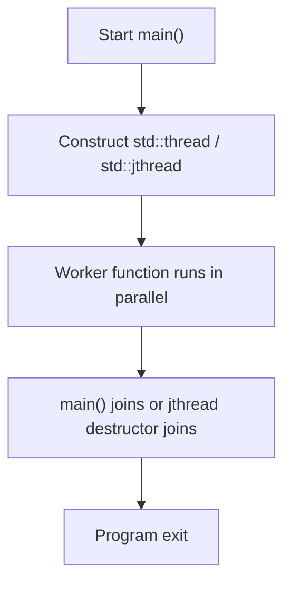
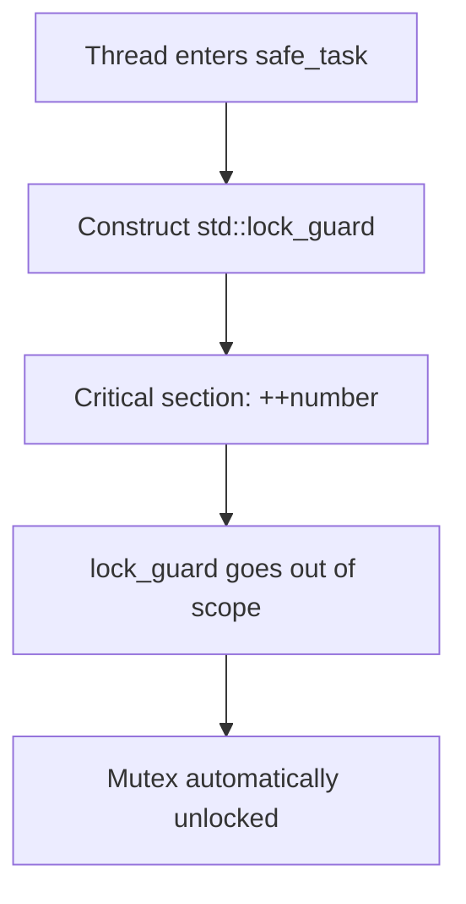
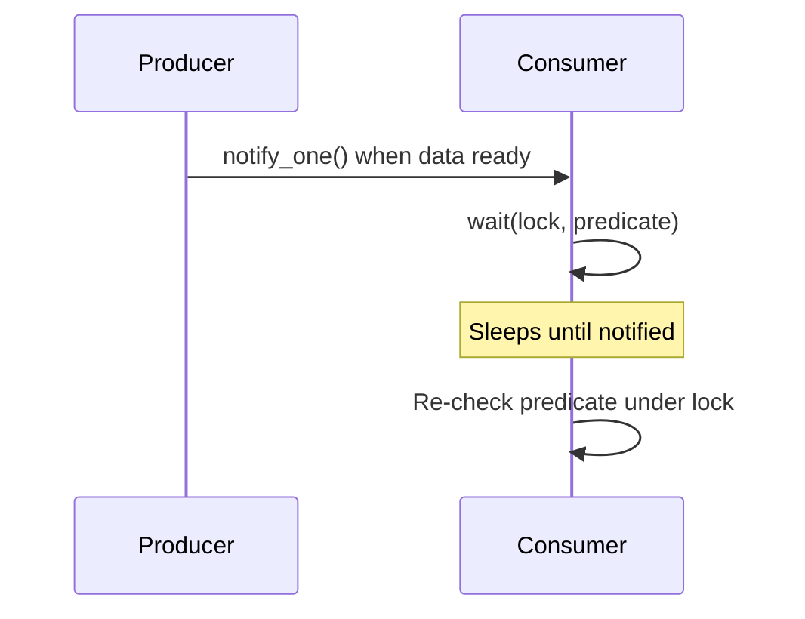

> The C++11 standard revolutionized C++ by introducing a standardized, platform-independent memory model and a comprehensive library for multithreading, making concurrent programming more accessible and portable.

## Why multithreading matters

C++ multithreading is fundamentally about improving performance and responsiveness by running tasks concurrently instead of sequentially on a single thread.
Slow or blocking operations such as network I/O or disk access can be moved to background threads so the main thread (often the UI or game loop) stays responsive instead of freezing.
For computationally heavy workloads, multithreading lets you split work across multiple CPU cores, drastically reducing total execution time when the workload can be parallelized.
In practice, that is how games keep rendering smooth while streaming assets in the background, and how machine learning frameworks overlap data loading with compute to maximize hardware utilization.

## 1. Creating a simple thread

Modern C++ makes it easy to spin up threads using the headers `<thread>` and `<chrono>`.
`<thread>` provides `std::thread` for creating and managing threads, and `<chrono>` provides strong-typed time durations that you can pass into functions like `std::this_thread::sleep_for`.
To start a thread, you construct a `std::thread` with a callable (function, lambda, functor) as the first argument.
The calling thread needs to eventually synchronize with worker threads via `join()` so the program does not exit while workers are still running.

```cpp
#include <iostream>
#include <thread>
#include <chrono>

int number = 1;

void ThreadProc1() {
    while (number < 100) {
        std::cout << "thread 1 :" << number << std::endl;
        ++number;
        std::this_thread::sleep_for(std::chrono::milliseconds(10));
    }
}

void ThreadProc2() {
    while (number < 100) {
        std::cout << "thread 2 :" << number << std::endl;
        ++number;
        std::this_thread::sleep_for(std::chrono::milliseconds(10));
    }
}

int main() {
    std::thread t1(ThreadProc1);
    std::thread t2(ThreadProc2);

    t1.join();
    t2.join();

    return 0;
}
```

This example demonstrates two threads incrementing the same variable and printing from different threads.
However, it also contains a classic race condition: both `ThreadProc1` and `ThreadProc2` read and write the shared `number` without synchronization, so their operations can interleave unpredictably.

### Prefer `std::jthread` in C++20

C++20 introduced `std::jthread` as a safer, RAII-style replacement for `std::thread`.
A `std::jthread` automatically joins in its destructor, so you cannot accidentally forget to call `join()` and leak a running thread.
This follows the RAII principle and typically results in cleaner code, since explicit `join()` calls can disappear from most scopes.



> Avoid `detach()` unless you have a very specific, well-understood reason.
> Detached threads become fire-and-forget and are killed abruptly when `main()` exits, which can easily corrupt state or leak resources.

## 2. Protecting shared data with mutexes

A race condition occurs when multiple threads access the same shared resource (the *critical section*) concurrently and at least one thread modifies it.
To prevent this, C++ provides the `std::mutex` type in `<mutex>`, which guarantees that only one thread can hold the lock at a time.
The low-level interface uses `lock()` and `unlock()`, but calling these manually is error-prone and can easily lead to deadlocks if an exception is thrown or a code path forgets to unlock.

Instead, prefer RAII-based lock wrappers like `std::lock_guard`, `std::unique_lock`, or C++17's `std::scoped_lock`.
These acquire the mutex in their constructors and release it in their destructors, guaranteeing the mutex is always unlocked when the guard goes out of scope.

```cpp
#include <iostream>
#include <thread>
#include <mutex>
#include <vector>

long long number = 0;
std::mutex g_lock;

void safe_task() {
    for (int i = 0; i < 100000; ++i) {
        std::lock_guard<std::mutex> locker(g_lock);
        ++number;
    }
}

int main() {
    std::thread t1(safe_task);
    std::thread t2(safe_task);

    t1.join();
    t2.join();

    std::cout << "Final value: " << number << std::endl;
    return 0;
}
```

Here, `std::lock_guard` ensures that increments to `number` are serialized, eliminating the race condition.
For more advanced scenarios, `std::unique_lock` supports deferred locking, timed locking, and interaction with condition variables, while `std::scoped_lock` can acquire multiple mutexes without deadlock.



## 3. Coordinating threads with condition variables

Sometimes threads need to wait for a specific condition before proceeding.
Busy-waiting (polling in a loop) wastes CPU time, so C++ offers `std::condition_variable` in `<condition_variable>` for efficient blocking waits.
A condition variable is always used together with a `std::mutex` and typically a `std::unique_lock`.

The key operation is `cv.wait(lock, predicate)` which:

- Atomically releases the mutex and suspends the thread.
- Wakes up when another thread calls `cv.notify_one()` or `cv.notify_all()`.
- Re-acquires the mutex and re-checks the predicate, looping to protect against spurious wake-ups.

This pattern is ideal for classic coordination problems, such as forcing threads to work in a specific order like printing `ABCABC...` from three threads.



## 4. Lock-free programming with atomic variables

Mutexes serialize access to shared data but can introduce contention and the possibility of deadlock if misused.
For simple operations like incrementing a counter or toggling a flag, `std::atomic` from `<atomic>` provides lock-free, hardware-supported operations that are indivisible.
An atomic operation is guaranteed to complete without interference from other threads, which prevents race conditions without explicit locks.

C++20 also provides `std::atomic_ref`, which lets you apply atomic semantics temporarily to an existing non-atomic object without changing its type.
This can be useful when you need atomic access for only a narrow scope or when integrating with legacy code.

```cpp
#include <iostream>
#include <thread>
#include <atomic>
#include <vector>

std::atomic<long long> atomic_number(0);

void atomic_task() {
    for (int i = 0; i < 100000; ++i) {
        atomic_number++;
    }
}

int main() {
    std::thread t1(atomic_task);
    std::thread t2(atomic_task);

    t1.join();
    t2.join();

    std::cout << "Final atomic value: " << atomic_number << std::endl;
    return 0;
}
```

This example eliminates the need for a mutex entirely.
The increments on `atomic_number` are safe even when executed concurrently from multiple threads.

## 5. Getting results from threads: `std::future`, `std::promise`, and `std::packaged_task`

`std::thread` itself does not provide a built-in way to get a return value from the function it runs.
Instead, the C++ standard library uses the future–promise model to separate task execution from result retrieval.
A `std::future<T>` represents a value of type `T` that will be set in the future; calling `get()` on the future will block until the result is ready.

The producer side is `std::promise<T>`, which owns the shared state and can set the result (or an exception).
The future and promise are tied together: you construct a `std::promise`, obtain its `std::future`, and pass the promise (or parts of it) to the worker.
When the worker sets the value on the promise, the future becomes ready.

`std::packaged_task<R(Args...)>` wraps a callable and manages the promise internally.
When you invoke the packaged task, it automatically stores the return value into the associated future, simplifying some patterns.


## 6. The easiest asynchronous tool: `std::async`

While `std::promise` and `std::packaged_task` are flexible, `std::async` is usually the simplest way to run a one-off task asynchronously and obtain its result.
`std::async` takes a callable and arguments, starts the computation (usually in a new thread), and returns a `std::future` that will hold the result.

You can control how `std::async` launches the task using a launch policy:

- `std::launch::async` forces the work onto a new thread.
- `std::launch::deferred` defers execution until you call `get()` or `wait()` on the future.

To avoid ambiguity across implementations, it is a good practice to specify `std::launch::async` explicitly when you truly want parallelism.
A subtle but important safety guarantee is that the future's destructor will block until the asynchronous task completes, preventing the program from exiting while work is still in flight.

## 7. Timed waits with `std::future::wait_for`

Sometimes you cannot afford to block indefinitely waiting for a result.
The member function `std::future::wait_for()` lets you wait for a specified duration and returns a `std::future_status` indicating what happened.
If the result is ready, `wait_for` returns `std::future_status::ready`.
If the timeout expires first, it returns `std::future_status::timeout`.
If the task is deferred (e.g., launched with `std::launch::deferred` and not yet run), it returns `std::future_status::deferred`.

```cpp
#include <iostream>
#include <future>
#include <thread>
#include <chrono>

int main() {
    std::future<int> future = std::async(std::launch::async, []() {
        std::this_thread::sleep_for(std::chrono::seconds(3));
        return 8;
    });

    std::cout << "waiting...\n";
    std::future_status status;
    do {
        status = future.wait_for(std::chrono::seconds(1));
        if (status == std::future_status::timeout) {
            std::cout << "timeout\n";
        } else if (status == std::future_status::ready) {
            std::cout << "ready!\n";
        }
    } while (status != std::future_status::ready);

    std::cout << "result is " << future.get() << '\n';
    return 0;
}
```

A typical output would be:

```text
waiting...
timeout
timeout
timeout
ready!
result is 8
```

This polling loop pattern allows you to interleave other work or UI updates while periodically checking whether the asynchronous result is available.

## Final thoughts

Across all of these facilities, the guiding design principle is RAII, *Resource Acquisition Is Initialization*.
In practice, that means preferring `std::jthread` over `std::thread` so threads are automatically joined, and using RAII lock wrappers like `std::lock_guard` or `std::scoped_lock` instead of calling `lock()` and `unlock()` manually.

When choosing tools, start with the highest-level abstraction that fits your problem.
For running a function asynchronously and obtaining its result, `std::async` is often the best first choice because it bundles thread management, lifetime, and communication into one high-level primitive.
Drop down to `std::packaged_task` or explicit `std::promise`/`std::future` only when you need more control over scheduling or communication.

Equally important is avoiding dangerous patterns such as `std::thread::detach()` in most cases, keeping critical sections short to reduce contention, and using `std::atomic` for simple, frequent updates to shared state.
By combining mutexes for protecting shared data, condition variables for coordination, and futures for result delivery, you can confidently build responsive, performant, and robust multithreaded C++ applications.

Thoughts, feedback, and comments are welcome—thanks for reading.
