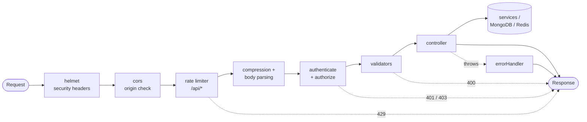
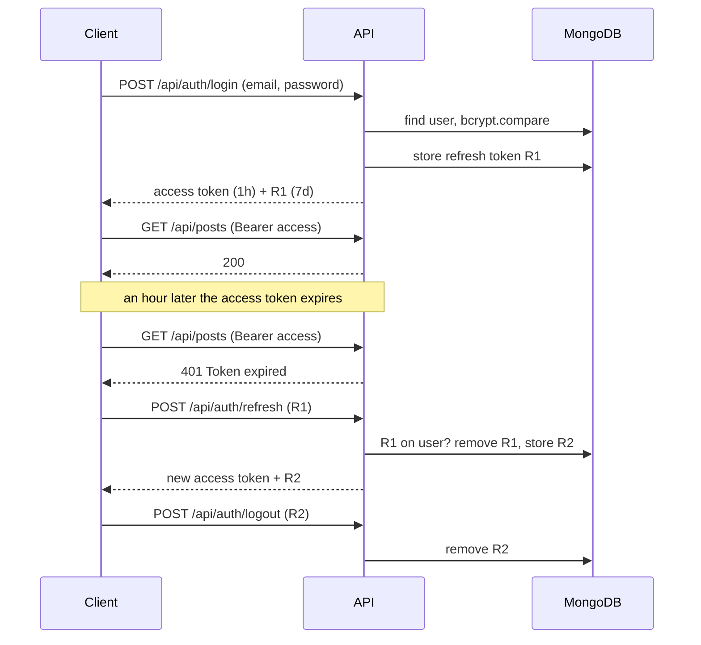

Building scalable REST APIs is a cornerstone skill for modern backend developers. In this comprehensive guide, we'll explore how to create robust, maintainable, and scalable APIs using Node.js and Express, following industry best practices.

## Table of Contents

1. [Project Setup and Architecture](#project-setup)
2. [Database Design and Models](#database-design)
3. [Authentication and Authorization](#authentication)
4. [API Design Principles](#api-design)
5. [Error Handling and Validation](#error-handling)
6. [Performance Optimization](#performance)
7. [Testing Strategies](#testing)
8. [Deployment and Monitoring](#deployment)

## Project Setup and Architecture {#project-setup}

### Folder Structure

A well-organized project structure is crucial for maintainability:

```
src/
├── controllers/     # Request handlers
├── models/         # Database models
├── middleware/     # Custom middleware
├── routes/         # Route definitions
├── services/       # Business logic
├── utils/          # Utility functions
├── config/         # Configuration files
├── validators/     # Input validation
└── tests/          # Test files
```

### Environment Configuration

```javascript
// config/database.js
const mongoose = require("mongoose");

const connectDB = async () => {
  try {
    // useNewUrlParser / useUnifiedTopology are no-ops since Mongoose 6.
    const conn = await mongoose.connect(process.env.MONGODB_URI);
    console.log(`MongoDB Connected: ${conn.connection.host}`);
  } catch (error) {
    console.error("Database connection failed:", error.message);
    process.exit(1);
  }
};

module.exports = connectDB;
```

### Express Application Setup

Every request passes through the same middleware chain before it reaches a controller. The order matters: security headers and CORS first, the rate limiter before any expensive work, body parsing only once the request is allowed in, and the error handler last so it can catch whatever the controllers throw.



```javascript
// app.js
const express = require("express");
const cors = require("cors");
const helmet = require("helmet");
const rateLimit = require("express-rate-limit");
const compression = require("compression");

const app = express();

// Security middleware
app.use(helmet());
app.use(
  cors({
    origin: process.env.ALLOWED_ORIGINS?.split(",") || [
      "http://localhost:3000",
    ],
    credentials: true,
  })
);

// Rate limiting
const limiter = rateLimit({
  windowMs: 15 * 60 * 1000, // 15 minutes
  max: 100, // limit each IP to 100 requests per windowMs
  message: "Too many requests from this IP",
});
app.use("/api/", limiter);

// Performance middleware
app.use(compression());
app.use(express.json({ limit: "10mb" }));
app.use(express.urlencoded({ extended: true }));

// Routes
app.use("/api/auth", require("./routes/auth"));
app.use("/api/users", require("./routes/users"));
app.use("/api/posts", require("./routes/posts"));

// Error handler last, after every route (see Error Handling below)
app.use(require("./middleware/errorHandler"));

module.exports = app;
```

**What `app.js` sets up, in order:**

- **`helmet()`**: adds security-related response headers (no MIME sniffing, a restrictive frame policy, and more) in one line.
- **`cors({ origin, credentials: true })`**: only the listed front-end origins may call the API from a browser. `credentials: true` allows cookies and auth headers on those cross-origin requests; it must never be combined with a wildcard origin.
- **`rateLimit({ windowMs, max })`**: each client IP gets 100 requests per 15-minute window on `/api/` routes; after that, `429 Too Many Requests`. It's mounted *before* the routes, so rejected requests cost almost nothing.
- **`compression()`**: gzip responses; JSON compresses very well.
- **`express.json({ limit: "10mb" })`**: parse JSON bodies, and refuse anything larger. Pick the smallest limit your real payloads need: a huge limit is an easy memory-exhaustion attack.
- **`app.use("/api/…", require(…))`**: each resource's routes live in their own router module.
- **The error handler goes last**: Express treats a middleware with four parameters `(err, req, res, next)` as an error handler, and only reaches it for errors thrown or passed to `next(err)` by the routes registered *before* it.

## Database Design and Models {#database-design}

### User Model with Mongoose

```javascript
// models/User.js
const mongoose = require("mongoose");
const bcrypt = require("bcryptjs");
const jwt = require("jsonwebtoken");

const userSchema = new mongoose.Schema(
  {
    username: {
      type: String,
      required: [true, "Username is required"],
      unique: true,
      trim: true,
      minlength: [3, "Username must be at least 3 characters"],
      maxlength: [30, "Username cannot exceed 30 characters"],
    },
    email: {
      type: String,
      required: [true, "Email is required"],
      unique: true,
      lowercase: true,
      match: [/^\w+([.-]?\w+)*@\w+([.-]?\w+)*(\.\w{2,3})+$/, "Invalid email"],
    },
    password: {
      type: String,
      required: [true, "Password is required"],
      minlength: [8, "Password must be at least 8 characters"],
      select: false, // Don't include password in queries by default
    },
    role: {
      type: String,
      enum: ["user", "admin", "moderator"],
      default: "user",
    },
    profile: {
      firstName: String,
      lastName: String,
      avatar: String,
      bio: String,
    },
    isActive: {
      type: Boolean,
      default: true,
    },
    lastLogin: Date,
    // No TTL index here: `expires` on a field inside an array creates a TTL
    // index on the *users* collection, so MongoDB would delete the whole user
    // 7 days after their first login. The JWT's own expiry does the job;
    // stale entries are pruned when a token is rotated.
    refreshTokens: [
      {
        token: String,
        createdAt: { type: Date, default: Date.now },
      },
    ],
  },
  {
    timestamps: true,
    toJSON: { virtuals: true },
    toObject: { virtuals: true },
  }
);

// Virtual for full name
userSchema.virtual("fullName").get(function () {
  return `${this.profile?.firstName || ""} ${
    this.profile?.lastName || ""
  }`.trim();
});

// Hash password before saving
userSchema.pre("save", async function (next) {
  if (!this.isModified("password")) return next();

  const salt = await bcrypt.genSalt(12);
  this.password = await bcrypt.hash(this.password, salt);
  next();
});

// Compare password method
userSchema.methods.comparePassword = async function (candidatePassword) {
  return await bcrypt.compare(candidatePassword, this.password);
};

// Generate JWT token
userSchema.methods.generateToken = function () {
  return jwt.sign(
    {
      id: this._id,
      username: this.username,
      role: this.role,
    },
    process.env.JWT_SECRET,
    { expiresIn: process.env.JWT_EXPIRE || "1h" }
  );
};

// Generate refresh token
userSchema.methods.generateRefreshToken = function () {
  const refreshToken = jwt.sign(
    { id: this._id },
    process.env.JWT_REFRESH_SECRET,
    { expiresIn: "7d" }
  );

  this.refreshTokens.push({ token: refreshToken });
  return refreshToken;
};

module.exports = mongoose.model("User", userSchema);
```

**Reading the `User` model:**

- **Field options are validation rules**: `required`, `unique`, `minlength`, `enum` and `match` are checked by Mongoose before anything reaches MongoDB, and violations come back as a `ValidationError` (which the error handler below turns into a `400`). Note that `unique` is really an **index**, not a validator: duplicates are rejected by MongoDB with error code `11000`.
- **`select: false` on `password`**: the hash is left out of every query unless explicitly requested with `.select("+password")`, as the login code does. That makes it hard to leak the hash through an API response by accident.
- **`timestamps: true`**: Mongoose maintains `createdAt` and `updatedAt` for you.
- **`virtual("fullName")`**: a computed property that isn't stored; `toJSON: { virtuals: true }` includes it in API responses.
- **`pre("save")` hook**: hash the password with bcrypt (cost factor 12) whenever it changes. `isModified("password")` stops an already-hashed password from being hashed again on every save.
- **`comparePassword`**: `bcrypt.compare` hashes the candidate with the stored salt and compares in constant time.
- **`generateToken` / `generateRefreshToken`**: sign short-lived access tokens and 7-day refresh tokens with *different* secrets, so a leaked access-token secret can't mint refresh tokens.

## Authentication and Authorization {#authentication}

### How the Two Tokens Work Together

The access token is short-lived (1 hour) and never stored server-side; the refresh token lives 7 days and is stored on the user so it can be revoked. Each refresh *rotates* it: the old one is removed and a new one issued, so a stolen refresh token stops working as soon as the real client uses it.



In production, store a hash of each refresh token rather than the token itself, the same way you store passwords.

### JWT Authentication Middleware

```javascript
// middleware/auth.js
const jwt = require("jsonwebtoken");
const User = require("../models/User");

const authenticate = async (req, res, next) => {
  try {
    const token = req.header("Authorization")?.replace("Bearer ", "");

    if (!token) {
      return res.status(401).json({
        success: false,
        message: "Access denied. No token provided.",
      });
    }

    const decoded = jwt.verify(token, process.env.JWT_SECRET);
    const user = await User.findById(decoded.id);

    if (!user || !user.isActive) {
      return res.status(401).json({
        success: false,
        message: "Invalid token or user not found.",
      });
    }

    req.user = user;
    next();
  } catch (error) {
    res.status(401).json({
      success: false,
      message: "Invalid token.",
    });
  }
};

const authorize = (...roles) => {
  return (req, res, next) => {
    if (!roles.includes(req.user.role)) {
      return res.status(403).json({
        success: false,
        message: "Access denied. Insufficient permissions.",
      });
    }
    next();
  };
};

module.exports = { authenticate, authorize };
```

**How the middleware works:**

- **`authenticate`**: reads `Authorization: Bearer <token>`, verifies the signature and expiry with `jwt.verify` (it throws on either failure, landing in the `catch`), then loads the user. Loading from the database on every request costs a query, but it means a deactivated user (`isActive: false`) is locked out immediately, not when their token expires.
- **`req.user = user`**: later handlers read the authenticated user from the request.
- **`authorize(...roles)`**: a function that *returns* a middleware, so routes can declare their requirements inline: `router.delete("/:id", authenticate, authorize("admin"), deletePost)`. It must run after `authenticate`, which sets `req.user`.
- **`401` vs `403`**: `401 Unauthorized` means "we don't know who you are" (log in again); `403 Forbidden` means "we know who you are, and you can't do this".

### Authentication Controller

```javascript
// controllers/authController.js
const User = require("../models/User");
const jwt = require("jsonwebtoken");

class AuthController {
  // Register new user
  async register(req, res, next) {
    try {
      const { username, email, password, profile } = req.body;

      // Check if user already exists
      const existingUser = await User.findOne({
        $or: [{ email }, { username }],
      });

      if (existingUser) {
        return res.status(400).json({
          success: false,
          message: "User already exists with this email or username",
        });
      }

      // Create new user
      const user = new User({
        username,
        email,
        password,
        profile,
      });

      await user.save();

      // Generate tokens
      const token = user.generateToken();
      const refreshToken = user.generateRefreshToken();
      await user.save();

      res.status(201).json({
        success: true,
        message: "User registered successfully",
        user: {
          id: user._id,
          username: user.username,
          email: user.email,
          role: user.role,
          profile: user.profile,
        },
        tokens: {
          accessToken: token,
          refreshToken: refreshToken,
        },
      });
    } catch (error) {
      // Let the global error handler map Mongoose validation errors to 400
      next(error);
    }
  }

  // Login user
  async login(req, res) {
    try {
      const { email, password } = req.body;

      // Find user and include password
      const user = await User.findOne({ email }).select("+password");

      if (!user) {
        return res.status(401).json({
          success: false,
          message: "Invalid credentials",
        });
      }

      // Check password
      const isPasswordValid = await user.comparePassword(password);

      if (!isPasswordValid) {
        return res.status(401).json({
          success: false,
          message: "Invalid credentials",
        });
      }

      // Update last login
      user.lastLogin = new Date();

      // Generate tokens
      const token = user.generateToken();
      const refreshToken = user.generateRefreshToken();
      await user.save();

      res.json({
        success: true,
        message: "Login successful",
        user: {
          id: user._id,
          username: user.username,
          email: user.email,
          role: user.role,
          profile: user.profile,
        },
        tokens: {
          accessToken: token,
          refreshToken: refreshToken,
        },
      });
    } catch (error) {
      res.status(500).json({
        success: false,
        message: "Login failed",
        error: error.message,
      });
    }
  }

  // Refresh token
  async refreshToken(req, res) {
    try {
      const { refreshToken } = req.body;

      if (!refreshToken) {
        return res.status(401).json({
          success: false,
          message: "Refresh token required",
        });
      }

      const decoded = jwt.verify(refreshToken, process.env.JWT_REFRESH_SECRET);
      const user = await User.findById(decoded.id);

      if (!user || !user.refreshTokens.some((t) => t.token === refreshToken)) {
        return res.status(401).json({
          success: false,
          message: "Invalid refresh token",
        });
      }

      // Remove the used token (and any older than 7 days), then rotate
      const weekAgo = Date.now() - 7 * 24 * 60 * 60 * 1000;
      user.refreshTokens = user.refreshTokens.filter(
        (t) => t.token !== refreshToken && t.createdAt.getTime() > weekAgo
      );
      const newAccessToken = user.generateToken();
      const newRefreshToken = user.generateRefreshToken();
      await user.save();

      res.json({
        success: true,
        tokens: {
          accessToken: newAccessToken,
          refreshToken: newRefreshToken,
        },
      });
    } catch (error) {
      res.status(401).json({
        success: false,
        message: "Invalid refresh token",
      });
    }
  }

  // Logout user
  async logout(req, res) {
    try {
      const { refreshToken } = req.body;
      const user = req.user;

      if (refreshToken) {
        user.refreshTokens = user.refreshTokens.filter(
          (t) => t.token !== refreshToken
        );
        await user.save();
      }

      res.json({
        success: true,
        message: "Logout successful",
      });
    } catch (error) {
      res.status(500).json({
        success: false,
        message: "Logout failed",
        error: error.message,
      });
    }
  }
}

module.exports = new AuthController();
```

**The four auth endpoints, step by step:**

- **`register`**: check for an existing email *or* username in one query (`$or`), create the user (the `pre("save")` hook hashes the password), issue both tokens, and save again to store the refresh token. Errors go to `next(error)`, so validation failures become `400`s in one place.
- **`login`**: fetch the user *with* the password hash (`select("+password")`), compare, then issue tokens. Both "no such email" and "wrong password" return the same `Invalid credentials` message, so the endpoint can't be used to discover which emails have accounts.
- **`refreshToken`**: verify the refresh token's signature, then check that it's still on the user's list. Being on the list is what makes it revocable: logout removes it, and rotation replaces it. The old token is removed *before* new ones are issued, so each refresh token works exactly once.
- **`logout`**: remove the presented refresh token. The access token stays valid until it expires, which is why it's kept short (1 hour).

## API Design Principles {#api-design}

### RESTful Resource Controllers

```javascript
// controllers/postController.js
const Post = require("../models/Post");

class PostController {
  // GET /api/posts - Get all posts with pagination and filtering
  async getPosts(req, res) {
    try {
      const {
        page = 1,
        limit = 10,
        sort = "-createdAt",
        category,
        author,
        search,
      } = req.query;

      // Build query
      const query = { isPublished: true };

      if (category) query.category = category;
      if (author) query.author = author;
      if (search) {
        // Escape user input: a raw string here is a regex, so "(a+)+$" could
        // hang the database (ReDoS). For real search, use a text index.
        const safe = search.replace(/[.*+?^${}()|[\]\\]/g, "\\$&");
        query.$or = [
          { title: { $regex: safe, $options: "i" } },
          { content: { $regex: safe, $options: "i" } },
        ];
      }

      // Execute query with pagination (query strings arrive as strings)
      const pageNum = Number(page);
      const limitNum = Number(limit);
      const [posts, total] = await Promise.all([
        Post.find(query)
          .populate("author", "username profile.firstName profile.lastName")
          .sort(sort)
          .skip((pageNum - 1) * limitNum)
          .limit(limitNum)
          .lean(),
        Post.countDocuments(query),
      ]);

      res.json({
        success: true,
        data: posts,
        pagination: {
          page: pageNum,
          limit: limitNum,
          total,
          pages: Math.ceil(total / limitNum),
        },
      });
    } catch (error) {
      res.status(500).json({
        success: false,
        message: "Failed to fetch posts",
        error: error.message,
      });
    }
  }

  // GET /api/posts/:id - Get single post
  async getPost(req, res) {
    try {
      // $inc is atomic; read-modify-save loses views under concurrent requests
      const post = await Post.findByIdAndUpdate(
        req.params.id,
        { $inc: { views: 1 } },
        { new: true }
      )
        .populate("author", "username profile")
        .populate(
          "comments.author",
          "username profile.firstName profile.lastName"
        );

      if (!post) {
        return res.status(404).json({
          success: false,
          message: "Post not found",
        });
      }

      res.json({
        success: true,
        data: post,
      });
    } catch (error) {
      res.status(500).json({
        success: false,
        message: "Failed to fetch post",
        error: error.message,
      });
    }
  }

  // POST /api/posts - Create new post
  async createPost(req, res) {
    try {
      // Whitelist fields: spreading req.body would let a client set views,
      // likes or someone else's author id (mass assignment)
      const { title, content, category, tags, isPublished } = req.body;
      const postData = {
        title,
        content,
        category,
        tags,
        isPublished,
        author: req.user._id,
      };

      const post = new Post(postData);
      await post.save();
      await post.populate("author", "username profile");

      res.status(201).json({
        success: true,
        message: "Post created successfully",
        data: post,
      });
    } catch (error) {
      res.status(400).json({
        success: false,
        message: "Failed to create post",
        error: error.message,
      });
    }
  }

  // PUT /api/posts/:id - Update post
  async updatePost(req, res) {
    try {
      const post = await Post.findById(req.params.id);

      if (!post) {
        return res.status(404).json({
          success: false,
          message: "Post not found",
        });
      }

      // Check ownership or admin role
      if (
        post.author.toString() !== req.user._id.toString() &&
        req.user.role !== "admin"
      ) {
        return res.status(403).json({
          success: false,
          message: "Not authorized to update this post",
        });
      }

      const allowed = ["title", "content", "category", "tags", "isPublished"];
      const updates = Object.fromEntries(
        Object.entries(req.body).filter(([key]) => allowed.includes(key))
      );

      // timestamps: true maintains updatedAt
      const updatedPost = await Post.findByIdAndUpdate(
        req.params.id,
        updates,
        { new: true, runValidators: true }
      ).populate("author", "username profile");

      res.json({
        success: true,
        message: "Post updated successfully",
        data: updatedPost,
      });
    } catch (error) {
      res.status(400).json({
        success: false,
        message: "Failed to update post",
        error: error.message,
      });
    }
  }

  // DELETE /api/posts/:id - Delete post
  async deletePost(req, res) {
    try {
      const post = await Post.findById(req.params.id);

      if (!post) {
        return res.status(404).json({
          success: false,
          message: "Post not found",
        });
      }

      // Check ownership or admin role
      if (
        post.author.toString() !== req.user._id.toString() &&
        req.user.role !== "admin"
      ) {
        return res.status(403).json({
          success: false,
          message: "Not authorized to delete this post",
        });
      }

      await Post.findByIdAndDelete(req.params.id);

      res.json({
        success: true,
        message: "Post deleted successfully",
      });
    } catch (error) {
      res.status(500).json({
        success: false,
        message: "Failed to delete post",
        error: error.message,
      });
    }
  }
}

module.exports = new PostController();
```

**What each handler is careful about:**

- **`getPosts`**:
  - Filters are built up only from known query parameters, never by passing `req.query` straight to `find()` (that would let clients inject operators such as `{ "$ne": null }`).
  - The search term is regex-escaped before use.
  - `skip`/`limit` implement page-number pagination. It's simple, but it slows down on deep pages, because MongoDB still walks the skipped documents; for infinite scroll, paginate by the last seen `_id` instead.
  - `find` and `countDocuments` run in parallel with `Promise.all`.
  - `.lean()` returns plain objects instead of full Mongoose documents, which is faster for read-only responses.
- **`getPost`**: the view counter uses `$inc` in the same query that fetches the post, so it's atomic.
- **`createPost`**: the author comes from the authenticated user, **never** from the request body; the other fields are whitelisted.
- **`updatePost` / `deletePost`**: load first, then check ownership (`post.author` vs `req.user._id`) or the admin role, then act. `toString()` is needed because both are ObjectIds, and two ObjectId instances are never `===`. `runValidators: true` applies the schema's validation to updates, which Mongoose skips by default.

## Error Handling and Validation {#error-handling}

### Global Error Handler

```javascript
// middleware/errorHandler.js
const errorHandler = (err, req, res, next) => {
  let error = { ...err };
  error.message = err.message;

  // Log error
  console.error(err);

  // Mongoose bad ObjectId
  if (err.name === "CastError") {
    const message = "Resource not found";
    error = { message, statusCode: 404 };
  }

  // Mongoose duplicate key
  if (err.code === 11000) {
    const message = "Duplicate field value entered";
    error = { message, statusCode: 400 };
  }

  // Mongoose validation error
  if (err.name === "ValidationError") {
    const message = Object.values(err.errors)
      .map((val) => val.message)
      .join(", ");
    error = { message, statusCode: 400 };
  }

  // JWT errors
  if (err.name === "JsonWebTokenError") {
    const message = "Invalid token";
    error = { message, statusCode: 401 };
  }

  if (err.name === "TokenExpiredError") {
    const message = "Token expired";
    error = { message, statusCode: 401 };
  }

  res.status(error.statusCode || 500).json({
    success: false,
    message: error.message || "Server Error",
    ...(process.env.NODE_ENV === "development" && { stack: err.stack }),
  });
};

module.exports = errorHandler;
```

**How the error handler maps errors:**

- **`CastError`**: an invalid ObjectId in the URL (`/api/posts/not-an-id`) becomes `404 Resource not found` rather than a `500`.
- **`err.code === 11000`**: MongoDB's duplicate-key error, from a `unique` index, becomes `400`.
- **`ValidationError`**: joins every field's message into one response.
- **`JsonWebTokenError` / `TokenExpiredError`**: `401`, so clients know to refresh or log in again.
- **`stack` only in development**: stack traces reveal file paths and library versions, which is useful to you and to attackers.

### Input Validation Middleware

```javascript
// validators/postValidator.js
const { body, param, query, validationResult } = require("express-validator");

const createPostValidation = [
  body("title")
    .trim()
    .notEmpty()
    .withMessage("Title is required")
    .isLength({ min: 5, max: 200 })
    .withMessage("Title must be between 5 and 200 characters"),

  body("content")
    .trim()
    .notEmpty()
    .withMessage("Content is required")
    .isLength({ min: 10 })
    .withMessage("Content must be at least 10 characters"),

  body("category")
    .trim()
    .notEmpty()
    .withMessage("Category is required")
    .isIn(["technology", "lifestyle", "business", "health", "education"])
    .withMessage("Invalid category"),

  body("tags")
    .optional()
    .isArray()
    .withMessage("Tags must be an array")
    .custom((tags) => {
      if (tags.length > 10) {
        throw new Error("Maximum 10 tags allowed");
      }
      return true;
    }),

  body("isPublished")
    .optional()
    .isBoolean()
    .withMessage("isPublished must be a boolean"),
];

const updatePostValidation = [
  param("id").isMongoId().withMessage("Invalid post ID"),

  body("title")
    .optional()
    .trim()
    .isLength({ min: 5, max: 200 })
    .withMessage("Title must be between 5 and 200 characters"),

  body("content")
    .optional()
    .trim()
    .isLength({ min: 10 })
    .withMessage("Content must be at least 10 characters"),

  body("category")
    .optional()
    .trim()
    .isIn(["technology", "lifestyle", "business", "health", "education"])
    .withMessage("Invalid category"),
];

const getPostsValidation = [
  query("page")
    .optional()
    .isInt({ min: 1 })
    .withMessage("Page must be a positive integer"),

  query("limit")
    .optional()
    .isInt({ min: 1, max: 100 })
    .withMessage("Limit must be between 1 and 100"),

  query("sort")
    .optional()
    .isIn([
      "-createdAt",
      "createdAt",
      "-updatedAt",
      "updatedAt",
      "title",
      "-title",
    ])
    .withMessage("Invalid sort parameter"),
];

// Validation result handler
const handleValidationErrors = (req, res, next) => {
  const errors = validationResult(req);

  if (!errors.isEmpty()) {
    return res.status(400).json({
      success: false,
      message: "Validation failed",
      errors: errors.array(),
    });
  }

  next();
};

module.exports = {
  createPostValidation,
  updatePostValidation,
  getPostsValidation,
  handleValidationErrors,
};
```

**How the validators are used:** each exported array is a list of middlewares that record problems on the request, and `handleValidationErrors` turns them into a single `400` with every problem listed. On a route they chain in order:

```javascript
router.post("/", authenticate, createPostValidation, handleValidationErrors, createPost);
```

- **`body()`, `param()`, `query()`**: which part of the request a rule applies to.
- **`.trim()`**: a *sanitizer*; it changes the value, and the controller receives the trimmed string.
- **`.isIn([...])`**: an allow-list, which is safer than trying to block bad values.
- **`.optional()`**: skip the remaining rules when the field is absent, which is what makes partial updates work.
- **`sort` whitelisted**: without this, clients could sort by any field, including unindexed ones that force full collection scans.

## Performance Optimization {#performance}

### Caching with Redis

```javascript
// middleware/cache.js
const { createClient } = require("redis");

// node-redis v4+: options object, explicit connect, promise API
const client = createClient({ url: process.env.REDIS_URL });
client.on("error", (err) => {
  console.error("Redis Client Error", err);
});
client.connect();

const cache = (duration = 300) => {
  return async (req, res, next) => {
    // Skip cache for authenticated requests with user-specific data
    if (req.user) {
      return next();
    }

    const key = `cache:${req.originalUrl || req.url}`;

    try {
      const cachedData = await client.get(key);

      if (cachedData) {
        return res.json(JSON.parse(cachedData));
      }

      // Store original json method
      const originalJson = res.json;

      // Override json method to cache response
      res.json = function (data) {
        // Cache successful responses only
        if (res.statusCode === 200) {
          client.set(key, JSON.stringify(data), { EX: duration }).catch(() => {});
        }

        // Call original json method
        return originalJson.call(this, data);
      };

      next();
    } catch (error) {
      console.error("Cache error:", error);
      next();
    }
  };
};

module.exports = { cache };
```

**How the cache middleware works:**

- **The cache key is the full URL** (`req.originalUrl`), including the query string, so `?page=2` and `?page=3` are cached separately.
- **Authenticated requests skip the cache**: their responses may be user-specific, and serving one user's data to another is the classic caching bug.
- **Hit**: return the stored JSON straight away, without touching MongoDB.
- **Miss**: wrap `res.json` so that when the route eventually responds, a `200` body is also written to Redis with an expiry (`{ EX: duration }`). Errors are never cached.
- **Redis failures fall through** to the route (`catch` → `next()`): if the cache is down, the API gets slower, not broken.
- **Invalidation**: expiry is the only invalidation here, so a new post can take up to `duration` seconds to appear. Delete the relevant keys when posts change if that's too slow.

Use it per route: `router.get("/", cache(300), getPosts)`.

### Database Query Optimization

```javascript
// services/postService.js
class PostService {
  async getPopularPosts(limit = 10) {
    return await Post.aggregate([
      { $match: { isPublished: true } },
      {
        $addFields: {
          popularity: {
            $add: [
              "$views",
              { $multiply: ["$likes", 2] },
              { $multiply: [{ $size: "$comments" }, 3] },
            ],
          },
        },
      },
      { $sort: { popularity: -1 } },
      { $limit: limit },
      {
        $lookup: {
          from: "users",
          localField: "author",
          foreignField: "_id",
          as: "author",
          pipeline: [
            {
              $project: {
                username: 1,
                "profile.firstName": 1,
                "profile.lastName": 1,
              },
            },
          ],
        },
      },
      { $unwind: "$author" },
    ]);
  }

  async getPostsByCategory(category, options = {}) {
    const { page = 1, limit = 10, sort = "-createdAt" } = options;

    return await Post.find({ category, isPublished: true })
      .populate("author", "username profile.firstName profile.lastName")
      .sort(sort)
      .limit(limit)
      .skip((page - 1) * limit)
      .lean(); // cache at the route with the cache() middleware above
  }
}

module.exports = new PostService();
```

**The aggregation pipeline, stage by stage:**

1. **`$match`**: only published posts. Filtering first means every later stage handles fewer documents, and `$match` at the start can use an index.
2. **`$addFields`**: compute a `popularity` score: views, plus likes weighted ×2, plus comment count weighted ×3.
3. **`$sort` + `$limit`**: highest scores first, top `limit` only. MongoDB optimizes this pair into a top-k sort that never sorts the full set.
4. **`$lookup`**: join each post's author from the `users` collection, with a sub-pipeline that `$project`s only public fields (never the password hash).
5. **`$unwind`**: `$lookup` produces an array; unwinding turns it back into a single `author` object.

Because the score is computed at query time, this runs a full scan of published posts on every call. It's fine for thousands of documents and a good candidate for the cache middleware. At larger scale, maintain `popularity` as a stored, indexed field that's updated when views, likes and comments change.

## Testing Strategies {#testing}

### Unit Tests with Jest

```javascript
// tests/controllers/authController.test.js
const request = require("supertest");
const app = require("../../app");
const User = require("../../models/User");
const connectDB = require("../../config/database");

describe("Auth Controller", () => {
  beforeAll(async () => {
    await connectDB();
  });

  beforeEach(async () => {
    await User.deleteMany({});
  });

  describe("POST /api/auth/register", () => {
    const validUserData = {
      username: "testuser",
      email: "test@example.com",
      password: "password123",
      profile: {
        firstName: "Test",
        lastName: "User",
      },
    };

    it("should register a new user successfully", async () => {
      const response = await request(app)
        .post("/api/auth/register")
        .send(validUserData)
        .expect(201);

      expect(response.body.success).toBe(true);
      expect(response.body.user.email).toBe(validUserData.email);
      expect(response.body.tokens.accessToken).toBeDefined();
      expect(response.body.tokens.refreshToken).toBeDefined();
    });

    it("should not register user with invalid email", async () => {
      const invalidData = { ...validUserData, email: "invalid-email" };

      const response = await request(app)
        .post("/api/auth/register")
        .send(invalidData)
        .expect(400);

      expect(response.body.success).toBe(false);
    });

    it("should not register user with duplicate email", async () => {
      // Create first user
      await request(app).post("/api/auth/register").send(validUserData);

      // Try to create second user with same email
      const response = await request(app)
        .post("/api/auth/register")
        .send(validUserData)
        .expect(400);

      expect(response.body.success).toBe(false);
      expect(response.body.message).toContain("already exists");
    });
  });

  describe("POST /api/auth/login", () => {
    beforeEach(async () => {
      // Create a test user
      await request(app).post("/api/auth/register").send({
        username: "testuser",
        email: "test@example.com",
        password: "password123",
      });
    });

    it("should login user with valid credentials", async () => {
      const response = await request(app)
        .post("/api/auth/login")
        .send({
          email: "test@example.com",
          password: "password123",
        })
        .expect(200);

      expect(response.body.success).toBe(true);
      expect(response.body.tokens.accessToken).toBeDefined();
    });

    it("should not login user with invalid credentials", async () => {
      const response = await request(app)
        .post("/api/auth/login")
        .send({
          email: "test@example.com",
          password: "wrongpassword",
        })
        .expect(401);

      expect(response.body.success).toBe(false);
    });
  });
});
```

**What the unit tests exercise:**

- **`supertest`**: sends real HTTP requests into the Express app in memory, without opening a port.
- **`beforeAll(connectDB)`**: one connection for the whole file; point `MONGODB_URI` at a test database (or `mongodb-memory-server`), never at development data.
- **`beforeEach(User.deleteMany({}))`**: every test starts from an empty collection, so tests don't depend on each other's order.
- **`.expect(201)`**: asserts the status code as part of the request chain.
- **One behaviour per test**: registering works; a malformed email is a `400`; a duplicate is a `400` with a useful message. Each failure then points at exactly one thing.

### Integration Tests

```javascript
// tests/integration/posts.test.js
const request = require("supertest");
const app = require("../../app");
const User = require("../../models/User");
const Post = require("../../models/Post");

describe("Posts API", () => {
  let authToken;
  let testUser;

  beforeEach(async () => {
    // Clean database
    await User.deleteMany({});
    await Post.deleteMany({});

    // Create test user and get auth token
    const userData = {
      username: "testuser",
      email: "test@example.com",
      password: "password123",
    };

    const authResponse = await request(app)
      .post("/api/auth/register")
      .send(userData);

    authToken = authResponse.body.tokens.accessToken;
    testUser = authResponse.body.user;
  });

  describe("POST /api/posts", () => {
    const validPostData = {
      title: "Test Post Title",
      content: "This is test post content with enough characters",
      category: "technology",
      tags: ["test", "api"],
      isPublished: true,
    };

    it("should create a new post", async () => {
      const response = await request(app)
        .post("/api/posts")
        .set("Authorization", `Bearer ${authToken}`)
        .send(validPostData)
        .expect(201);

      expect(response.body.success).toBe(true);
      expect(response.body.data.title).toBe(validPostData.title);
      expect(response.body.data.author._id).toBe(testUser.id);
    });

    it("should not create post without authentication", async () => {
      const response = await request(app)
        .post("/api/posts")
        .send(validPostData)
        .expect(401);

      expect(response.body.success).toBe(false);
    });
  });

  describe("GET /api/posts", () => {
    beforeEach(async () => {
      // Create test posts
      const posts = [
        {
          title: "First Post",
          content: "Content of first post",
          category: "technology",
          author: testUser.id,
          isPublished: true,
        },
        {
          title: "Second Post",
          content: "Content of second post",
          category: "lifestyle",
          author: testUser.id,
          isPublished: true,
        },
      ];

      await Post.insertMany(posts);
    });

    it("should get all posts", async () => {
      const response = await request(app).get("/api/posts").expect(200);

      expect(response.body.success).toBe(true);
      expect(response.body.data).toHaveLength(2);
      expect(response.body.pagination.total).toBe(2);
    });

    it("should filter posts by category", async () => {
      const response = await request(app)
        .get("/api/posts?category=technology")
        .expect(200);

      expect(response.body.success).toBe(true);
      expect(response.body.data).toHaveLength(1);
      expect(response.body.data[0].category).toBe("technology");
    });
  });
});
```

**What the integration tests add:** they go through the full chain (authentication, validation, controller, database) with real tokens:

- **`beforeEach`** registers a fresh user and keeps its access token, so each test acts as a logged-in client.
- **`` .set("Authorization", `Bearer ${authToken}`) ``**: the same header a browser or mobile client sends.
- **The negative test** (no token → `401`) matters as much as the positive one: it's what catches a route that accidentally lost its `authenticate` middleware.
- **`Post.insertMany`** seeds data directly, bypassing the API, which keeps the `GET` tests about listing and filtering only.

## Deployment and Monitoring {#deployment}

### Docker Configuration

```dockerfile
# Dockerfile
FROM node:22-alpine

WORKDIR /app

# Copy package files
COPY package*.json ./

# Install production dependencies only
RUN npm ci --omit=dev

# Create non-root user
RUN addgroup -g 1001 -S nodejs && adduser -S app -u 1001 -G nodejs

# Copy source code, owned by that user (no separate chown layer)
COPY --chown=app:nodejs . .
USER app

EXPOSE 3000

# Health check: Alpine has no curl; BusyBox wget is built in
HEALTHCHECK --interval=30s --timeout=3s --start-period=5s --retries=3 \
  CMD wget -qO- http://localhost:3000/api/health || exit 1

CMD ["npm", "start"]
```

**The Dockerfile, line by line:**

- **`FROM node:22-alpine`**: a current LTS Node release on a small base image.
- **`COPY package*.json` → `npm ci --omit=dev`**: install dependencies before copying the source, so code changes don't reinstall them (layer caching); `--omit=dev` leaves out test and build tools.
- **`addgroup` / `adduser`**: create an unprivileged user and group with fixed IDs.
- **`COPY --chown=app:nodejs . .`**: copy the source already owned by that user, instead of a separate `chown -R` layer that would duplicate every file in the image.
- **`USER app`**: the process never runs as root.
- **`HEALTHCHECK … wget -qO- …/api/health`**: Docker calls the health endpoint every 30 s; three failures mark the container unhealthy, which orchestrators and `docker ps` can act on. It uses `wget` because Alpine ships BusyBox `wget` but not `curl`.
- **`CMD ["npm", "start"]`**: consider `CMD ["node", "server.js"]` instead: npm doesn't always forward `SIGTERM` to Node, which makes graceful shutdown on `docker stop` unreliable.

### Docker Compose for Development

```yaml
# docker-compose.yml (the top-level `version:` key is obsolete in Compose v2)
services:
  api:
    build: .
    ports:
      - "3000:3000"
    environment:
      - NODE_ENV=development
      - MONGODB_URI=mongodb://mongo:27017/myapp
      - REDIS_URL=redis://redis:6379
      - JWT_SECRET=your-jwt-secret
      - JWT_REFRESH_SECRET=your-refresh-secret
    depends_on:
      - mongo
      - redis
    volumes:
      - .:/app
      - /app/node_modules

  mongo:
    image: mongo:7
    ports:
      - "27017:27017"
    volumes:
      - mongo_data:/data/db

  redis:
    image: redis:7-alpine
    ports:
      - "6379:6379"

volumes:
  mongo_data:
```

**What the Compose file gives you:**

- **`api`** builds from the Dockerfile and gets its configuration through `environment`. The secrets shown inline are for local development only; use an `env_file` that isn't committed for anything real.
- **`MONGODB_URI=mongodb://mongo:27017/myapp`**: `mongo` is the service name, resolved by Compose's network DNS.
- **`depends_on`**: start order only. The API must still retry its database connection until MongoDB is ready (or add a healthcheck plus `condition: service_healthy`).
- **`volumes: .:/app` and `/app/node_modules`**: the first mounts your source for live editing. The second, an anonymous volume, *masks* `node_modules` inside the container, so the Alpine-built modules from the image aren't replaced by your host's.
- **`mongo_data`**: a named volume, so the database survives `docker compose down`.

### Health Check Endpoint

```javascript
// routes/health.js
const express = require("express");
const mongoose = require("mongoose");
const redisClient = require("../config/redis"); // the shared node-redis client
const router = express.Router();

router.get("/", async (req, res) => {
  const healthCheck = {
    uptime: process.uptime(),
    timestamp: new Date().toISOString(),
    status: "OK",
    services: {
      database: "OK",
      redis: "OK",
    },
  };

  try {
    // Check database connection
    if (mongoose.connection.readyState !== 1) {
      healthCheck.services.database = "ERROR";
      healthCheck.status = "ERROR";
    }

    // Check Redis connection
    if (!redisClient.isReady) {
      healthCheck.services.redis = "ERROR";
      healthCheck.status = "ERROR";
    }

    res.status(healthCheck.status === "OK" ? 200 : 503).json(healthCheck);
  } catch (error) {
    healthCheck.status = "ERROR";
    healthCheck.error = error.message;
    res.status(503).json(healthCheck);
  }
});

module.exports = router;
```

**Why the health check is built this way:**

- **It checks dependencies, not just the process**: `mongoose.connection.readyState === 1` means connected; the Redis client's `isReady` flag means connected and authenticated.
- **`503 Service Unavailable` when anything is down**: load balancers and orchestrators route traffic away from instances that return non-2xx, which is exactly what should happen when this instance can't reach its database.
- **`uptime` and `timestamp`** make restarts and clock problems visible at a glance.
- **Keep it cheap**: health checks run every few seconds. Check connection *state*, don't run queries, and don't put it behind authentication or rate limiting.

## Conclusion

Building scalable REST APIs requires careful consideration of architecture, security, performance, and maintainability. The patterns and practices shown in this guide provide a solid foundation for creating robust APIs that can grow with your application's needs.

Key takeaways:

1. **Structure matters**: Organize your code for maintainability
2. **Security first**: Implement proper authentication and authorization
3. **Validate everything**: Never trust user input
4. **Plan for scale**: Use caching, pagination, and efficient queries
5. **Test thoroughly**: Write comprehensive tests for all endpoints
6. **Monitor constantly**: Implement health checks and logging

Remember that building scalable APIs is an iterative process. Start with solid foundations and continuously improve based on real-world usage and performance metrics.
