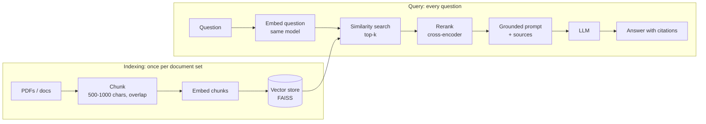

Many developers run into the same problems when using large language models on professional documents. I hit this myself while building an internal knowledge base. When dealing with company policies or product manuals, a standard model often just says it does not know because its training data is outdated. When asked about internal rules or workflows that require precision, it tends to confidently produce incorrect answers or even hallucinate. That makes it unusable for compliance level tasks.

These issues went away once I built a local knowledge base using RAG. No complex fine tuning was needed, and no sensitive data had to be sent to the cloud. It took about 30 minutes to set up, and the model could finally answer questions with real evidence. The improvement in productivity was immediate.

This article is a practical introduction. It focuses on real usage, not theory. You will learn the core ideas and build a working system: section 3 has a complete, minimal script you can copy, point at a PDF, and extend into your first RAG based document QA system.

---

## 1. Why RAG is essential for real world LLM use

Before using RAG, whether with ChatGPT or open source models, three problems keep showing up when handling professional or internal data.

**Outdated knowledge**

Most models are trained on data that stops at a certain point. Many open models only go up to mid 2023. Anything recent such as policies, industry updates, or new technical changes is missing.

**Hallucination risk**

LLMs generate answers based on probability, not facts. Without reliable context, they will invent content that sounds correct but is wrong. In fields like law, medicine, or compliance, this is unacceptable.

**Data privacy concerns**

Sending internal documents, customer data, or medical records to cloud models can create serious security and compliance risks. Many companies cannot use cloud models for this reason.

RAG, retrieval augmented generation, solves this by adding an external knowledge layer. The model itself does not change. Instead, it retrieves relevant information from your own data in real time and uses that to generate answers.

A simple way to think about it:

The model is the brain. RAG is the library.

Even a smart brain cannot give accurate answers without reliable references.

This design makes RAG useful across many scenarios:

* Internal company knowledge search
* Professional domains like legal, medical, or research
* Personal learning and summarization of large materials

---

## 2. Core RAG workflow in three steps

RAG is often described as complex, but the core idea is simple. It is just storing information, finding it, and using it to answer questions.

The work splits into two paths. Indexing runs once per document set; the query path runs on every question.



### Step 1: Data preparation

You convert raw documents into searchable units.

**Chunking**

Split large documents into smaller pieces, usually 500 to 1000 characters. This keeps meaning intact while making retrieval efficient. Overlapping chunks helps avoid losing context.

**Embedding**

Convert each chunk into a vector using an embedding model. Similar meaning leads to similar vectors. This is what enables semantic search.

Today, stronger options include models like bge large, e5, or newer multilingual embeddings depending on your language needs.

**Vector storage**

Store vectors in a database. FAISS works well for local setups. For production, systems like Milvus, Weaviate, or Pinecone are more scalable.

---

### Step 2: Retrieval

When a user asks a question:

**Query embedding**

Convert the question into a vector using the same embedding model.

**Similarity search**

Find the most relevant chunks by comparing vector distance.

**Reranking**

Use a reranker model such as a cross encoder to reorder results. This step is now standard in modern RAG pipelines and significantly improves accuracy.

---

### Step 3: Generation

The retrieved content is passed to the language model.

**Context construction**

Build a prompt that includes the retrieved text and clear instructions to only use that information.

**Answer generation**

The model generates a response grounded in the provided context. If no relevant data exists, it should explicitly say so.

Modern improvements often include:

* Structured prompts with citations
* Context compression to fit more useful information
* Guardrails to prevent unsupported claims

---

## 3. Build a local RAG system in 30 minutes

You can create a simple PDF question answering system with Python.

### Setup

Install dependencies:

```bash
pip install pypdf sentence-transformers faiss-cpu requests
```

For generation this uses a local model through [Ollama](https://ollama.com) (`ollama pull qwen2.5:7b`), so nothing leaves your machine. Any local or API based model such as DeepSeek, Qwen, or Llama works; only the `generate` function changes.

---

### Updated architecture notes

Instead of older patterns, a more current setup would include:

* LangChain or LlamaIndex for orchestration
* A modern embedding model like bge small or e5 base
* Optional reranker such as bge reranker
* A local or API LLM for generation

Key improvements compared to basic RAG:

* Add reranking after retrieval
* Limit context to the most relevant tokens
* Include source attribution in answers
* Cache embeddings to avoid recomputation

---

### Core pipeline logic

1. Load and split the PDF
2. Generate embeddings and store them
3. Retrieve top matches for a query
4. Rerank results
5. Build a grounded prompt
6. Generate the final answer

### The code

Each numbered comment below is one step from the list above. It keeps the page number with every chunk so answers can cite where they came from.

```python
# rag.py: minimal local RAG over one PDF.  python rag.py manual.pdf
import sys

import faiss
import requests
from pypdf import PdfReader
from sentence_transformers import CrossEncoder, SentenceTransformer

CHUNK, OVERLAP = 800, 150
embedder = SentenceTransformer("BAAI/bge-small-en-v1.5")
reranker = CrossEncoder("BAAI/bge-reranker-base")

# 1. Load and split the PDF, keeping the page number with each chunk
def load_chunks(path):
    chunks = []
    for page_no, page in enumerate(PdfReader(path).pages, start=1):
        text = " ".join((page.extract_text() or "").split())
        for start in range(0, len(text), CHUNK - OVERLAP):
            piece = text[start : start + CHUNK]
            if len(piece) > 50:
                chunks.append({"page": page_no, "text": piece})
    return chunks

# 2. Embed every chunk and store the vectors (normalized, so inner product = cosine)
def build_index(chunks):
    vectors = embedder.encode([c["text"] for c in chunks], normalize_embeddings=True)
    index = faiss.IndexFlatIP(vectors.shape[1])
    index.add(vectors)
    return index

# 3. Retrieve the top matches, then 4. rerank them with a cross-encoder
def retrieve(question, chunks, index, k=20, keep=4):
    q = embedder.encode([question], normalize_embeddings=True)
    _, ids = index.search(q, k)
    hits = [chunks[i] for i in ids[0] if i != -1]
    scores = reranker.predict([(question, h["text"]) for h in hits])
    ranked = sorted(zip(scores, hits), key=lambda pair: pair[0], reverse=True)
    return [h for _, h in ranked[:keep]]

# 5. Build a grounded prompt that only allows the retrieved text
def build_prompt(question, hits):
    context = "\n\n".join(f"[p.{h['page']}] {h['text']}" for h in hits)
    return (
        "Answer using ONLY the context below. Cite pages like [p.3]. "
        "If the answer is not in the context, say you don't know.\n\n"
        f"Context:\n{context}\n\nQuestion: {question}\nAnswer:"
    )

# 6. Generate the answer with a local model (Ollama's HTTP API)
def generate(prompt, model="qwen2.5:7b"):
    r = requests.post(
        "http://localhost:11434/api/generate",
        json={"model": model, "prompt": prompt, "stream": False},
        timeout=300,
    )
    r.raise_for_status()
    return r.json()["response"]

if __name__ == "__main__":
    chunks = load_chunks(sys.argv[1])
    index = build_index(chunks)
    print(f"Indexed {len(chunks)} chunks. Ask a question (empty line to quit).")
    while question := input("> ").strip():
        print(generate(build_prompt(question, retrieve(question, chunks, index))))
```

### What each part does

**Setup.** `CHUNK, OVERLAP = 800, 150` sets chunks of about 800 characters, each sharing 150 characters with the previous one, so a sentence that straddles a boundary appears whole in at least one chunk. The two models load once at startup:
- `bge-small-en-v1.5` turns text into 384-number vectors. It's small enough to run on a laptop CPU.
- `bge-reranker-base` scores (question, passage) pairs directly.

**1. `load_chunks`** walks the PDF page by page.
- `" ".join(text.split())` collapses the line breaks and repeated spaces that PDF extraction produces.
- `range(0, len(text), CHUNK - OVERLAP)` steps 650 characters at a time, which is what creates the overlap.
- Fragments under 50 characters (page numbers, headers) are dropped.
- Each chunk keeps its page number, which is what makes citations possible later.

**2. `build_index`** embeds every chunk.
- `normalize_embeddings=True` scales each vector to length 1. With unit vectors, the inner product *is* cosine similarity, so the fast exact index `IndexFlatIP` ranks by semantic similarity.
- "Flat" means brute force, comparing against every vector. That's exact and plenty fast up to hundreds of thousands of chunks; beyond that, FAISS has approximate indexes such as IVF and HNSW.

**3–4. `retrieve`** is the two-step search.
- It embeds the question the same way and asks FAISS for the 20 nearest chunks: cheap, but based only on vector similarity.
- The cross-encoder then reads each (question, chunk) pair together and scores how well that chunk answers *this* question. It's slower per pair, which is why it only sees 20 candidates, not the whole document.
- The top 4 after reranking go to the model.
- The `i != -1` check guards against FAISS padding results with `-1` when the index holds fewer than `k` chunks.

**5. `build_prompt`** stitches the chunks into a context, each labeled with its page (`[p.12] …`). The instructions do the grounding work:
- answer only from the context;
- cite pages;
- say "I don't know" when the context doesn't contain the answer. This line matters most: without it, models fill gaps from their training data, which is exactly the hallucination RAG is meant to prevent.

**6. `generate`** calls Ollama's local HTTP API.
- `"stream": False` returns the whole answer as one JSON object.
- `raise_for_status()` turns HTTP errors (model not pulled, Ollama not running) into a clear exception instead of a confusing `KeyError`.

**The main loop** indexes once, then answers questions until you enter an empty line. The `:=` (walrus operator) reads a line and tests it in one expression.

The index lives in memory, so it is rebuilt on every run. Once that gets slow, save it with `faiss.write_index` and the chunk list as JSON, and only re-embed documents that changed.

---

## 4. Common mistakes to avoid

**Chunk size issues**

Too large reduces retrieval precision. Too small breaks context. Stay in the 500 to 1000 range.

**Wrong embedding model**

Choose based on language and use case. Multilingual and domain specific models perform much better than generic ones.

**Skipping reranking**

This is one of the biggest upgrades in modern RAG. Without it, retrieval quality drops significantly.

**Using basic vector search only**

Advanced setups now combine:

* Hybrid search using keywords and vectors
* Metadata filtering
* Multi step retrieval

**Ignoring evaluation**

You should test your system with real queries and measure accuracy. Tools like RAGAS or simple human evaluation help a lot.

---

## Final thoughts

RAG turns language models from guessers into systems that answer with evidence. It solves outdated knowledge, reduces hallucination, and keeps data under your control.

You do not need fine tuning to get useful results. A simple pipeline with good retrieval and prompt design already goes a long way.

For beginners and small teams, this is the fastest path to deploying real LLM applications.
