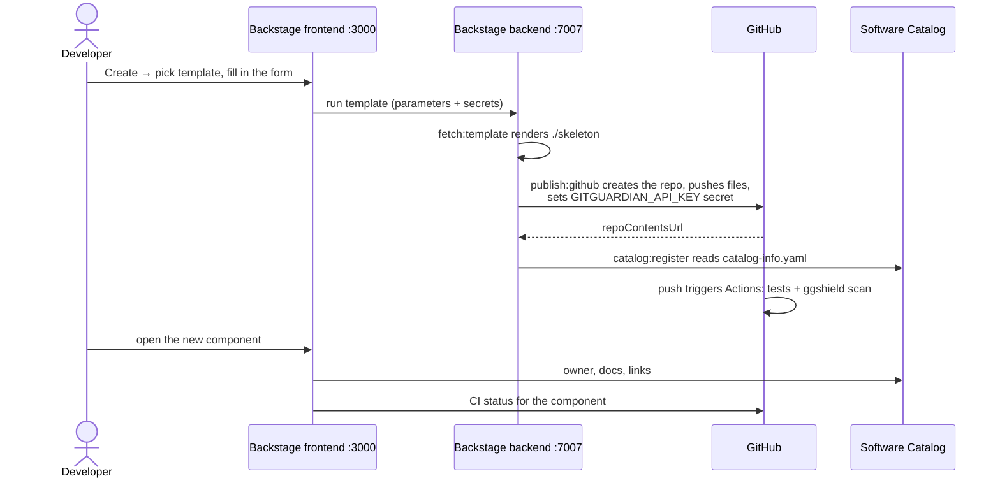

## What We Talk About When We Talk About Developer Portals

At its core, platform engineering is about self-service. This makes an internal **developer portal** critical in this new paradigm, as it's where all self-service functionalities and integrations are implemented.

Given the importance of a developer portal, before building one, we need to clarify our expectations. Typically, to maximize the benefits of platform engineering, a developer portal will include several key features:

- **Service Catalog:** This allows developers to view all projects, services, deployment statuses, documentation, ownership, and even on-call schedules and incidents.

- **Repository Scaffolding/Project Generation Tool:** Tools like Cookie cutter can enable developers to spin up new services directly from the portal.

- **Customization:** You'll likely want to integrate your existing toolchain into your developer portal, making it a truly unified, one-stop experience. Possible integrations include Kubernetes, CI/CD status, on-call schedules, incident management systems, secret managers, and more.

---

## Choosing a Tool: Backstage

Now that we understand what we truly want in a developer portal, let's start building it.

A developer portal will have diverse functionalities, and the design/coding part itself is a massive project that not all teams can afford. This means we need a tool to quickly build the portal. Fortunately, such a tool already exists: **Backstage**.

Backstage is an open platform for building developer portals. It's not a developer portal itself, but rather a tool for building one. Backstage includes:

- **Software Catalog:** For managing all your software, such as microservices, libraries, data pipelines, websites, and ML models.

- **Software Templates:** For quickly spinning up new projects and standardizing your tooling with enterprise best practices.

- **Documentation:** Adopting a "docs-as-code" approach to easily create, maintain, find, and consume technical documentation.

- **Evolving Open-Source Plugin Ecosystem:** To further extend Backstage's customizability and functionality.

Backstage's architecture is highly flexible: it has a frontend written in React/TypeScript and a backend written in Node.js. Its capabilities can be extended by adding plugins.

Additionally, Backstage (created by Spotify) is now hosted by the Cloud Native Computing Foundation (CNCF) as an incubating project. This means users get all the community support they need. There are also office hours you can join interactively every Thursday to learn exactly how the open-source platform can improve developer efficiency and experience.

Today, we'll build a developer portal from scratch. After this tutorial, you'll be able to use a template with a secure CI workflow to start a new service, check its CI status, and view its documentation, all in one place.

---

## Building the Portal

### Prerequisites

These are likely already familiar to most DevOps engineers:

- **Unix-based operating system:** This can run on macOS, Linux, or Windows Subsystem for Linux (WSL).

- `curl`, `git`, `Docker`

- `Node.js`, `yarn`

---

### Creating the Portal

Run the following command:

```bash
npx @backstage/create-app@latest
```

The command will ask for a name for your application. Enter a descriptive name, like "my-portal", press Enter, and wait for the application to finish setting up.

Once the setup is complete, navigate into your newly created directory and run:

```bash
yarn dev
```

That's it! Your Backstage developer portal is now up and running.

Take some time to explore the interface and get familiar with the basic layout of the software catalog, templates, and documentation sections.

---

## GitHub Authentication and Integration

Since the developer portal will be responsible for bootstrapping new code repositories, it requires operational permissions with GitHub. This is why we need to set up GitHub authentication and integration.

### Personal Access Token for Integration

While using a GitHub App is often the best way to set up integrations due to its granular permission settings, for this tutorial, we'll use a **Personal Access Token (PAT)** for a quicker start.

1. Open the [GitHub token creation page](https://github.com/settings/tokens/new) to create your personal access token.

2. Provide a descriptive name in the "Note" field to identify this token, and choose an expiration date.

   - If you're unsure about the expiration, we suggest selecting 7 days. (We're only testing locally, not running in production.)

   - For this tutorial, we will set the scope to the maximum to avoid issues with GitHub permissions. **However, never do this in a production environment!**

3. Then, export the token as an environment variable:

   ```bash
   export GITHUB_TOKEN="your_personal_access_token_here"
   ```

4. In your `app-config.yaml` file, change the `integrations` section to the following:

   ```yaml
   integrations:
     github:
       - host: github.com
         token: ${GITHUB_TOKEN}
   ```

### Creating a GitHub OAuth Application

1. Visit [https://github.com/settings/applications/new](https://github.com/settings/applications/new) to create your OAuth application.

2. The **Homepage URL** should point to the Backstage frontend. For this tutorial, it will be `http://localhost:3000`.

3. The **Authorization callback URL** will point to the Auth backend, most likely `http://localhost:7007/api/auth/github/handler/frame`.

4. Then, open your `app-config.yaml` file again and update the `auth` section to configure authentication:

   ```yaml
   auth:
     environment: development
     providers:
       github:
         development:
           clientId: your_github_oauth_app_client_id
           clientSecret: your_github_oauth_app_client_secret
   ```

   **Important Security Best Practice:** Storing client secrets as hardcoded values in configuration files violates security best practices and should only be used for local development. For production use, you should adhere to the [12-factor app](https://12factor.net/config) principles and read these values from environment variables.

After these configuration changes, restart your Backstage development server by running `yarn dev`.

---

## Creating a Template

Next, let's prepare a software template that can be used to instantly spin up new services. A template should include:

- Basic source code/directory structure common to your services

- Documentation

- CI workflows for testing/building/deploying services

For this tutorial, we will use this template: [https://github.com/IronCore864/backstage-test-template](https://github.com/IronCore864/backstage-test-template)

The directory structure is relatively simple, with only two parts:

- A `skeleton` folder

- A `template.yaml` file

### `skeleton` Folder

The `skeleton` folder contains all the templated files that will be generated when a new service is created using this template. Variables are formatted as `${{ values.varName }}`. If you're familiar with Helm, YAML, or Go templates (or any templating tool), you'll find this easy to read and understand.

It's worth highlighting the `catalog-info.yaml` file, which is used by Backstage. This file **must** exist; otherwise, the created service cannot be registered as a component in the portal. In our template, we've built in some GitHub Actions workflows. One will test pull requests and pushes to the main branch, and another will scan the repository for hardcoded secrets using `ggshield`.

This approach allows us to embed all CI/CD best practices directly into the template. When others roll out new services, they'll have everything they need for security features enabled by default.

### `template.yaml` File

The `template.yaml` file defines how the template appears in the portal's user interface and what actions it performs. This file can be long and seem overwhelming at first glance, but a closer look reveals it's quite intuitive:

- The syntax is similar to Kubernetes custom resources.

- It has two main sections: `parameters` and `steps`.

- `parameters` define the required inputs and their types when using the template.

- `steps` define what actually happens when the template is executed, much like a GitHub Actions workflow.

**Example Parameters:**

Each entry under `parameters` is one page of the form, written as JSON Schema; `ui:field` swaps in Backstage's pickers.

```yaml
parameters:
  - title: Service details
    required: [service_name, owner]
    properties:
      service_name:
        title: Service Name
        type: string
        description: Unique name of the service
        ui:autofocus: true
      owner:
        title: Owner
        type: string
        description: Owner of the service
        ui:field: OwnerPicker
        ui:options:
          catalogFilter:
            kind: Group
  - title: Repository
    required: [repoUrl, gitguardian_api_key]
    properties:
      repoUrl:
        title: Repository Location
        type: string
        ui:field: RepoUrlPicker
        ui:options:
          allowedHosts: [github.com]
      gitguardian_api_key:
        title: GitGuardian API key
        type: string
        ui:field: Secret # masked in the form, never logged
```

**Example Steps:**

Steps read the form through `parameters.*` (inside the skeleton files the same values are `values.*`), and sensitive fields through `secrets.*`:

```yaml
steps:
  - id: fetch-base
    name: Fetch Base
    action: fetch:template
    input:
      url: ./skeleton
      values:
        service_name: ${{ parameters.service_name }}
        owner: ${{ parameters.owner }}

  - id: publish
    name: Publish
    action: publish:github
    input:
      repoUrl: ${{ parameters.repoUrl }}
      # Stored as a GitHub Actions secret on the new repo, never written to a file
      secrets:
        GITGUARDIAN_API_KEY: ${{ secrets.gitguardian_api_key }}

  - id: register
    name: Register
    action: catalog:register
    input:
      repoContentsUrl: ${{ steps['publish'].output.repoContentsUrl }}
      catalogInfoPath: /catalog-info.yaml
```

Keep tokens out of `fetch:template` values: anything passed there can be rendered into the skeleton's files and committed to the new repository. Backstage publishes with the integration token from `app-config.yaml`, and the GitGuardian key goes to the repository as an Actions secret.

From the file above, we can infer its specific definition:

1. First, it asks for the service details: `service_name` and `owner`.

2. Then, it asks for a repository location and the GitGuardian API key the CI pipeline needs.

3. Next, it fetches the template, renders it, publishes it to GitHub (setting the key as a repository secret), and registers it in our portal.

### Registering the Template

Finally, add your template to the portal's catalog so others can use it.

The simplest catalog configuration is to declaratively add locations pointing to YAML files with static locations. These locations will be added under `catalog.locations` in your `app-config.yaml` file.

```yaml
catalog:
  locations:
    - type: url
      target: https://github.com/IronCore864/backstage-test-template/blob/main/template.yaml
```

The rule above allows us to add templates from the specified URL.

Remember to restart your `yarn dev` server after these changes.

---

## Bringing Everything Together

Now that everything is set up, it's time to see it in action.

Visit `http://localhost:3000`, then click the "Create" button and select our template.

Enter the necessary information. You'll need to create a GitGuardian API key here: [https://dashboard.gitguardian.com/api/personal-access-tokens](https://dashboard.gitguardian.com/api/personal-access-tokens).

Once everything is set up, click "Next." Here is what happens behind that button:



The new service appears in the catalog with its owner and the rendered files, and its page shows the CI runs.

It appears the pipelines have completed successfully. You can click on them to view more details, including detailed steps and logs. If you prefer to view them in your CI software (GitHub Actions, in this case), you can click the corresponding link to jump directly there. For your reference, this repository was created using the template above.

This means that regardless of the toolchain a team uses, team members don't have to remember 10 different URLs for 10 different tools, nor do they need to keep 10 tabs open constantly. When they need any information, they only need to visit the developer portal, and that's precisely the advantage of an internal developer portal.

---

## Summary

In this article, we reviewed the characteristics of a developer portal, learned how to create our own using the open-source Backstage tool, configured our portal with GitHub, created a software template, and bootstrapped a service from it.

In real-world scenarios, a developer portal can be much more as integrations grow. Imagine if you deploy services in Kubernetes, use Argo CD for GitOps deployments, HashiCorp Vault for secret management, and all these integrations are within your portal. When you need to check deployment status, for example, to view actual resources in K8s, you don't have to visit Vault, Argo CD, or the K8s Dashboard. You don't even have to remember their URLs; just click directly on the developer portal.

It's important to note that this tutorial is only for a quick local start. For production use, further considerations and adjustments are necessary based on your specific situation. For instance, we currently use static configuration, which means catalog information would be lost if the development server were restarted. To address this, you would need to configure Postgres for the portal. Another example is using `yarn dev` to start both the frontend and backend; in production, you might want to separate them, deploy them as containers in K8s, and create Ingress for them.

Backstage plugins, which extend the portal much further than templates, are the natural next step from here.
