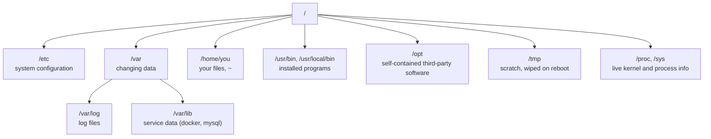
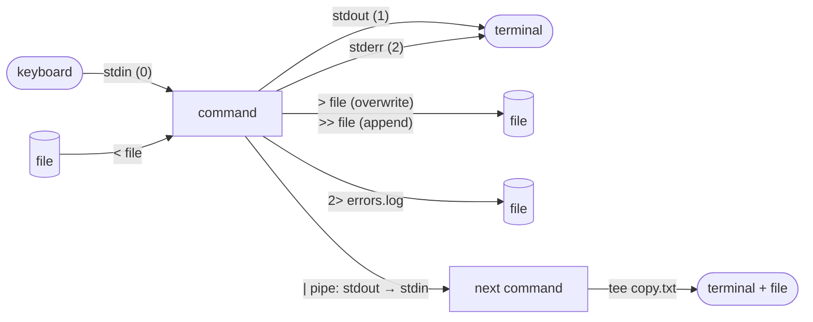

Everything later in this series runs on Linux. A Docker container is a Linux process with some fences around it. A CI runner is a Linux machine executing your shell commands. When a Kubernetes pod misbehaves, the fix usually starts with `kubectl exec` into a shell. So before any of that, this chapter covers the command line itself.

I've organized it by **the job you're trying to do** rather than alphabetically, because that's how you actually look things up: "how do I find which process is holding port 8080?", not "what does `ss` do?". Each section shows the commands, then breaks down the flags that matter. There's a cheat sheet at the end.

Everything here works in Bash on any mainstream distribution (Ubuntu, Debian, Fedora, Arch), in WSL on Windows, and mostly in macOS's zsh (where GNU and BSD tools differ, I say so).

## The shape of a command

Almost every command follows the same pattern:

```bash
ls -la --color=auto /var/log
```

| Part | Example | Meaning |
|---|---|---|
| Command | `ls` | The program to run |
| Short flags | `-la` | Single-letter options; `-la` is `-l` and `-a` combined |
| Long flag | `--color=auto` | A spelled-out option, often with a value |
| Argument | `/var/log` | What the command acts on, usually a path |

Two habits save a lot of time:

```bash
ls --help        # quick usage summary, printed by the command itself
man ls           # the full manual; press / to search, q to quit
```

`--help` is the near-universal convention. Don't rely on `-h`: for many tools (`ls`, `df`, `du`, `sort`) it means "human-readable sizes", not help. If you want worked examples instead of reference text, the community `tldr` pages (`tldr tar`) are excellent.

## Finding your way around

### Where am I, and what's here?

```bash
pwd              # print working directory
ls               # list the current directory
ls -lah          # long format, include hidden files, human-readable sizes
ls -lt           # newest first
ls -R src/       # recurse into subdirectories
```

`ls -l` is worth reading carefully, because it answers most "why can't I…" questions:

```text
-rw-r--r--  1 echo staff  4.2K Jul  9 10:14 notes.md
drwxr-xr-x  5 echo staff  160B Jul  9 09:02 src
```

- **First character**: the type. `-` is a regular file, `d` a directory, `l` a symbolic link.
- **Next nine characters**: permissions for the owner, the group and everyone else (covered below).
- **`echo staff`**: the owning user and group.
- **Size, date, name**: what you'd expect. `-h` turns `4213` into `4.2K`.

Files starting with a dot (`.bashrc`, `.git`) are hidden by convention; `-a` shows them.

### Moving

```bash
cd /var/log      # absolute path: starts at the root
cd projects/api  # relative path: starts where you are
cd ..            # up one level
cd -             # back to the previous directory
cd               # home (same as cd ~)
```

### Where things live

The Linux filesystem is one tree starting at `/`. You'll keep coming back to the same few branches:



When a service misbehaves, its config is almost always under `/etc`, its logs under `/var/log` (or in the journal, below), and its data under `/var/lib`.

## Working with files and directories

```bash
touch notes.md                 # create an empty file (or update its timestamp)
mkdir -p projects/api/src      # create a directory and any missing parents
cp config.yml config.yml.bak   # copy a file
cp -r src/ backup/             # copy a directory recursively
mv draft.md posts/final.md     # move and rename in one step
rm old.log                     # delete a file
rm -r build/                   # delete a directory and its contents
rm -i *.tmp                    # ask before each deletion
ln -s /opt/tool/bin/tool ~/bin/tool   # symbolic link (a shortcut)
```

A few details that bite people:

- **`rm` has no recycle bin.** Deleted is deleted. `rm -rf` (recursive, force, no prompts) combined with a variable that turned out empty has wiped real systems; if you script it, guard the variable: `rm -rf -- "${BUILD_DIR:?}"/*` refuses to run when `BUILD_DIR` is unset.
- **`cp` and `mv` overwrite silently.** Add `-i` to be asked first, or `-n` to never overwrite.
- **Wildcards are expanded by the shell, not the command.** `*.log` matches every `.log` file in the current directory; `?` matches one character; `{a,b}` expands to both (`cp app.{yml,yml.bak}` copies `app.yml` to `app.yml.bak`).

## Reading files

```bash
cat short.txt          # print a whole (short) file
less long.log          # page through a file: / to search, n for next, q to quit
head -n 20 data.csv    # first 20 lines
tail -n 50 app.log     # last 50 lines
tail -f app.log        # keep printing new lines as they're written
wc -l data.csv         # count lines (-w words, -c bytes)
```

`tail -f` is the single most useful debugging command on a server: start it in one terminal, reproduce the problem in another, and watch the log as it happens. `less +F` does the same inside `less`, and Ctrl+C drops you back into normal scrolling.

## Finding things

### Files, by name, size or age: `find`

```bash
find . -name "*.yml"                          # by name, from the current directory down
find /var/log -name "*.gz" -mtime +30         # .gz files older than 30 days
find . -type f -size +100M                    # regular files larger than 100 MB
find . -name "node_modules" -type d -prune    # directories only, don't descend into them
find /tmp -type f -mtime +7 -delete           # delete week-old files in /tmp
```

`find` reads as a sentence: **where to look**, then **tests** that must all match, then an optional **action**.

- `-name "*.yml"`: quote the pattern, so the shell passes it to `find` instead of expanding it.
- `-type f` / `-type d`: files or directories.
- `-mtime +30`: modified more than 30 days ago (`-30` means less than).
- `-size +100M`: larger than 100 MB (`k`, `M`, `G` suffixes).
- `-delete`: acts on every match, so run the command without it first and check the list.

### Text inside files: `grep`

```bash
grep "timeout" app.log               # lines containing "timeout"
grep -i "error" app.log              # case-insensitive
grep -n "TODO" *.py                  # show line numbers
grep -r "DATABASE_URL" .             # search a whole directory tree
grep -v "healthcheck" access.log     # lines that do NOT match
grep -E "5[0-9]{2} " access.log      # extended regex: any 5xx status
grep -c "WARN" app.log               # just count matching lines
```

For big codebases, `ripgrep` (`rg`) is a faster `grep -r` that respects `.gitignore`, and it's worth installing.

### Programs: `which` and `type`

```bash
which python3        # the file that runs when you type python3
type ll              # also reveals aliases and shell built-ins
```

When "it works in my terminal but not in cron", `which` usually shows a different binary or a missing `PATH` entry.

## Pipes and redirection: making small tools work together

This is where the command line stops being a list of commands and becomes a language. Every process starts with three streams: **standard input** (0), **standard output** (1) and **standard error** (2). By default all three are your terminal; the operators below re-point them.



```bash
ls -l /etc > listing.txt          # stdout to a file (overwrites)
echo "done" >> build.log          # append instead
sort < names.txt                  # a file as stdin
make 2> errors.log                # only errors to the file
make > build.log 2>&1             # both streams to the same file
ls -l /etc | less                 # pipe: output of one becomes input of the next
./deploy.sh | tee deploy.log      # see the output AND keep a copy
```

`2>&1` reads "send stream 2 wherever stream 1 is going". Order matters: `> build.log 2>&1` captures both, while `2>&1 > build.log` sends errors to the terminal, because stream 2 copied stream 1 before stream 1 was redirected.

### A worked pipeline

Here's the kind of one-liner that answers a real question: *which client IPs are hitting this server hardest?*

```bash
awk '{print $1}' /var/log/nginx/access.log | sort | uniq -c | sort -rn | head -n 10
```

Read it left to right. Each stage does one small thing:

1. **`awk '{print $1}' access.log`**: print the first whitespace-separated field of every line, which in the default Nginx log format is the client IP.
2. **`sort`**: put identical IPs next to each other (`uniq` only collapses *adjacent* duplicates).
3. **`uniq -c`**: collapse each run into one line, prefixed with its count.
4. **`sort -rn`**: sort by that count, numerically (`-n`), largest first (`-r`).
5. **`head -n 10`**: keep the top ten.

No script, no temporary files, and every stage can be tested on its own by cutting the pipeline short.

### The text-processing toolkit

```bash
cut -d',' -f2 data.csv            # 2nd comma-separated column
sort -t',' -k3 -n data.csv        # sort by 3rd column, numerically
sort -u names.txt                 # sort and drop duplicates
tr 'a-z' 'A-Z' < file.txt         # translate characters (here: uppercase)
sed 's/http:/https:/g' links.txt  # replace text in every line (printed, file untouched)
sed -i 's/DEBUG=true/DEBUG=false/' .env   # edit the file in place (GNU sed; macOS needs -i '')
awk -F',' '$3 > 100 {print $1, $3}' sales.csv   # rows where column 3 > 100
```

`xargs` connects commands that print filenames to commands that take filenames:

```bash
find . -name "*.log" -mtime +30 -print0 | xargs -0 gzip
```

- `-print0` / `-0`: separate names with a null byte instead of newlines, so filenames containing spaces don't split into two arguments.
- `gzip` receives the whole batch of files as arguments and compresses each one.

## Permissions and ownership

Every file has an owner, a group, and three sets of permissions:

```text
-rwxr-x---  1 deploy www-data  1.2K  deploy.sh
 └┬┘└┬┘└┬┘
  │  │  └── others: ---  no access
  │  └───── group (www-data): r-x  read and execute
  └──────── owner (deploy):   rwx  read, write, execute
```

For a directory, `r` means list its contents, `w` means create or delete files in it, and `x` means enter it (`cd`) and reach files inside.

```bash
chmod +x deploy.sh           # make it executable
chmod u+x,go-w deploy.sh     # symbolic: add x for the user; remove w from group and others
chmod 640 secrets.env        # numeric: owner rw-, group r--, others ---
chown deploy:www-data site/  # change owner and group
chown -R deploy site/        # recursively
sudo systemctl restart nginx # run one command as root
```

The numeric form adds up per digit: **read = 4, write = 2, execute = 1**.

| Number | Permissions | Typical use |
|---|---|---|
| `755` | `rwxr-xr-x` | programs, directories others may enter |
| `644` | `rw-r--r--` | ordinary files |
| `600` | `rw-------` | private keys, `.env` files |
| `700` | `rwx------` | `~/.ssh`, private scripts |

If `ssh` refuses a key with "unprotected private key file", this is why: it wants `600` on the key and `700` on `~/.ssh`.

**`sudo`** runs a single command with root privileges and logs it. Use it per command rather than living in a root shell; the friction is the point.

## Processes

```bash
ps aux                       # every process, with user, CPU and memory
ps aux | grep node           # find a specific one
pgrep -a node                # the same, without matching grep itself
top                          # live view (htop is friendlier if installed)
kill 4312                    # ask process 4312 to stop (SIGTERM)
kill -9 4312                 # force it (SIGKILL), only when TERM didn't work
pkill -f "python worker.py"  # signal by command line instead of PID
```

`kill` sends a **signal**. `SIGTERM` (the default) politely asks the process to shut down, so it can finish writes and close connections. `SIGKILL` (`-9`) removes it immediately with no cleanup, which can leave lock files or half-written data behind. Always try TERM first. The same distinction comes back as `docker stop` versus `docker kill`.

### Running things in the background

```bash
./long-task.sh &             # start in the background
jobs                         # list background jobs of this shell
fg %1                        # bring job 1 back to the foreground
# Ctrl+Z pauses the foreground job; bg resumes it in the background
nohup ./long-task.sh > task.log 2>&1 &   # keep running after you log out
```

For anything that should survive reboots, don't use `nohup`: make it a service.

## Services and logs (systemd)

Most distributions manage long-running services with systemd:

```bash
systemctl status nginx            # running? since when? last log lines
sudo systemctl restart nginx      # stop + start
sudo systemctl reload nginx       # re-read config without dropping connections (if supported)
sudo systemctl enable --now docker  # start now AND on every boot
journalctl -u nginx --since "1 hour ago"   # a service's logs
journalctl -u nginx -f            # follow, like tail -f
journalctl -p err -b              # only errors, since the last boot
```

`systemctl status` is always my first command when something is down: it shows whether the service is running, its exit code if not, and the last few log lines, which usually name the problem.

## Disks and memory

```bash
df -h                    # free space per mounted filesystem
du -sh *                 # size of each item in the current directory
du -sh /var/lib/docker   # how much Docker is using
free -h                  # memory and swap
lsblk                    # disks and partitions as a tree
```

When a disk fills up, `df -h` tells you *which* filesystem; then `du -sh /* 2>/dev/null | sort -h` walks down the tree to find the culprit. (Sending errors to `/dev/null` hides the "permission denied" noise.)

## Networking

```bash
ip a                          # interfaces and IP addresses
ip r                          # routing table (the "default via" line is your gateway)
ping -c 4 example.com         # is it reachable? (-c: stop after 4)
curl -I https://example.com   # just the response headers
curl -fsSL https://example.com/install.sh -o install.sh   # download quietly, fail on HTTP errors
dig example.com +short        # DNS lookup
ss -tulpn                     # which ports are listening, and which process owns each
```

`ss -tulpn` answers "what's already on port 8080?": **t**cp, **u**dp, **l**istening sockets, **p**rocess names (needs `sudo` for other users' processes), **n**umeric ports.

### Remote machines

```bash
ssh-keygen -t ed25519 -C "echo@laptop"      # create a key pair once
ssh-copy-id deploy@203.0.113.10             # install the public key on a server
ssh deploy@203.0.113.10                     # log in
scp app.tar.gz deploy@203.0.113.10:/tmp/    # copy a file up
rsync -avz --delete site/ deploy@203.0.113.10:/var/www/site/   # sync a directory
```

- **`ed25519`** keys are short, fast and the modern default; only fall back to `-t rsa -b 4096` for very old servers.
- **`rsync`** copies only what changed. `-a` preserves permissions and timestamps, `-v` lists files, `-z` compresses in transit, `--delete` removes files at the destination that no longer exist locally. The trailing slash on `site/` means "the contents of site", not the directory itself.

## Archives

```bash
tar -czf backup.tar.gz project/      # create a gzip-compressed archive
tar -tzf backup.tar.gz               # list its contents without extracting
tar -xzf backup.tar.gz -C /restore   # extract into /restore
zip -r site.zip site/                # zip, for people on Windows
unzip site.zip -d site/
```

The `tar` letters stand for **c**reate / e**x**tract / lis**t**, **z** for gzip, **f** for "the archive file is the next argument". So `-czf` is "create, gzip, to this file". Use `-J` instead of `-z` for `.tar.xz`.

## Installing software

| Distribution | Install | Update everything |
|---|---|---|
| Debian, Ubuntu | `sudo apt install nginx` | `sudo apt update && sudo apt upgrade` |
| Fedora, RHEL, Rocky | `sudo dnf install nginx` | `sudo dnf upgrade` |
| Arch | `sudo pacman -S nginx` | `sudo pacman -Syu` |
| macOS | `brew install nginx` | `brew upgrade` |

On Debian-based systems, `apt update` refreshes the package list and `apt upgrade` installs the newer versions; you need both.

## Making the shell work for you

```bash
history | grep docker    # find a command you ran last week
!!                       # repeat the last command (sudo !! when you forgot sudo)
alias ll='ls -lah'       # a shortcut; put it in ~/.bashrc to keep it
export EDITOR=vim        # set an environment variable for this shell and its children
echo $PATH               # where the shell looks for programs
source ~/.bashrc         # reload your config without opening a new terminal
```

And the keystrokes that pay for themselves within a day:

- **Tab**: complete commands, paths and (with completion installed) flags.
- **Ctrl+R**: search your history as you type; press it again for older matches.
- **Ctrl+A / Ctrl+E**: jump to the start / end of the line.
- **Ctrl+C**: stop the running command. **Ctrl+D**: end input, or log out of an empty shell.

## A few rules I follow

1. **Look before you delete.** Run a `find` or a glob with `ls` first, then add `-delete` or swap in `rm`.
2. **Quote your variables.** `"$file"`, not `$file`, or filenames with spaces will split.
3. **Prefer pipes to temporary files.** Each stage can be tested on its own.
4. **Don't live as root.** Use `sudo` per command.
5. **Write down anything you had to look up twice** as an alias or a small script.
6. **Practice somewhere disposable.** A VM, a cloud instance you can delete, or `docker run -it --rm ubuntu bash`, which is exactly where the next chapter starts.

## Cheat sheet

| Task | Command |
|---|---|
| Where am I / what's here | `pwd`, `ls -lah` |
| Move around | `cd dir`, `cd ..`, `cd -` |
| Create | `touch file`, `mkdir -p a/b/c` |
| Copy / move / delete | `cp -r`, `mv`, `rm -r` (no undo) |
| Read | `cat`, `less`, `head -n`, `tail -f` |
| Find files | `find . -name "*.log" -mtime +7` |
| Find text | `grep -rn "pattern" .` |
| Count | `wc -l` |
| Sort / dedupe / count | `sort`, `uniq -c`, `sort -rn` |
| Columns and fields | `cut -d, -f2`, `awk '{print $1}'` |
| Replace text | `sed 's/old/new/g'` |
| Redirect | `>`, `>>`, `2>`, `2>&1`, `tee` |
| Pipe | `cmd1 \| cmd2` |
| Permissions | `chmod 644`, `chmod +x`, `chown user:group` |
| Processes | `ps aux`, `pgrep -a`, `top`, `kill` (TERM), `kill -9` |
| Services | `systemctl status/restart/enable`, `journalctl -u name -f` |
| Disk / memory | `df -h`, `du -sh *`, `free -h` |
| Network | `ip a`, `ss -tulpn`, `curl -I`, `dig +short` |
| Remote | `ssh`, `scp`, `rsync -avz` |
| Archives | `tar -czf` / `-xzf` / `-tzf` |
| Help | `command --help`, `man command`, `tldr command` |

Next up, [Chapter 1.1]() takes these fundamentals into containers: what Docker actually isolates, and how to build and run your first image.
