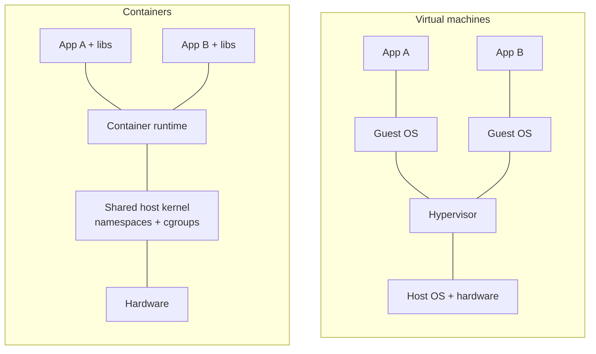
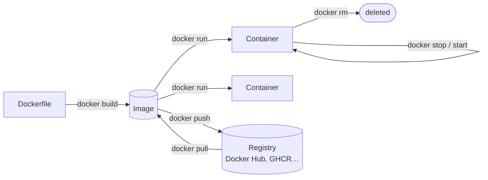

Every team eventually ships something that runs perfectly on one laptop and fails everywhere else. A different Node version, a missing system library, an environment variable someone set by hand two years ago. The code was fine; the **environment** wasn't part of what you shipped.

Docker's answer is to ship the environment too. You describe everything your program needs in a file, build it into an **image**, and run that image as a **container** on any machine with Docker installed. The same image runs on your laptop, in CI and in production.

This chapter covers the core ideas and the commands you'll use every day, then packages a small web service from an empty directory.

## Containers are not small virtual machines

A virtual machine emulates a whole computer: virtual hardware, its own kernel, its own boot process. That's strong isolation, but every VM carries a full operating system, takes seconds to minutes to start, and reserves memory whether it uses it or not.

A container is something much lighter: **an ordinary process on the host**, which the Linux kernel fences off from everything else.

- **Namespaces** give the process its own view of the system: its own process list (it believes it's PID 1), its own network interfaces, its own hostname and its own filesystem root.
- **cgroups** limit what it can consume: CPU, memory, I/O.
- The **image** supplies the filesystem it sees: an OS userland (Alpine, Debian…), your runtime, your code.



Because there's no guest kernel to boot, a container starts in well under a second and uses only the memory its process actually uses. The trade-off is that all containers share the host's kernel. That's why Linux containers need a Linux kernel: on macOS and Windows, Docker Desktop runs a small Linux VM behind the scenes.

## Installing Docker

- **Linux**: install **Docker Engine** from Docker's own repository ([Ubuntu](https://docs.docker.com/engine/install/ubuntu/), [Debian](https://docs.docker.com/engine/install/debian/), [Fedora](https://docs.docker.com/engine/install/fedora/), [others](https://docs.docker.com/engine/install/)). Distribution packages named `docker.io` often lag behind.
- **macOS and Windows**: install [Docker Desktop](https://docs.docker.com/desktop/). It's free for personal use, education and small businesses; larger companies need a paid subscription. Colima (macOS) and Rancher Desktop are free alternatives.

Check that the client can talk to the daemon:

```bash
docker version     # prints both Client and Server sections if all is well
docker run hello-world
```

`docker` is only a client: it sends requests to the **Docker daemon** (`dockerd`), which does the actual work. If `docker version` prints the client but errors on the server, the daemon isn't running: `sudo systemctl start docker` on Linux, or start Docker Desktop.

On Linux you can skip typing `sudo` by adding yourself to the `docker` group (`sudo usermod -aG docker $USER`, then log out and back in). Be aware that this group is effectively root on the host, since anyone in it can start a container that mounts `/`. Only do it on machines you control.

## Images and containers

These two words carry the whole model:

- An **image** is a read-only template: a filesystem plus metadata (which command to run, which port it listens on). It's built in **layers**, one per build step, and layers are shared between images.
- A **container** is a running (or stopped) instance of an image, with a thin writable layer on top. You can start many containers from one image.

The relationship between them, and the commands that move between them:



Try it with an image someone else built:

```bash
docker run -it --rm ubuntu bash
```

- **`run`**: create a container from an image and start it, pulling the image first if it isn't on your machine.
- **`-it`**: `-i` keeps standard input open and `-t` gives it a terminal, so you get an interactive shell.
- **`--rm`**: delete the container when it exits, so it doesn't pile up.
- **`ubuntu`**: the image (`ubuntu:latest` from Docker Hub).
- **`bash`**: the command to run inside it, instead of the image's default.

Inside, look around: `ps aux` shows only your shell (PID 1), `hostname` prints a random ID, and `cat /etc/os-release` says Ubuntu even if your host runs Fedora. Type `exit` and the container is gone. That's the isolation from the diagram above.

## Building your own image

Let's package a small web service. Create an empty directory with three files.

**`server.js`**: a web server that reports which container answered:

```javascript
const express = require("express");
const os = require("os");

const app = express();
const port = process.env.PORT || 3000;

app.get("/", (req, res) => {
  res.send(`Hello from ${os.hostname()}\n`);
});

app.listen(port, () => console.log(`listening on port ${port}`));
```

**`package.json`**:

```json
{
  "name": "hello-docker",
  "version": "1.0.0",
  "main": "server.js",
  "dependencies": {
    "express": "^5.1.0"
  }
}
```

**`Dockerfile`**: the recipe for the image:

```dockerfile
FROM node:22-alpine

WORKDIR /app

COPY package*.json ./
RUN npm install --omit=dev

COPY . .

ENV PORT=3000
EXPOSE 3000

USER node
CMD ["node", "server.js"]
```

### The Dockerfile, line by line

- **`FROM node:22-alpine`**: start from the official Node.js 22 image built on Alpine Linux, a very small distribution. Every image starts from another image (or from the empty `scratch`).
- **`WORKDIR /app`**: create `/app` and make it the current directory for every instruction that follows, and for the running container.
- **`COPY package*.json ./`**: copy *only* the dependency manifest first…
- **`RUN npm install --omit=dev`**: …then install dependencies. `RUN` executes at **build time**, and its result is saved as a layer. `--omit=dev` skips development-only packages.
- **`COPY . .`**: now copy the rest of the source code.
- **`ENV PORT=3000`**: an environment variable baked into the image; `server.js` reads it.
- **`EXPOSE 3000`**: documents the port the app listens on. It doesn't publish anything by itself.
- **`USER node`**: run as the unprivileged `node` user the base image provides, instead of root.
- **`CMD ["node", "server.js"]`**: the default command when a container starts. Unlike `RUN`, it executes at **run time**.

**Why copy `package.json` separately?** Docker caches each layer and reuses it until something it depends on changes. Because dependencies are installed before the source is copied, editing `server.js` only invalidates the last `COPY`; the slow `npm install` layer is reused and rebuilds take a second or two. Copy everything first and every one-line change reinstalls every dependency.

**Why `CMD ["node", "server.js"]` and not `CMD node server.js`?** The JSON-array ("exec") form runs `node` directly as the container's main process. The plain-string form wraps it in `/bin/sh -c`, and the shell doesn't forward signals, so `docker stop` can't shut your app down gracefully and falls back to killing it after ten seconds.

Also add a **`.dockerignore`**, which works like `.gitignore` for the build:

```text
node_modules
npm-debug.log
.git
```

Without it, `COPY . .` would copy your local `node_modules` (built for your OS, not Alpine) into the image over the ones `npm install` just built, along with your whole Git history.

### Build it

```bash
docker build -t hello-docker:1.0 .
```

- **`-t hello-docker:1.0`**: name (`hello-docker`) and tag (`1.0`) the image. Without a tag, Docker uses `latest`.
- **`.`**: the **build context**, the directory whose files the Dockerfile's `COPY` can see (here, the current one).

`docker image ls` now lists it. Change a line in `server.js` and build again: watch the output report `CACHED` for every step up to the final `COPY`.

## Running it

```bash
docker run -d --name web -p 8080:3000 hello-docker:1.0
curl http://localhost:8080
# Hello from 3f9c1b2a7d44
```

- **`-d`**: detached, so it runs in the background and prints the container ID.
- **`--name web`**: a name to use instead of that ID.
- **`-p 8080:3000`**: publish the port, `host:container`. Requests to port 8080 on your machine are forwarded to port 3000 inside the container. Without `-p` the service is only reachable from other containers.

The hostname in the response is the container's ID: the process really does have its own view of the system. Start a second one on another host port and you'll get a different hostname:

```bash
docker run -d --name web2 -p 8081:3000 hello-docker:1.0
curl http://localhost:8081
```

## Looking inside and cleaning up

```bash
docker ps                      # running containers (add -a to include stopped ones)
docker logs -f web             # the app's stdout/stderr; -f follows like tail -f
docker exec -it web sh         # open a shell in the running container
docker stop web web2           # graceful: SIGTERM, then SIGKILL after 10s
docker start web               # start a stopped container again, same state
docker rm -f web web2          # remove (-f stops them first)
```

A few things worth knowing:

- **Stopped containers still exist** and keep their writable layer until you `docker rm` them. `docker ps -a` shows them all; `--rm` on `docker run` removes the container automatically when it exits.
- **`docker exec`** runs an *additional* process in an already-running container. It's how you debug. Alpine images have `sh`, not `bash`.
- **Anything written inside a container is lost when it's removed.** Data that must survive, such as databases and uploads, goes in **volumes**, which later chapters use heavily.
- `docker system df` shows how much disk images, containers and volumes use; `docker system prune` removes stopped containers, unused networks and dangling images. Read the prompt before confirming.

## Sharing it

Images are shared through a **registry**. Docker Hub is the default; GitHub Container Registry, GitLab and every cloud provider run their own.

```bash
docker login                                         # Docker Hub; pass a hostname for others
docker tag hello-docker:1.0 yourname/hello-docker:1.0
docker push yourname/hello-docker:1.0
```

- **`docker tag`** adds a second name to the same image. Registry images are named `registry/namespace/repository:tag`; for Docker Hub the registry part is implied, so `yourname/hello-docker` is enough.
- **`docker push`** uploads only the layers the registry doesn't already have. Push a new version and only your code layer goes up; the Node base layers are already there.

Anyone can now run your service with a single `docker run yourname/hello-docker:1.0`, with no Node.js installed and no `npm install`, on any machine with Docker.

## What to remember

- An **image** is the packaged environment; a **container** is a process running from it.
- Containers are isolated processes sharing the host kernel, not virtual machines.
- `RUN` happens when you **build**, `CMD` when you **run**.
- Order Dockerfile steps from least to most frequently changing, so the cache does its job.
- Containers are disposable. Anything worth keeping lives in a volume, or in the image.

[Chapter 1.2]() goes deeper into day-to-day container management: the container lifecycle, inspecting and debugging running containers, and running your own private registry.
