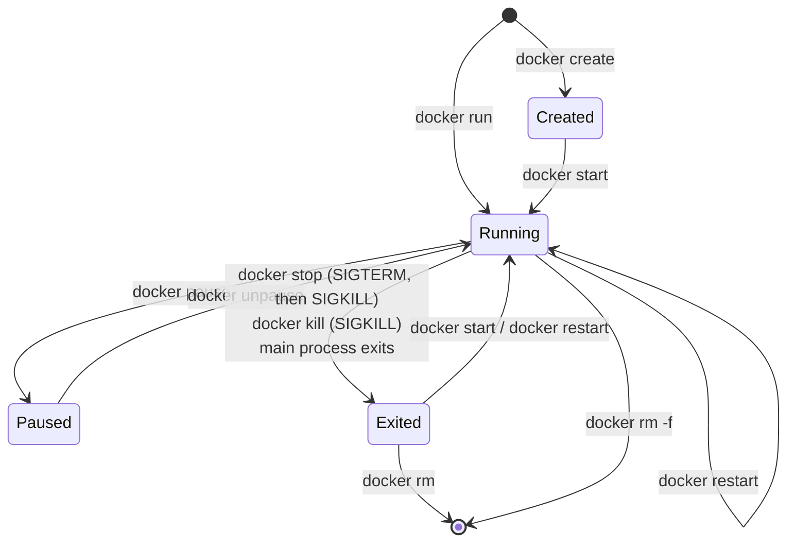

[Chapter 1.1]() built an image and ran it. This chapter is about everything that happens after `docker run`: keeping containers running, finding out why one isn't, getting files in and out, cleaning up, and storing images somewhere other than Docker Hub.

## The container lifecycle

A container moves through a small set of states, and almost every `docker` command is a transition between two of them:



Two things in that diagram surprise people:

- **A container lives exactly as long as its main process.** When the command in `CMD` exits, successfully or not, the container stops. A container that "starts and immediately exits" is a process that finished or crashed; its logs will say which.
- **Exited isn't gone.** A stopped container keeps its writable layer, its logs and its configuration until you `docker rm` it, which is why `docker start` can bring it back exactly as it was.

## `docker run` flags you'll actually use

```bash
docker run -d \
  --name api \
  -p 8080:3000 \
  -e NODE_ENV=production \
  --env-file ./api.env \
  -v api-data:/app/data \
  --restart unless-stopped \
  --memory 512m --cpus 1.5 \
  --network backend \
  yourname/api:1.4.2
```

| Flag | What it does |
|---|---|
| `-d` | Run in the background; print the container ID. |
| `--name api` | A stable name for every later command, instead of the random one Docker generates. |
| `-p 8080:3000` | Publish container port 3000 on host port 8080. Add an IP to limit exposure: `-p 127.0.0.1:8080:3000`. |
| `-e KEY=value` | Set an environment variable. |
| `--env-file ./api.env` | Load many variables from a file, one `KEY=value` per line. Keeps secrets out of your shell history. |
| `-v api-data:/app/data` | Mount a **named volume** at `/app/data`, so data survives the container. `-v /host/path:/app/data` mounts a host directory instead. |
| `--restart unless-stopped` | Restart policy, see below. |
| `--memory 512m --cpus 1.5` | cgroup limits: the container is killed if it exceeds 512 MB and can use at most 1.5 CPU cores. |
| `--network backend` | Attach to a user-defined network, where containers reach each other by name ([Chapter 1.8]()). |
| `--rm` | Delete the container when it exits. Ideal for one-off commands; it works together with `-d`. |

**Restart policies** decide what Docker does when the main process exits or the daemon restarts:

| Policy | Restarts after a crash | Restarts after a daemon restart / reboot |
|---|---|---|
| `no` (default) | no | no |
| `on-failure[:5]` | yes, on non-zero exit (optionally at most 5 times) | depends on how it last exited; don't rely on it |
| `always` | yes | yes, **even if you had stopped it by hand** |
| `unless-stopped` | yes | yes, unless you stopped it by hand |

`unless-stopped` is what you usually want for services. Policies can be changed on an existing container without recreating it: `docker update --restart unless-stopped api`.

## Seeing what's going on

### Which containers exist


```bash
docker ps                                  # running
docker ps -a                               # including stopped
docker ps -a --filter status=exited        # only the stopped ones
docker ps --format "table {{.Names}}\t{{.Status}}\t{{.Ports}}"
```


`--format` takes a Go template over each container's fields. The example above prints a compact name/status/ports table, which is easier to scan than the default output when you run many containers.

### What it printed

```bash
docker logs api                    # everything the main process wrote to stdout/stderr
docker logs -f --tail 100 api      # last 100 lines, then keep following
docker logs --since 10m api        # only the last ten minutes
```

Docker captures a container's standard output and error. That's why well-behaved container apps log to stdout instead of to files: `docker logs`, and every log collector built on top of it, only sees stdout and stderr.

### How it's configured


```bash
docker inspect api                                          # full JSON: config, mounts, network, state
docker inspect -f '{{.State.Status}} {{.State.ExitCode}}' api
docker inspect -f '{{.NetworkSettings.Networks.backend.IPAddress}}' api
docker inspect -f '{{json .Mounts}}' api
```


`docker inspect` is the source of truth for "what did I actually start?" The `-f` templates pull out single fields:

- `.State.Status` and `.State.ExitCode`: why a container stopped. Exit code `137` means it was killed with SIGKILL, very often by the kernel for exceeding its memory limit (`.State.OOMKilled` is then `true`). `143` means it exited on SIGTERM.
- `.NetworkSettings.Networks.<network>.IPAddress`: its address on a given network.
- `json .Mounts`: which volumes and host paths are mounted where.

### What it's using

```bash
docker stats              # live CPU, memory, network and disk I/O per container
docker top api            # processes inside the container, as seen from the host
docker events             # a live feed of container starts, stops, OOM kills…
```

## Getting inside

```bash
docker exec -it api sh              # a shell in the running container (bash on Debian-based images)
docker exec api env                 # run a single command and print its output
docker exec -u root -it api sh      # as root, e.g. to install a debugging tool temporarily
```

`docker exec` starts an **additional** process inside a running container. It's the standard way in, and it doesn't disturb the main process. You'll also come across `docker attach`, which connects your terminal to the container's *main* process: pressing Ctrl+C there sends the signal to your app and can stop the container. For debugging, use `exec`.

Minimal images often have no shell at all (see [Chapter 1.12]()). For those, `docker debug` (Docker Desktop) or a throwaway container sharing its namespaces gives you tools without changing the image:

```bash
docker run -it --rm --network container:api --pid container:api busybox sh
```

- `--network container:api`: share the target's network stack, so `localhost` is the app.
- `--pid container:api`: share its process list, so `ps` shows the app's processes.

### Copying files in and out

```bash
docker cp api:/app/logs/error.log .          # container → host
docker cp ./fixture.json api:/app/data/      # host → container
```

`docker cp` works on stopped containers too, which is handy for pulling logs or crash dumps out of something that won't start.

## Changing containers (and why you mostly shouldn't)

```bash
docker rename api api-old
docker update --memory 1g --restart unless-stopped api
docker commit api yourname/api:debug-snapshot
```

`docker commit` saves a container's current filesystem as a new image. It's useful for capturing a broken state to investigate later, but don't build images this way: nobody can see or reproduce what went into a committed image. Change the Dockerfile and rebuild instead.

## Keeping disk usage under control

Images, stopped containers, unused volumes and build cache accumulate quickly on a build machine.

```bash
docker system df                 # what's using space, and how much is reclaimable
docker container prune           # remove all stopped containers
docker image prune               # remove dangling images (untagged leftovers from rebuilds)
docker image prune -a            # remove every image not used by a container
docker builder prune             # clear the build cache
docker volume prune              # remove unused volumes (this deletes data)
docker system prune              # containers + networks + dangling images in one go
```

Everything except the first command asks for confirmation. Read the prompt, especially for `volume prune`: a volume that isn't attached to a container *right now* may still hold a database you care about.

## Running your own registry

Docker Hub works until you need private images without a subscription, a machine without internet access, or faster pulls inside your own network. Docker publishes a registry server as an image:

```bash
docker run -d --name registry \
  -p 5000:5000 \
  -v registry-data:/var/lib/registry \
  --restart unless-stopped \
  registry:2
```

- **`-p 5000:5000`**: the registry's HTTP API.
- **`-v registry-data:/var/lib/registry`**: the images themselves, kept in a volume so they survive the container.
- **`registry:2`**: the official registry server, latest 2.x release.

`curl http://localhost:5000/v2/` answers `{}` when it's up. Pushing an image there is just a matter of naming it with the registry's address:

```bash
docker tag hello-docker:1.0 localhost:5000/hello-docker:1.0
docker push localhost:5000/hello-docker:1.0
curl http://localhost:5000/v2/_catalog        # {"repositories":["hello-docker"]}
```

### Using it from other machines

Docker only speaks HTTPS to registries, with one exception: addresses on `127.0.0.0/8`, which is why `localhost:5000` worked above. From another machine, `docker push 192.168.1.10:5000/hello-docker:1.0` fails with `http: server gave HTTP response to HTTPS client`. There are two fixes:

1. **Put TLS in front of it** (Nginx with a real certificate, [Chapter 1.3]()), or run the registry with its own certificate. This is the right answer for anything shared.
2. **For a lab network only**, tell each client's daemon to accept plain HTTP for that one address. On Linux, edit `/etc/docker/daemon.json`; in Docker Desktop, go to **Settings → Docker Engine**:

```json
{
  "insecure-registries": ["192.168.1.10:5000"]
}
```

Then restart the daemon (`sudo systemctl restart docker`). Note that this registry has **no authentication**: anyone who can reach port 5000 can push and pull. Add `htpasswd` auth (see the registry docs) or, for a team, run **Harbor**, which adds users, projects, vulnerability scanning and replication on top.

## Talking to the daemon directly

The `docker` CLI is a client for the daemon's REST API, which listens on a Unix socket by default. You can call it yourself:

```bash
curl --unix-socket /var/run/docker.sock http://localhost/containers/json
```

That returns the same data as `docker ps`, as JSON, which is useful in scripts and monitoring tools.

Old tutorials often expose this API over TCP with `-H tcp://0.0.0.0:2375`. **Don't.** An unauthenticated Docker API on the network is full root access to the host for anyone who can reach it, and it's one of the most scanned-for ports on the internet. To manage a remote host, use SSH instead, which needs no daemon changes at all ([Chapter 1.10]()):

```bash
docker -H ssh://deploy@203.0.113.10 ps
```

## The errors you'll hit first

| Error | What it means | Fix |
|---|---|---|
| `port is already allocated` | Something on the host already uses that port. | `ss -tulpn \| grep 8080` to find it, or publish a different host port. |
| `Conflict. The container name "/api" is already in use` | A stopped container still has that name. | `docker rm api`, or `docker start api` if you wanted it back. |
| Container exits immediately | The main process finished or crashed. | `docker logs api`; `docker inspect -f` for the exit code. |
| Exit code `137` | Killed with SIGKILL, often out of memory. | Check `.State.OOMKilled`; raise `--memory` or fix the leak. |
| `permission denied ... docker.sock` | Your user can't reach the daemon. | Use `sudo`, or join the `docker` group (root-equivalent). |
| `no space left on device` | Images, cache or volumes filled the disk. | `docker system df`, then the prune commands above. |
| `manifest unknown` / `not found` on pull | The tag doesn't exist, or you're not logged in to that registry. | Check the tag on the registry; `docker login`. |

[Chapter 1.3]() puts these pieces to work on a real service: Nginx serving a site over HTTPS, with its configuration and certificates mounted from the host.
