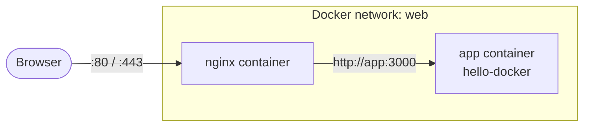
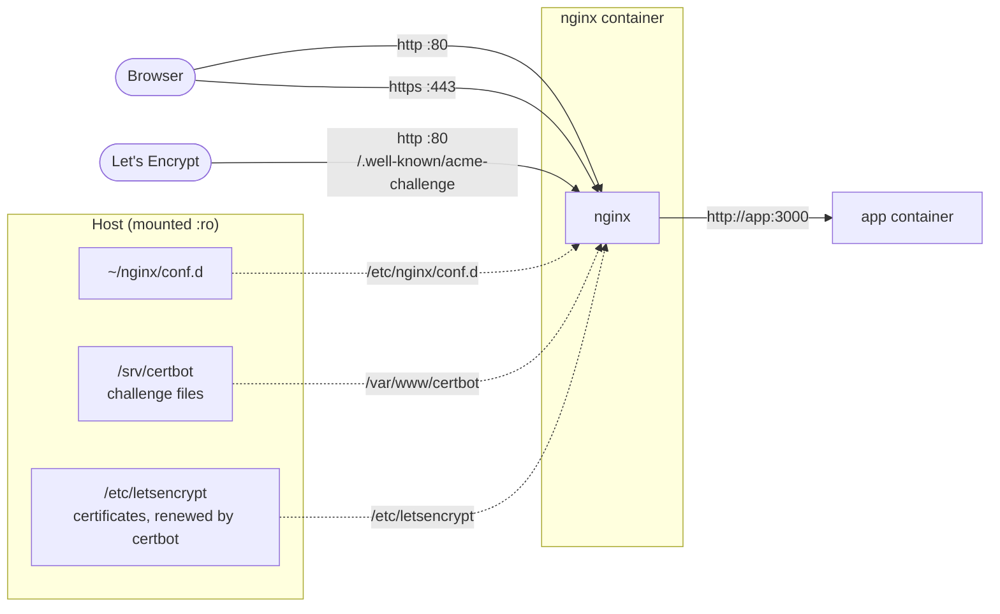

Nginx is usually the first thing a request meets: it serves static files, forwards everything else to your application, and handles TLS so your app doesn't have to. It's also a very good first "real" container, because it shows the pattern almost every service follows: **the image stays stock, and everything specific to you (config, content, certificates) is mounted in from the host.**

We'll build up in three steps: a static site, a reverse proxy in front of the app from [Chapter 1.1](), then HTTPS.

## Step 0: stock Nginx

```bash
docker run -d --name web -p 8080:80 nginx:1.27
curl -I http://localhost:8080
```

`HTTP/1.1 200 OK` and the Nginx welcome page. Pin a version tag (`nginx:1.27`) rather than `latest`, so a routine pull doesn't upgrade your web server under you.

Two things the official image does that you'll rely on:

- **Logs go to stdout/stderr.** `/var/log/nginx/access.log` and `error.log` are symlinks to them, so `docker logs web` shows every request.
- **Config is modular.** The main `/etc/nginx/nginx.conf` includes every file in `/etc/nginx/conf.d/*.conf`. You almost never touch the main file; you add or replace files in `conf.d`.

`docker rm -f web` when you're done looking.

## Step 1: serving a static site

Put your site in a directory, for example `~/site/index.html`, and mount it over Nginx's default web root:

```bash
docker run -d --name web \
  -p 8080:80 \
  -v ~/site:/usr/share/nginx/html:ro \
  nginx:1.27
```

- **`-v ~/site:/usr/share/nginx/html`**: a **bind mount**. The container's web root *is* your host directory, so edits to `index.html` show up on the next request with no rebuild or restart.
- **`:ro`**: read-only inside the container. Nginx only needs to read the files, and a compromised web server then can't modify your site.

## Step 2: a reverse proxy in front of an app

Now the more common setup: Nginx in front, the application behind it, never exposed directly.



Create a network and start the app on it, **without** publishing its port:

```bash
docker network create web
docker run -d --name app --network web hello-docker:1.0
```

On a user-defined network, containers reach each other by name through Docker's built-in DNS: from the Nginx container, `app` resolves to the app container's IP. Because the app publishes no port, the only way in is through Nginx. (Networks get a full chapter in [1.8]().)

Write the proxy config to `~/nginx/conf.d/default.conf`:

```nginx
server {
    listen 80;
    server_name _;

    location / {
        proxy_pass http://app:3000;

        proxy_set_header Host              $host;
        proxy_set_header X-Real-IP         $remote_addr;
        proxy_set_header X-Forwarded-For   $proxy_add_x_forwarded_for;
        proxy_set_header X-Forwarded-Proto $scheme;
    }
}
```

What each part does:

- **`listen 80`**: accept plain HTTP on port 80 inside the container.
- **`server_name _`**: a catch-all; this block answers for any hostname. With several sites you'd list real names instead.
- **`location /`**: applies to every path.
- **`proxy_pass http://app:3000`**: forward the request to the `app` container on port 3000, resolved by Docker's DNS.
- **`proxy_set_header ...`**: without these, your app would see every request as coming *from Nginx*. They pass along the original `Host` header, the client's real IP (`X-Real-IP`, `X-Forwarded-For`) and whether the client used HTTP or HTTPS (`X-Forwarded-Proto`), which your app needs to build correct redirect URLs.

Run Nginx on the same network with that directory mounted over `conf.d`:

```bash
docker run -d --name proxy \
  --network web \
  -p 8080:80 \
  -v ~/nginx/conf.d:/etc/nginx/conf.d:ro \
  nginx:1.27

curl http://localhost:8080
# Hello from 9b1e4c3a0f12   (the app container's hostname)
```

## Step 3: HTTPS with Let's Encrypt

For a public site you need a domain pointing at your server and a certificate. Let's Encrypt issues free certificates through `certbot`, which proves you control the domain by placing a file that Let's Encrypt then fetches over plain HTTP at `http://your-domain/.well-known/acme-challenge/...`.

The layout keeps everything on the host and mounts it into the container read-only:



### 3a. Serve the challenge directory over HTTP

Replace `default.conf` with a port-80 block that answers challenges and redirects everything else to HTTPS:

```nginx
server {
    listen 80;
    server_name example.com www.example.com;

    # Let's Encrypt fetches proof-of-control files from here
    location /.well-known/acme-challenge/ {
        root /var/www/certbot;
    }

    # Everything else moves to HTTPS
    location / {
        return 301 https://$host$request_uri;
    }
}
```

- **`location /.well-known/acme-challenge/`** with **`root /var/www/certbot`**: requests under that path are served from the challenge directory, which we'll mount from the host.
- **`return 301 https://$host$request_uri`**: a permanent redirect to the same host and path over HTTPS. Plain HTTP serves nothing else.

Start Nginx with the challenge directory mounted:

```bash
sudo mkdir -p /srv/certbot
docker rm -f proxy
docker run -d --name proxy \
  --network web \
  --restart unless-stopped \
  -p 80:80 -p 443:443 \
  -v ~/nginx/conf.d:/etc/nginx/conf.d:ro \
  -v /srv/certbot:/var/www/certbot:ro \
  -v /etc/letsencrypt:/etc/letsencrypt:ro \
  nginx:1.27
```

Mount the whole `/etc/letsencrypt` directory, not just `live/`: the files in `live/` are symlinks into `archive/`, and they'd dangle inside the container without it.

### 3b. Get the certificate

Install certbot on the host (`sudo apt install certbot`), then:

```bash
sudo certbot certonly --webroot -w /srv/certbot \
  -d example.com -d www.example.com \
  --email you@example.com --agree-tos
```

- **`certonly`**: obtain the certificate, but don't try to edit any web server config; we manage Nginx ourselves.
- **`--webroot -w /srv/certbot`**: write the challenge file into `/srv/certbot`, which Nginx serves from step 3a.
- **`-d`**: every hostname the certificate should cover.

The certificate and key land in `/etc/letsencrypt/live/example.com/`, which the container can already see.

### 3c. Add the HTTPS server

Append a second block to `default.conf`:

```nginx
server {
    listen 443 ssl;
    http2 on;
    server_name example.com www.example.com;

    ssl_certificate     /etc/letsencrypt/live/example.com/fullchain.pem;
    ssl_certificate_key /etc/letsencrypt/live/example.com/privkey.pem;
    ssl_protocols       TLSv1.2 TLSv1.3;

    location / {
        proxy_pass http://app:3000;
        proxy_set_header Host              $host;
        proxy_set_header X-Real-IP         $remote_addr;
        proxy_set_header X-Forwarded-For   $proxy_add_x_forwarded_for;
        proxy_set_header X-Forwarded-Proto $scheme;
    }
}
```

- **`listen 443 ssl`** and **`http2 on`**: TLS on port 443, with HTTP/2 enabled. (`http2 on` is the current syntax; older guides put `http2` on the `listen` line.)
- **`ssl_certificate`**: `fullchain.pem` is your certificate *plus* the intermediate certificates; browsers need the full chain.
- **`ssl_certificate_key`**: the private key. It never leaves the host, and it's mounted read-only.
- **`ssl_protocols TLSv1.2 TLSv1.3`**: refuse the old, broken protocol versions.
- **`location /`**: the same proxy settings as before, now reached over HTTPS.

Test the config, then reload it without dropping connections:

```bash
docker exec proxy nginx -t          # syntax check; fix anything it reports first
docker exec proxy nginx -s reload   # apply without restarting the container
```

### 3d. Renewal

Let's Encrypt certificates last 90 days. The certbot package installs a timer that renews them automatically; Nginx only needs to reload afterwards to pick up the new files. Certbot runs every executable script in its deploy-hooks directory after a successful renewal, so add one:

```bash
sudo tee /etc/letsencrypt/renewal-hooks/deploy/reload-nginx.sh > /dev/null <<'EOF'
#!/bin/sh
docker exec proxy nginx -s reload
EOF
sudo chmod +x /etc/letsencrypt/renewal-hooks/deploy/reload-nginx.sh

sudo certbot renew --dry-run
```

- **`tee ... <<'EOF'`**: write the script as root (a plain `>` redirect would run as your user and fail on a root-owned directory).
- **`deploy/`**: hooks here run only when a certificate was actually renewed, not on every check.
- **`--dry-run`**: rehearses a full renewal against Let's Encrypt's staging server without replacing your certificate. If it passes, real renewals will too, and each one reloads Nginx on its own.

## Day-to-day commands

```bash
docker logs -f proxy                 # access and error log, live
docker exec proxy nginx -t           # validate config after editing
docker exec proxy nginx -s reload    # apply it
docker exec -it proxy sh             # look around inside (Debian-based image: bash works too)
```

Because the config, content and certificates all live on the host, upgrading Nginx is just a matter of pulling the new tag and recreating the container with the same `docker run` line. Nothing inside the old container needs saving. Typing those long `docker run` commands by hand gets old quickly, though; [Chapter 1.9]() moves this whole setup into a Compose file.

[Chapter 1.4]() runs a service with more moving parts: Jenkins, building and deploying projects inside containers of its own.
