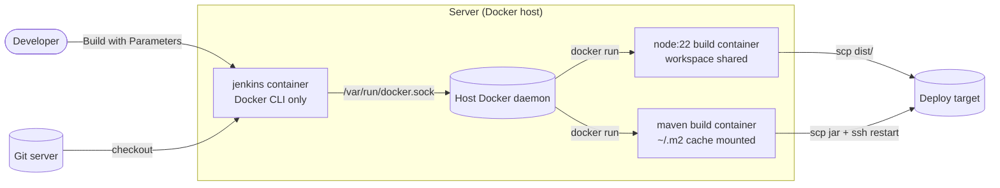

A long-lived Jenkins server tends to accumulate things: three Node versions, two JDKs, a Maven someone upgraded by hand. Builds start depending on whatever happens to be installed, and nobody dares touch the machine.

Docker removes that problem at both ends:

- **Jenkins itself runs in a container**, with its state in a volume. Upgrading means pulling a new image.
- **Every build runs in a fresh container** of whatever toolchain the project asks for: `node:22` for one job, `maven:3.9` for the next. Nothing is installed on the server, and two projects can use different versions side by side.

## How the pieces fit

The Jenkins container doesn't run Docker *inside* itself. It gets the host's Docker socket mounted in, so when a pipeline asks for a `node:22` container, the host's daemon starts it as a **sibling** of Jenkins:



**A security note before you start.** Access to the Docker socket is root access to the host: anything that can talk to it can start a privileged container that mounts `/`. Mounting it into Jenkins means that anyone who can edit a Jenkinsfile, or log in to Jenkins, effectively has root on this server. That's acceptable for a team's own build box; it's not acceptable on a machine shared with things you need to protect. The alternative is dedicated build agents, where the controller never touches Docker itself.

## 1. A Jenkins image with the Docker CLI

The official image doesn't include the `docker` command, and the plugins we need have to be installed. Create a `Dockerfile`:

```dockerfile
FROM jenkins/jenkins:lts-jdk21

USER root

# Docker CLI only (no daemon): the static binary from download.docker.com
ARG DOCKER_VERSION=27.3.1
RUN curl -fsSL "https://download.docker.com/linux/static/stable/x86_64/docker-${DOCKER_VERSION}.tgz" \
    | tar -xz --strip-components=1 -C /usr/local/bin docker/docker

# The socket belongs to the host's "docker" group. The same GID inside the
# image lets the jenkins user use it without being root.
ARG DOCKER_GID=999
RUN (getent group ${DOCKER_GID} || groupadd -g ${DOCKER_GID} docker) \
    && usermod -aG ${DOCKER_GID} jenkins

USER jenkins

# Plugins baked into the image, so a rebuilt container comes up ready
RUN jenkins-plugin-cli --plugins \
    workflow-aggregator \
    docker-workflow \
    git \
    credentials-binding \
    ssh-credentials \
    junit
```

Line by line:

- **`FROM jenkins/jenkins:lts-jdk21`**: the Long-Term Support line on Java 21. LTS releases are the ones to run in production; weekly releases change too often.
- **`USER root`**: package-level changes need root; we switch back afterwards.
- **`ARG DOCKER_VERSION` + `RUN curl … | tar`**: download Docker's static binaries and extract only the `docker` client into `/usr/local/bin`. `--strip-components=1` drops the `docker/` directory prefix from the archive. Keep the CLI version close to the host's daemon version.
- **`ARG DOCKER_GID` + `groupadd`/`usermod`**: this is the step most setups get wrong. On the host, `/var/run/docker.sock` is owned by the group `docker` with some numeric ID (often 999, but it varies). File permissions are checked by *number*, so the jenkins user must belong to a group with that same GID or every build fails with `permission denied … docker.sock`. `getent group ${DOCKER_GID} || groupadd …` creates the group only if no group in the image already has that number; `usermod -aG` accepts the number either way.
- **`USER jenkins`**: Jenkins runs unprivileged, as in the official image.
- **`jenkins-plugin-cli --plugins …`**: installs plugins at build time. `workflow-aggregator` is Pipeline itself, `docker-workflow` lets pipelines run in containers, `credentials-binding` and `ssh-credentials` handle secrets, and `junit` publishes test reports.

Build it with the host's docker GID:

```bash
docker build \
  --build-arg DOCKER_GID="$(getent group docker | cut -d: -f3)" \
  -t my-jenkins:lts-jdk21 .
```

`getent group docker` prints `docker:x:999:…`; `cut -d: -f3` takes the third colon-separated field, the GID. Run this on the server that will host Jenkins, or pass that server's number.

## 2. Run it with Compose

Save as `compose.yml` next to the Dockerfile:

```yaml
services:
  jenkins:
    image: my-jenkins:lts-jdk21
    restart: unless-stopped
    ports:
      - "8086:8080"
    volumes:
      - jenkins_home:/var/jenkins_home
      - /var/run/docker.sock:/var/run/docker.sock

volumes:
  jenkins_home:
```

- **`ports: "8086:8080"`**: the web UI on host port 8086. Port 50000, which you'll see in other guides, is only for inbound agents; this setup doesn't use any.
- **`jenkins_home:/var/jenkins_home`**: *all* Jenkins state (jobs, build history, credentials, plugins) lives here. Back up this volume and you've backed up Jenkins.
- **`/var/run/docker.sock:/var/run/docker.sock`**: the host's Docker socket, as discussed above.
- **`restart: unless-stopped`**: come back after reboots.

```bash
docker compose up -d
docker compose logs -f jenkins          # wait for "Jenkins is fully up and running"
docker compose exec jenkins cat /var/jenkins_home/secrets/initialAdminPassword
```

Open `http://your-server:8086`, paste the initial admin password, choose **Install suggested plugins**, and create your admin user. To check the Docker wiring, run `docker compose exec jenkins docker ps`: it should list the Jenkins container itself.

`docker compose down` stops and removes the container but **keeps** the `jenkins_home` volume; only `down -v` deletes it.

## 3. Credentials

Deployments need an SSH key that the target server accepts. Generate a dedicated one, never your personal key:

```bash
ssh-keygen -t ed25519 -f jenkins_deploy -C "jenkins deploy" -N ""
ssh-copy-id -i jenkins_deploy.pub deploy@203.0.113.20
```

- **`-f jenkins_deploy`**: write the pair to `jenkins_deploy` and `jenkins_deploy.pub`.
- **`-N ""`**: no passphrase, since Jenkins has to use it unattended; protect it through Jenkins' credential store instead.
- **`ssh-copy-id`**: appends the public key to the `deploy` user's `authorized_keys` on the target.

In Jenkins, go to **Manage Jenkins → Credentials → (global) → Add Credentials**, choose **SSH Username with private key**, set the ID to `deploy-key`, the username to `deploy`, and paste the contents of `jenkins_deploy`. Add your Git credentials the same way if the repositories are private. Then delete the private key file from wherever you generated it.

## 4. A Node.js pipeline

Create a **Pipeline** job, set **Definition** to **Pipeline script from SCM**, point it at the application's repository, and commit this as `Jenkinsfile` in that repository:

```groovy
pipeline {
    agent {
        docker {
            image 'node:22'
            args '-v /var/cache/jenkins-npm:/tmp/npm-cache'
        }
    }

    parameters {
        choice(name: 'TARGET', choices: ['staging', 'production'], description: 'Where to deploy')
    }

    environment {
        DEPLOY_DIR = '/var/www/shop'
    }

    stages {
        stage('Install') {
            steps {
                sh 'npm ci --cache /tmp/npm-cache'
            }
        }
        stage('Test') {
            steps {
                sh 'npm test'
            }
        }
        stage('Build') {
            steps {
                sh 'npm run build'
            }
        }
        stage('Deploy') {
            steps {
                script {
                    env.DEPLOY_HOST = params.TARGET == 'production' ? '203.0.113.20' : '203.0.113.21'
                }
                withCredentials([sshUserPrivateKey(credentialsId: 'deploy-key',
                                                   keyFileVariable: 'SSH_KEY',
                                                   usernameVariable: 'SSH_USER')]) {
                    sh '''
                        ssh -i "$SSH_KEY" -o StrictHostKeyChecking=accept-new \
                            "$SSH_USER@$DEPLOY_HOST" "rm -rf $DEPLOY_DIR/next && mkdir -p $DEPLOY_DIR/next"
                        scp -i "$SSH_KEY" -o StrictHostKeyChecking=accept-new -r dist/. \
                            "$SSH_USER@$DEPLOY_HOST:$DEPLOY_DIR/next/"
                        ssh -i "$SSH_KEY" "$SSH_USER@$DEPLOY_HOST" \
                            "rm -rf $DEPLOY_DIR/previous; mv $DEPLOY_DIR/current $DEPLOY_DIR/previous 2>/dev/null; mv $DEPLOY_DIR/next $DEPLOY_DIR/current"
                    '''
                }
            }
        }
    }

    post {
        success { echo "Deployed to ${params.TARGET}" }
        failure { echo 'Build failed; check the stage logs above' }
    }
}
```

Block by block:

- **`agent { docker { image 'node:22' … } }`**: run the whole pipeline inside a `node:22` container. Jenkins checks out the repository first and shares the workspace with the container (when Jenkins itself runs in a container, the plugin does this with `--volumes-from`), so `npm` sees your code.
- **`args '-v /var/cache/jenkins-npm:/tmp/npm-cache'`**: extra `docker run` arguments. **The left side is a path on the Docker host**, not inside the Jenkins container, because it's the host's daemon that starts the build container. Create it once on the server with `sudo mkdir -p /var/cache/jenkins-npm && sudo chown 1000:1000 /var/cache/jenkins-npm`: builds run as Jenkins' user ID, 1000.
- **`parameters { choice(...) }`**: adds a **Build with Parameters** dropdown. Jenkins registers parameters on the first run, so that run uses the defaults.
- **`environment { DEPLOY_DIR = … }`**: variables available to every `sh` step.
- **`npm ci --cache /tmp/npm-cache`**: install exactly what `package-lock.json` specifies, with downloads cached on the host between builds.
- **`stage('Test')`**: a failing command fails the stage, and the pipeline stops before anything is deployed.
- **`script { env.DEPLOY_HOST = … }`**: a bit of Groovy to pick the target host from the parameter.
- **`withCredentials([sshUserPrivateKey(...)])`**: writes the `deploy-key` credential to a temporary file for the duration of the block and exposes its path as `$SSH_KEY` and the username as `$SSH_USER`. The key is masked in the log and deleted afterwards.
- **The `sh '''…'''` block**: uploads into a fresh `next/` directory, then swaps it into place, keeping the old release as `previous/`. A half-finished upload never serves traffic, and rolling back is one `mv`.
  - `StrictHostKeyChecking=accept-new` trusts a server's host key the first time and refuses if it later changes. That's safer than the common `=no`, which accepts anything, including an attacker.
  - The triple single quotes matter: Groovy doesn't interpolate `'''` strings, so `$SSH_KEY` is expanded by the shell, which keeps the secret out of Groovy and out of the logs.
- **`post { … }`**: runs after all stages, by outcome. This is the place for chat notifications.

## 5. A Java / Maven pipeline

For Maven there's no need for a custom image: the official `maven` images bundle a JDK.

```groovy
pipeline {
    agent {
        docker {
            image 'maven:3.9-eclipse-temurin-21'
            args '-v /var/cache/jenkins-m2:/var/maven/.m2'
        }
    }

    environment {
        DEPLOY_HOST = '203.0.113.20'
        APP_DIR     = '/opt/shop-api'
    }

    stages {
        stage('Build & test') {
            steps {
                sh 'mvn -B -Dmaven.repo.local=/var/maven/.m2/repository clean package'
            }
        }
        stage('Deploy') {
            steps {
                withCredentials([sshUserPrivateKey(credentialsId: 'deploy-key',
                                                   keyFileVariable: 'SSH_KEY',
                                                   usernameVariable: 'SSH_USER')]) {
                    sh '''
                        scp -i "$SSH_KEY" -o StrictHostKeyChecking=accept-new \
                            target/shop-api.jar "$SSH_USER@$DEPLOY_HOST:$APP_DIR/shop-api.jar.new"
                        ssh -i "$SSH_KEY" "$SSH_USER@$DEPLOY_HOST" \
                            "mv $APP_DIR/shop-api.jar.new $APP_DIR/shop-api.jar && sudo systemctl restart shop-api"
                    '''
                }
            }
        }
    }

    post {
        always {
            junit allowEmptyResults: true, testResults: '**/target/surefire-reports/*.xml'
        }
    }
}
```

What's different from the Node pipeline:

- **`image 'maven:3.9-eclipse-temurin-21'`**: Maven 3.9 on the Eclipse Temurin JDK 21. Match the JDK to your project; tags exist for 17, 21 and newer.
- **`-v /var/cache/jenkins-m2:/var/maven/.m2`** plus **`-Dmaven.repo.local=…`**: keep the downloaded dependency repository on the host between builds, so each build doesn't re-download half of Maven Central. As before, the host directory must be owned by UID 1000.
- **`mvn -B`**: batch mode, with no interactive prompts and no download progress bars flooding the log.
- **`clean package`**: compile, run the unit tests, build the jar. A failing test fails the build.
- **Deploy**: upload as `.jar.new`, then rename and restart in one SSH command, so the service never starts from a half-copied file. The `deploy` user needs a narrow sudo rule for exactly that one command: `deploy ALL=(root) NOPASSWD: /usr/bin/systemctl restart shop-api`.
- **`junit …`** in `post { always }`: publish the test results even when the build fails, which is exactly when you want to see them. Jenkins then shows test trends and failure details per build.

## 6. When the server can't reach Docker Hub

Some build servers sit on networks without internet access, or with registry access blocked. Images can be carried over as files: `docker save` writes an image, with all its layers, to a tar archive, and `docker load` reads it back.

On a machine that can pull:

```bash
docker pull node:22
docker pull maven:3.9-eclipse-temurin-21
docker save -o build-images.tar node:22 maven:3.9-eclipse-temurin-21 my-jenkins:lts-jdk21
scp build-images.tar deploy@203.0.113.10:/tmp/
```

On the build server:

```bash
docker load -i /tmp/build-images.tar
docker image ls          # the images appear with their original names and tags
```

- **`docker save -o file image …`**: several images can share one archive, and layers they have in common are stored once.
- **`docker load`** restores the names and tags too, so the Jenkinsfiles don't change. Just make sure the tags match exactly what the pipelines ask for.

If you do this often, run your own registry inside the network instead ([Chapter 1.2]()) and push the images there once.

## Troubleshooting

| Symptom | Cause | Fix |
|---|---|---|
| `permission denied while trying to connect to the Docker daemon socket` | The `docker` group GID in the image doesn't match the host's. | Rebuild with `--build-arg DOCKER_GID=$(getent group docker \| cut -d: -f3)`. |
| `docker: not found` in the build log | The Jenkins image has no Docker CLI. | Use the custom image from step 1. |
| `EACCES` writing to the npm or `.m2` cache | The host cache directory isn't owned by UID 1000. | `sudo chown -R 1000:1000 /var/cache/jenkins-npm`. |
| Parameters missing on the first run | Jenkins only learns about `parameters {}` by running the pipeline once. | Run it once with the defaults. |
| `Host key verification failed` | The target's host key changed, or was never accepted. | Check that it's really your server, then update `known_hosts`. |

[Chapter 1.5]() runs the other half of a self-hosted software pipeline: GitLab, with its container registry and CI runners.
