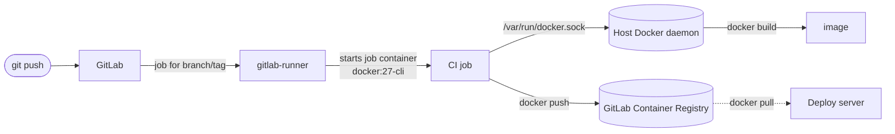
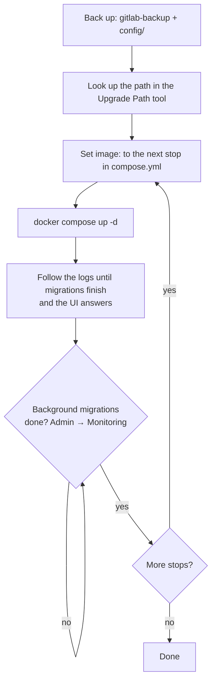

GitLab bundles Git hosting, merge requests, CI/CD and a container registry into one application. The official `gitlab/gitlab-ce` image packages all of it (Rails, PostgreSQL, Redis, Gitaly, Nginx) into a single container, which makes it the easiest way to self-host.

Plan for resources: GitLab needs **at least 4 GB of RAM, and 8 GB to be comfortable**, plus a few CPU cores. On less than that it starts, then swaps itself to a standstill.

## 1. Run GitLab with Compose

Create a directory for it and a `compose.yml`:

```yaml
services:
  gitlab:
    image: gitlab/gitlab-ce:18.2.1-ce.0
    container_name: gitlab
    hostname: gitlab.example.com
    restart: unless-stopped
    shm_size: "256m"
    ports:
      - "80:80"
      - "443:443"
      - "2222:22"
    environment:
      GITLAB_OMNIBUS_CONFIG: |
        external_url 'https://gitlab.example.com'
        gitlab_rails['gitlab_shell_ssh_port'] = 2222
        gitlab_rails['time_zone'] = 'America/Edmonton'
        gitlab_rails['backup_keep_time'] = 604800
        registry_external_url 'https://registry.example.com'
    volumes:
      - ./config:/etc/gitlab
      - ./logs:/var/log/gitlab
      - ./data:/var/opt/gitlab
```

Line by line:

- **`image: gitlab/gitlab-ce:18.2.1-ce.0`**: pin an exact version. GitLab upgrades must follow a specific path (section 7), and `latest` would jump you across versions on the next pull.
- **`hostname`**: the container's own hostname; GitLab uses it in a few generated places.
- **`shm_size: "256m"`**: GitLab's metrics exporter uses shared memory, and Docker's 64 MB default is too small for it.
- **`ports`**: web on 80/443, and GitLab's SSH on host port **2222**, because the host's own SSH server already owns 22.
- **`GITLAB_OMNIBUS_CONFIG`**: lines of Ruby that GitLab applies as if they were in `gitlab.rb`:
  - `external_url`: the address users see. With an `https://` URL and a public DNS name, GitLab requests a Let's Encrypt certificate automatically (it needs port 80 reachable for that).
  - `gitlab_shell_ssh_port = 2222`: tells GitLab that SSH is on 2222, so the clone URLs it shows read `ssh://git@gitlab.example.com:2222/group/project.git`. Without this line it displays port 22, and every copied clone command fails.
  - `time_zone`: for timestamps in the UI and in emails.
  - `backup_keep_time`: delete local backups older than 7 days (in seconds).
  - `registry_external_url`: turns on the built-in container registry at its own hostname (section 5).
- **`volumes`**: the three places GitLab keeps state. `config` holds `gitlab.rb` and the **secrets**, `logs` the logs, and `data` repositories, uploads, the database and backups. These bind mounts sit next to `compose.yml`, which makes them easy to find and to back up.

Start it and watch the first boot, which takes a few minutes:

```bash
docker compose up -d
docker compose logs -f gitlab       # wait until the log settles and the UI answers
```

A `502` page during those first minutes is normal: Nginx is up before Rails is.

The first login is `root`, with a generated password:

```bash
docker compose exec gitlab cat /etc/gitlab/initial_root_password
```

That file is deleted automatically after 24 hours. Log in and change the password straight away.

## 2. The SSH port, and the alternative

With the setup above, users clone with the port in the URL, and GitLab shows exactly that string:

```bash
git clone ssh://git@gitlab.example.com:2222/team/api.git
```

If you'd rather have plain `git@gitlab.example.com:team/api.git` URLs, GitLab must own port 22 on that address. Either give GitLab its own IP address, or move the host's SSH server to another port (edit `Port` in `/etc/ssh/sshd_config`, open the new port in your firewall, **test logging in on it from a second terminal before you close the first**, then restart `sshd`). After that, map `"22:22"` and drop the `gitlab_shell_ssh_port` line.

## 3. Changing configuration

Anything in `GITLAB_OMNIBUS_CONFIG` is applied on every container start. For settings you'd rather keep in a file, edit `./config/gitlab.rb` on the host, then:

```bash
docker compose exec gitlab gitlab-ctl reconfigure
```

`reconfigure` regenerates every component's configuration from `gitlab.rb` and restarts whatever changed. If a setting seems to be ignored, check that it isn't also set in `GITLAB_OMNIBUS_CONFIG`: the environment variable wins.

## 4. Backups (and the part everyone forgets)

GitLab's backup task dumps the database, repositories and uploads into one tar file under `./data/backups`:

```bash
docker compose exec gitlab gitlab-backup create
```

That file is **not enough to restore**. The configuration and the encryption secrets live in `./config`, which `gitlab-backup` doesn't touch:

- **`gitlab-secrets.json`** holds the keys that encrypt CI/CD variables, two-factor secrets and runner tokens in the database. Restore a backup without it and all of those become unreadable.
- **`gitlab.rb`** is your configuration.

Back up both together, and copy them **off the machine**; a backup that lives on the same disk as GitLab doesn't survive the disk. A nightly script:

```bash
#!/bin/bash
# /opt/gitlab/backup.sh: nightly GitLab backup, run from cron
set -euo pipefail
cd /opt/gitlab

docker compose exec -T gitlab gitlab-backup create CRON=1
tar czf "data/backups/gitlab-config-$(date +%F).tgz" config

rsync -a --delete data/backups/ backup@203.0.113.50:/backups/gitlab/
```

- **`set -euo pipefail`**: stop at the first failing command, treat unset variables as errors, and fail a pipeline if any part of it fails. Without it, a failed backup would still be rsynced away as if it had worked.
- **`exec -T`**: don't allocate a terminal; cron has none, and `exec` errors out without this flag.
- **`CRON=1`**: silence progress output unless something goes wrong, so cron only emails you on failure.
- **`tar czf … config`**: the configuration and secrets, next to the data backup.
- **`rsync -a --delete`**: mirror the backup directory to another machine. `--delete` keeps the copy in step with GitLab's own 7-day retention.

Schedule it with `crontab -e`:

```text
0 2 * * * /opt/gitlab/backup.sh
```

(minute 0, hour 2, every day of the month, every month, every day of the week).

### Restoring

A restore must go onto the **same GitLab version** that created the backup:

```bash
# 1. Put the config backup back: gitlab.rb and gitlab-secrets.json into ./config
# 2. Start GitLab (same version), then stop the processes that write to the database
docker compose exec gitlab gitlab-ctl stop puma
docker compose exec gitlab gitlab-ctl stop sidekiq

# 3. Restore; BACKUP is the file name without _gitlab_backup.tar
docker compose exec gitlab gitlab-backup restore BACKUP=1752900000_2025_07_19_18.2.1

# 4. Restart and verify
docker compose restart gitlab
docker compose exec gitlab gitlab-rake gitlab:check SANITIZE=true
```

Rehearse this on a spare machine before you need it. A restore you've never run is a hope, not a backup.

## 5. The container registry

The `registry_external_url` line from section 1 serves a Docker registry at `registry.example.com`, with GitLab handling authentication. Every project gets an image namespace: `registry.example.com/team/api`.

It needs its own DNS name pointing at the server. GitLab obtains its certificate automatically if Let's Encrypt is enabled; otherwise put a certificate for that name in `./config/ssl/`. Users log in with a personal access token that has the `read_registry` / `write_registry` scopes, never their password:

```bash
docker login registry.example.com
```

## 6. CI: a runner that builds Docker images

GitLab only coordinates CI; jobs run on a **runner**. We'll run the runner as a container on a separate machine (ideally, since builds are heavy) or on the same host.



### Start and register the runner

```bash
docker run -d --name gitlab-runner --restart unless-stopped \
  -v /srv/gitlab-runner/config:/etc/gitlab-runner \
  -v /var/run/docker.sock:/var/run/docker.sock \
  gitlab/gitlab-runner:latest
```

In GitLab, create the runner first: **Admin Area → CI/CD → Runners → New instance runner** (or a project's **Settings → CI/CD → Runners**). Set its tags there, for example `docker`. GitLab then shows an authentication token starting with `glrt-`. (The older "registration token" flow is deprecated since GitLab 16.)

```bash
docker exec -it gitlab-runner gitlab-runner register \
  --url https://gitlab.example.com \
  --token glrt-xxxxxxxxxxxxxxxxxxxx \
  --executor docker \
  --docker-image alpine:3.20
```

- **`--executor docker`**: each job runs in its own container, started from the image the job names.
- **`--docker-image alpine:3.20`**: the default image for jobs that don't name one.

### The runner's config

Registration writes `/srv/gitlab-runner/config/config.toml`. For jobs that build images, it should look like this:

```toml
concurrent = 2

[[runners]]
  name = "docker-builder"
  url = "https://gitlab.example.com"
  token = "glrt-xxxxxxxxxxxxxxxxxxxx"
  executor = "docker"

  [runners.docker]
    image = "alpine:3.20"
    privileged = false
    pull_policy = "if-not-present"
    volumes = ["/cache", "/var/run/docker.sock:/var/run/docker.sock"]
```

- **`concurrent = 2`**: how many jobs this runner process executes at once.
- **`privileged = false`**: jobs don't get elevated privileges.
- **`pull_policy = "if-not-present"`**: reuse images already on the machine instead of pulling on every job.
- **`volumes`**: `/cache` is a volume for the runner's job cache; the Docker socket line is **socket binding**. Job containers talk to the host's Docker daemon, so `docker build` inside a job works without Docker-in-Docker.

The runner watches `config.toml` and reloads it within seconds; there's no need to restart it after edits.

Socket binding is simple and fast, and builds reuse the host's layer cache. The trade-off is the same as with Jenkins: any job can control the host's Docker daemon, including other projects' containers. Keep socket-bound runners for trusted projects. The alternative, **Docker-in-Docker**, gives each job its own daemon in a `docker:dind` service container. It's better isolated, but it needs `privileged = true` and a cold cache per job. Pick one per runner, and don't mix the two.

### The pipeline

`.gitlab-ci.yml` in the project:

```yaml
stages:
  - build

build-image:
  stage: build
  image: docker:27-cli
  tags: [docker]
  before_script:
    - echo "$CI_REGISTRY_PASSWORD" | docker login -u "$CI_REGISTRY_USER" --password-stdin "$CI_REGISTRY"
  script:
    - docker build --pull -t "$CI_REGISTRY_IMAGE:$CI_COMMIT_SHORT_SHA" .
    - docker push "$CI_REGISTRY_IMAGE:$CI_COMMIT_SHORT_SHA"
    - |
      if [ "$CI_COMMIT_BRANCH" = "$CI_DEFAULT_BRANCH" ]; then
        docker tag "$CI_REGISTRY_IMAGE:$CI_COMMIT_SHORT_SHA" "$CI_REGISTRY_IMAGE:latest"
        docker push "$CI_REGISTRY_IMAGE:latest"
      fi
```

- **`image: docker:27-cli`**: the job container only needs the Docker client; the daemon is the host's, through the bound socket.
- **`tags: [docker]`**: only runners carrying the `docker` tag pick this job up. If a job sits at "stuck: no runners", the tags don't match.
- **`$CI_REGISTRY`, `$CI_REGISTRY_IMAGE`, `$CI_REGISTRY_USER`, `$CI_REGISTRY_PASSWORD`**: predefined by GitLab when the registry is enabled. The user is `gitlab-ci-token`, and the password is a job token that's valid only while this job runs. You don't create or store any credentials.
- **`--password-stdin`**: pass the password on standard input, so it never appears in the process list or the job log.
- **`--pull`**: always check for a newer base image, so security fixes in `FROM` images reach your builds.
- **Tag with `$CI_COMMIT_SHORT_SHA`**: every build gets a unique, traceable tag. `latest` is moved only on the default branch, so feature branches can't overwrite what production pulls.

## 7. Upgrading GitLab

GitLab upgrades have **required stops**: you can't jump from any version to any other, because database migrations must run in order. The official [Upgrade Path tool](https://gitlab-com.gitlab.io/support/toolbox/upgrade-path/) lists the exact versions to pass through for your starting point.



- **One stop at a time.** Change the `image:` tag to the next version on the path, then `docker compose up -d`. The container runs the migrations on start.
- **Wait for background migrations** (Admin Area → Monitoring → Background migrations) before taking the next step. Skipping ahead while they're still running is the classic way to break an upgrade.
- **If `reconfigure` aborts** with "Removed configurations found in gitlab.rb", a setting you use was removed in the new version. The log names it. Go back to the previous tag, remove or replace the setting in `gitlab.rb`, run `gitlab-ctl reconfigure` there, then try the upgrade again.

## Troubleshooting

| Symptom | Likely cause |
|---|---|
| `502` right after start or upgrade | Still booting or migrating; watch `docker compose logs -f`. |
| Clone URL shows port 22 but SSH is on 2222 | `gitlab_shell_ssh_port` isn't set. |
| Job stuck: "no runners online assigned" | Tags on the job and the runner don't match, or "Run untagged jobs" is off. |
| `Uploading artifacts … too large archive` | Raise **Admin → Settings → CI/CD → Maximum artifacts size**, and `client_max_body_size` in any proxy in front. |
| CI variables unreadable after a restore | `gitlab-secrets.json` wasn't restored with the backup. |

[Chapter 1.6]() moves on to running databases in containers, starting with MySQL.
