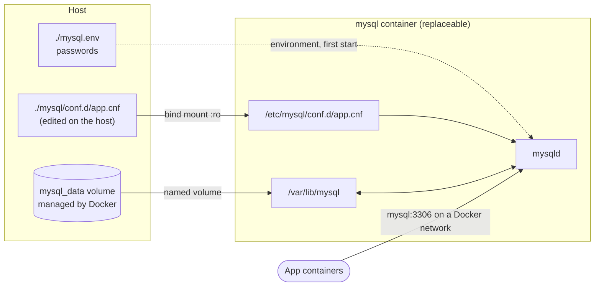

Databases are the containers people are most nervous about, and reasonably so: a web server container can be thrown away, but the data can't. The good news is that the rules are few. Keep the data in a **volume**, never inside the container. Keep configuration in a **file on the host**. And back up with the database's own tools rather than by copying files.

## The shape of it



The container itself holds nothing you can't recreate. Remove it, upgrade it, move it to another host: as long as the same volume and config are attached, MySQL picks up exactly where it stopped.

## Choosing a version

MySQL now has two release tracks:

- **LTS** (8.4): bug and security fixes only, supported for years. **This is what you want for data you care about.**
- **Innovation** (9.x): new features every quarter, each release supported only until the next.

`mysql:latest` follows Innovation. Pin the LTS line instead:

```bash
docker pull mysql:8.4
```

## Running it

Put the passwords in a file rather than on the command line, where they'd end up in your shell history and in `ps` output. Create `mysql.env`:

```bash
MYSQL_ROOT_PASSWORD=change-me-to-something-long
MYSQL_DATABASE=shop
MYSQL_USER=shop
MYSQL_PASSWORD=another-long-random-password
```

and restrict it: `chmod 600 mysql.env`. Then:

```bash
docker network create backend

docker run -d --name mysql \
  --network backend \
  --restart unless-stopped \
  -p 127.0.0.1:3306:3306 \
  --env-file ./mysql.env \
  -e TZ=America/Edmonton \
  -v mysql_data:/var/lib/mysql \
  -v "$PWD/mysql/conf.d:/etc/mysql/conf.d:ro" \
  mysql:8.4
```

- **`--network backend`**: your application containers join the same network and reach the database as `mysql:3306` (Docker's DNS resolves the container name).
- **`-p 127.0.0.1:3306:3306`**: publish the port on the host's loopback only, so you can connect from the host with a client, but the database isn't exposed to the network. Drop the line entirely if only containers need access.
- **`--env-file ./mysql.env`**: the variables above:
  - `MYSQL_ROOT_PASSWORD`: the root password.
  - `MYSQL_DATABASE`: a database to create.
  - `MYSQL_USER` / `MYSQL_PASSWORD`: an application user with full rights on that database *only*. Your app connects as this user, never as root.
- **`-e TZ=…`**: the container's time zone. MySQL takes its `system_time_zone` from it, so `NOW()` matches your local time.
- **`-v mysql_data:/var/lib/mysql`**: the data directory in a named volume. Docker creates it on first use.
- **`-v …/conf.d:/etc/mysql/conf.d:ro`**: your configuration (next section), read-only.

`docker logs -f mysql` shows the first-start initialization, then `ready for connections`.

### The first-start surprise

Those `MYSQL_*` variables are applied **only when the data directory is empty**, that is, on the very first start with a new volume. After that, MySQL uses what's stored in the volume, and the variables are ignored. If you change `MYSQL_ROOT_PASSWORD` later and restart, the password doesn't change. That's by design: the entrypoint won't overwrite an existing database. To change credentials on a running database, use SQL (`ALTER USER …`).

The same rule applies to initialization scripts. Any `.sql` or `.sh` file mounted into `/docker-entrypoint-initdb.d/` runs once, on that first start, in alphabetical order. That's handy for creating a schema or seed data:

```bash
-v "$PWD/initdb:/docker-entrypoint-initdb.d:ro"
```

## Configuration that works

Create `mysql/conf.d/app.cnf`. The official image reads every `.cnf` file in `/etc/mysql/conf.d/` on top of its defaults:

```ini
[mysqld]
# Full Unicode, including emoji
character-set-server = utf8mb4
collation-server     = utf8mb4_0900_ai_ci

# Binary log: needed for replication and point-in-time recovery
server-id                  = 1
binlog_expire_logs_seconds = 604800
max_binlog_size            = 100M

# Memory for caching data and indexes: the most important tuning knob
innodb_buffer_pool_size = 1G

# Connections
max_connections = 200

[client]
default-character-set = utf8mb4
```

- **`character-set-server` / `collation-server`**: store text as `utf8mb4`, real 4-byte UTF-8 (MySQL's older `utf8` can't store emoji). `utf8mb4_0900_ai_ci` is MySQL 8's default collation: accent- and case-insensitive comparisons, based on a recent Unicode standard.
- **`server-id`**: a unique number per server; required as soon as you add replication.
- **`binlog_expire_logs_seconds`**: the binary log (on by default since MySQL 8) records every change. Keeping 7 days of it lets you replay changes after restoring the last dump, known as point-in-time recovery. Older logs are purged automatically.
- **`innodb_buffer_pool_size`**: how much memory InnoDB uses to cache data and indexes. On a dedicated database host, 50–70% of RAM is typical; on a shared machine, size it so MySQL and everything else fit. If it's too large, the container gets killed for exceeding its memory.
- **`max_connections`**: the ceiling on concurrent connections. Your application's connection pool size, times its replica count, has to fit under it.

**Leave these to the image:** `datadir`, `socket` and `pid-file`. Moving the socket, in particular, breaks the `mysql` client inside the container and the image's own startup scripts. You'll also find old guides setting `character-set-client-handshake`, which was removed in MySQL 8.0; setting it now stops the server from starting.

**One setting to decide on day one:** `lower_case_table_names`. MySQL 8 only accepts it when the data directory is **first initialized**. Setting it later, or changing it, makes the server refuse to start. If you need case-insensitive table names (common when migrating from Windows), put `lower_case_table_names = 1` in the file *before* the first start.

After editing the file, restart to apply it: `docker restart mysql`. Many settings can also be changed live with `SET PERSIST`, which MySQL writes to `mysqld-auto.cnf` inside the volume.

## Connecting

```bash
# a client session inside the container
docker exec -it mysql mysql -u shop -p shop

# from the host, through the loopback-published port
mysql -h 127.0.0.1 -P 3306 -u shop -p shop
```

From another container on the `backend` network, the connection string is `mysql://shop:…@mysql:3306/shop`: the hostname is the container name.

Check that the settings took effect:

```sql
SHOW VARIABLES LIKE 'character_set_server';
SHOW VARIABLES LIKE 'innodb_buffer_pool_size';
SHOW BINARY LOGS;
SELECT NOW(), @@system_time_zone;
```

## Health checks

"The container is running" doesn't mean "MySQL accepts connections": the first start takes a while. In Compose, a health check makes dependent services wait:

```yaml
services:
  mysql:
    image: mysql:8.4
    env_file: mysql.env
    volumes:
      - mysql_data:/var/lib/mysql
      - ./mysql/conf.d:/etc/mysql/conf.d:ro
    healthcheck:
      test: ["CMD", "mysqladmin", "ping", "-h", "127.0.0.1", "--silent"]
      interval: 10s
      timeout: 5s
      retries: 10
      start_period: 30s

  api:
    image: yourname/shop-api:1.4.2
    depends_on:
      mysql:
        condition: service_healthy

volumes:
  mysql_data:
```

- **`mysqladmin ping`**: succeeds only once the server answers. `-h 127.0.0.1` forces a TCP connection, which isn't available during initialization, so the check can't pass too early.
- **`start_period: 30s`**: failures during the first 30 seconds don't count against `retries`.
- **`condition: service_healthy`**: `api` isn't started until MySQL's check passes. Plain `depends_on: [mysql]` only waits for the container to *start*.

## Backups

Don't copy the volume's files while MySQL is running. InnoDB keeps changes in memory and in its logs, so a live file copy is inconsistent and may not start. Use `mysqldump`:

```bash
docker exec mysql sh -c \
  'exec mysqldump --all-databases --single-transaction --routines --events -uroot -p"$MYSQL_ROOT_PASSWORD"' \
  | gzip > "backup-$(date +%F).sql.gz"
```

- **`sh -c '…'`**: run inside the container, so `$MYSQL_ROOT_PASSWORD` is expanded from the *container's* environment. The password never appears on your host's command line.
- **`--single-transaction`**: take a consistent snapshot of InnoDB tables without locking them; the app keeps running during the backup.
- **`--routines --events`**: include stored procedures and scheduled events, which are skipped by default.
- **`| gzip`**: SQL dumps compress very well.

Restoring:

```bash
gunzip -c backup-2025-07-13.sql.gz | docker exec -i mysql sh -c 'exec mysql -uroot -p"$MYSQL_ROOT_PASSWORD"'
```

`-i` connects your pipe to the container's standard input. Schedule the dump nightly with cron, copy it off the machine, and test a restore into a scratch container now and then:

```bash
docker run -d --name restore-test -e MYSQL_ROOT_PASSWORD=test mysql:8.4
```

For large databases, where a dump takes too long, look at Percona XtraBackup or MySQL Shell's dump utilities.

## Upgrading

Within the LTS line (8.4.x to 8.4.y), upgrading is just pulling the new image and recreating the container with the same volume and config. The server upgrades its data dictionary automatically on start (no more `mysql_upgrade` since 8.0.16).

Between major lines (8.0 → 8.4), take a dump first, read the release notes for removed settings, then change the tag. Downgrades aren't supported: once a newer version has started on the volume, your way back is the dump.

## A checklist

- Data in a named volume; configuration mounted read-only.
- Passwords in an env file with `600` permissions, or in Docker/Compose secrets.
- The app connects as its own user, never root.
- The port isn't published to the network unless something outside Docker really needs it.
- A memory limit on the container that's larger than `innodb_buffer_pool_size` plus headroom.
- Nightly `mysqldump`, copied off the host, restore tested.

[Chapter 1.7]() applies the same approach to Redis, where the default configuration hides a few traps of its own.
