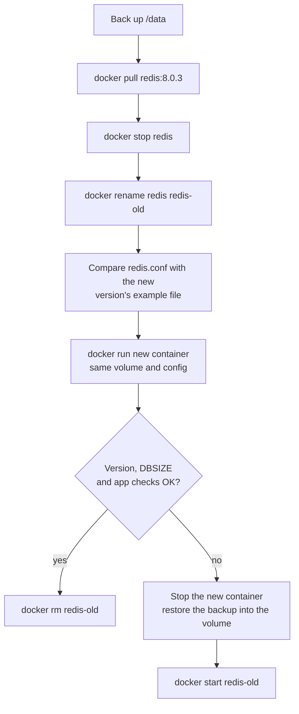

Redis is the Swiss-army knife next to most applications: a cache, a session store, a rate limiter, a job queue. It's also deceptively easy to run badly. The defaults are tuned for a developer laptop, and a Redis instance exposed to the internet without a password is still one of the most commonly exploited services.

This chapter sets it up properly: a config file you understand, data on a volume, memory that can't run away, and an upgrade path.

## First, decide what this Redis is for

Two settings follow from that one decision: **persistence** and **what happens when memory fills up**.

| Use | Persistence | When memory is full |
|---|---|---|
| **Cache** (data can be rebuilt from the database) | none, or snapshots only | evict old keys: `allkeys-lru` |
| **Sessions, rate limits** (losing them is annoying, not fatal) | snapshots (RDB) | `volatile-lru`, evicting keys that have a TTL |
| **Queues, source-of-truth data** | append-only file (AOF), ideally plus RDB | `noeviction`: reject writes rather than silently lose data |

The two persistence mechanisms:

- **RDB snapshots**: Redis periodically forks and writes the whole dataset to `dump.rdb`. Compact and fast to restart from, but you lose whatever changed since the last snapshot.
- **AOF (append-only file)**: every write is appended to a log. With `appendfsync everysec` you lose at most about a second of writes on a crash. Files are larger, and Redis compacts them in the background.

## Quick start for development

```bash
docker run -d --name redis-dev -p 127.0.0.1:6379:6379 redis:8.0
docker exec -it redis-dev redis-cli ping      # PONG
```

Fine on a laptop, and deliberately bound to `127.0.0.1`. Everything below is about running it for real.

## A production configuration

The official image ships **without** a config file (Redis runs on built-in defaults), so download the annotated example for your version and keep it next to your deployment:

```bash
mkdir -p ~/redis/conf
curl -fsSL -o ~/redis/conf/redis.conf \
  https://raw.githubusercontent.com/redis/redis/8.0/redis.conf
```

It's long and heavily commented, which makes it good documentation. These are the lines to change (they already exist in the file; edit them in place rather than appending duplicates):

```ini
# --- Network ---------------------------------------------------------------
bind 0.0.0.0 -::
protected-mode yes
port 6379

# --- Auth ------------------------------------------------------------------
requirepass use-a-long-random-password

# --- Persistence -----------------------------------------------------------
dir /data
appendonly yes
appendfsync everysec
save 3600 1 300 100 60 10000

# --- Memory ----------------------------------------------------------------
maxmemory 512mb
maxmemory-policy noeviction
```

Section by section:

- **`bind 0.0.0.0 -::`**: listen on all interfaces *inside the container*. The example file binds `127.0.0.1`, which inside a container means only the container itself can connect: your published port and your app containers would all get "connection refused". The `-` before `::` means "don't fail if IPv6 isn't available".
- **`protected-mode yes`**: refuse remote connections unless a password is set. With `requirepass` configured it no longer blocks anything, but it's a safety net if the password line is ever removed.
- **`requirepass`**: clients must `AUTH` first. Use a long random value (`openssl rand -base64 32`). For several apps with different permissions, Redis 6+ ACLs (`user … on >password ~keys:* +@read`) are the finer-grained option.
- **`dir /data`**: where snapshots and the AOF are written. We'll mount a volume there.
- **`appendonly yes` + `appendfsync everysec`**: turn on the AOF and flush it to disk once a second; this is the queue/source-of-truth profile from the table above. For a pure cache, set `appendonly no`.
- **`save 3600 1 300 100 60 10000`**: RDB snapshot rules, read in pairs: after 3600 s if at least 1 key changed, after 300 s if 100 changed, after 60 s if 10,000 changed. `save ""` disables snapshots.
- **`maxmemory 512mb`**: the ceiling for data. Without it, Redis grows until the container's memory limit (or the kernel) kills it.
- **`maxmemory-policy noeviction`**: when full, reject writes with an error. A cache would use `allkeys-lru` here instead, evicting the least recently used keys.

## Running it

```bash
docker network create backend

docker run -d --name redis \
  --network backend \
  --restart unless-stopped \
  --memory 768m \
  -p 127.0.0.1:6379:6379 \
  -v redis_data:/data \
  -v ~/redis/conf/redis.conf:/usr/local/etc/redis/redis.conf:ro \
  redis:8.0 redis-server /usr/local/etc/redis/redis.conf
```

- **`--network backend`**: app containers on the same network connect to `redis:6379`.
- **`--memory 768m`**: the container's hard limit, deliberately larger than `maxmemory` (512 MB). Redis needs headroom beyond the data itself: connection buffers, and the fork that writes RDB snapshots and rewrites the AOF, which can briefly need extra memory for pages being modified.
- **`-p 127.0.0.1:6379:6379`**: reachable from the host for `redis-cli`, not from the network. Omit it if only containers use Redis.
- **`-v redis_data:/data`**: persistence files live in a named volume.
- **`-v …redis.conf:/usr/local/etc/redis/redis.conf:ro`**: your config, read-only. The path inside the container is your choice; it just has to match the next argument.
- **`redis-server /usr/local/etc/redis/redis.conf`**: replace the image's default command so Redis starts with that file.

Check it (the examples from here on assume the password is in a shell variable, for example `read -rs REDIS_PASSWORD`, which reads it without echoing):

```bash
docker exec -it -e REDISCLI_AUTH="$REDIS_PASSWORD" redis redis-cli
127.0.0.1:6379> INFO persistence
127.0.0.1:6379> CONFIG GET maxmemory*
```

`REDISCLI_AUTH` passes the password through the environment instead of `-a`, which would show it in the process list and prints a warning.

Most settings can be changed live (`CONFIG SET maxmemory 1gb`) and written back to the file with `CONFIG REWRITE`. With the file mounted read-only, that write fails on purpose: edit the host file and `docker restart redis` instead, so the file on the host stays the source of truth.

## Backups

Everything Redis persists is in the volume: `dump.rdb` and, with AOF on, the `appendonlydir/` directory (Redis 7+ splits the AOF into several files plus a manifest). To take a consistent copy:

```bash
docker exec -e REDISCLI_AUTH="$REDIS_PASSWORD" redis redis-cli BGSAVE
docker exec -e REDISCLI_AUTH="$REDIS_PASSWORD" redis redis-cli LASTSAVE      # repeat until the timestamp changes
docker run --rm -v redis_data:/data -v "$PWD":/backup alpine \
  tar czf "/backup/redis-$(date +%F).tgz" -C /data .
```

- **`BGSAVE`**: write a fresh snapshot in the background, without blocking clients.
- **`LASTSAVE`**: the Unix time of the last successful save; when it changes, the snapshot is complete.
- **The `alpine` container**: a throwaway container that mounts the same volume and your current directory, then archives the volume's contents. This is the general-purpose way to back up any named volume.

## Upgrading

Newer Redis versions read older RDB and AOF files, but not the other way round. So the plan is: keep the old container around until the new one has proven itself, and have a backup for the moment you can't go back.



Checks after the switch:

```bash
docker exec -e REDISCLI_AUTH="$REDIS_PASSWORD" redis redis-cli INFO server | grep redis_version
docker exec -e REDISCLI_AUTH="$REDIS_PASSWORD" redis redis-cli DBSIZE
```

Compare `DBSIZE` with the number before the upgrade. Resist `KEYS *` on a real instance: it walks the entire keyspace in one blocking call and freezes every client until it finishes. `SCAN` gives you a sample without blocking.

Before a major version jump, diff your `redis.conf` against the new version's example file: directives do get renamed or removed, and Redis refuses to start on an unknown directive, which is at least an easy failure to spot.

## A note on licensing

Redis changed its license in 2024 (to RSALv2/SSPL) and added AGPLv3 as an option with Redis 8. For most teams running it internally this changes nothing, but if you offer Redis as a service or redistribute it, check the terms. **Valkey**, a Linux Foundation fork of Redis 7.2, remains BSD-licensed, is a drop-in replacement for the commands above (`valkey/valkey` image, `valkey-cli`), and is what several cloud providers now offer.

## Checklist

- Password (or ACLs) set, and the port never published to the internet.
- `bind 0.0.0.0` inside the container, so containers and published ports can actually reach it.
- Persistence chosen deliberately: none for caches, AOF for anything you can't lose.
- `maxmemory` set, with the container limit comfortably above it.
- The volume backed up after a `BGSAVE`; upgrades keep the old container until verified.

[Chapter 1.8]() looks at what has been connecting all these containers: Docker's network modes.
