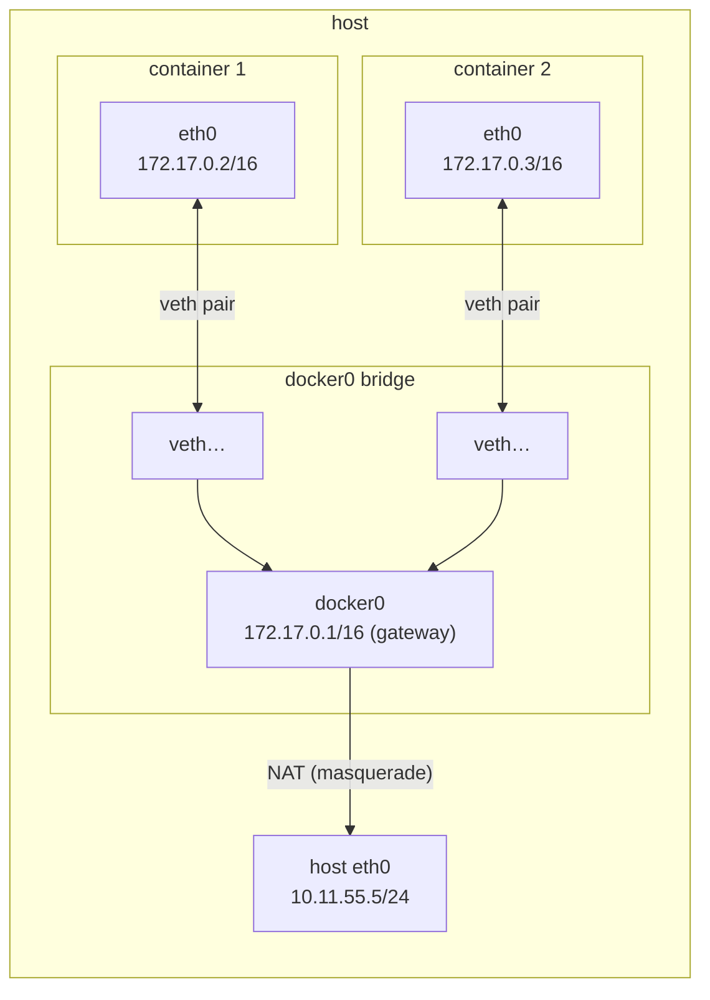
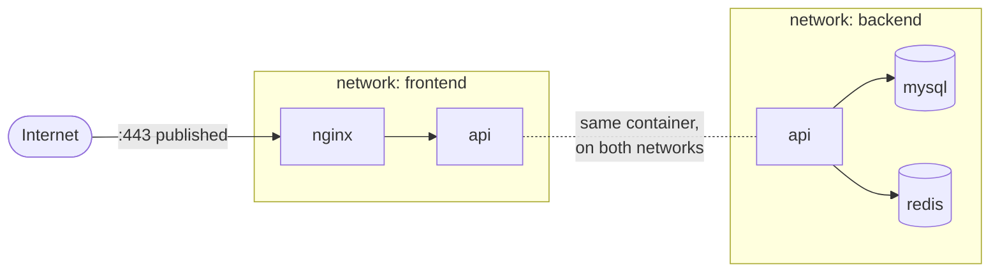
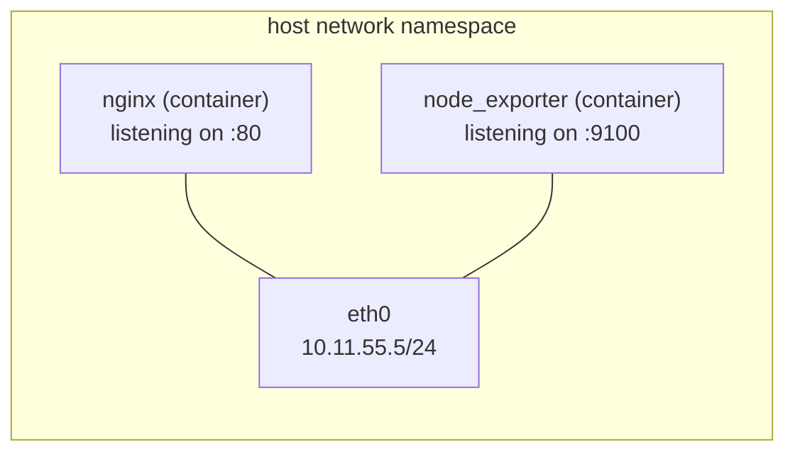
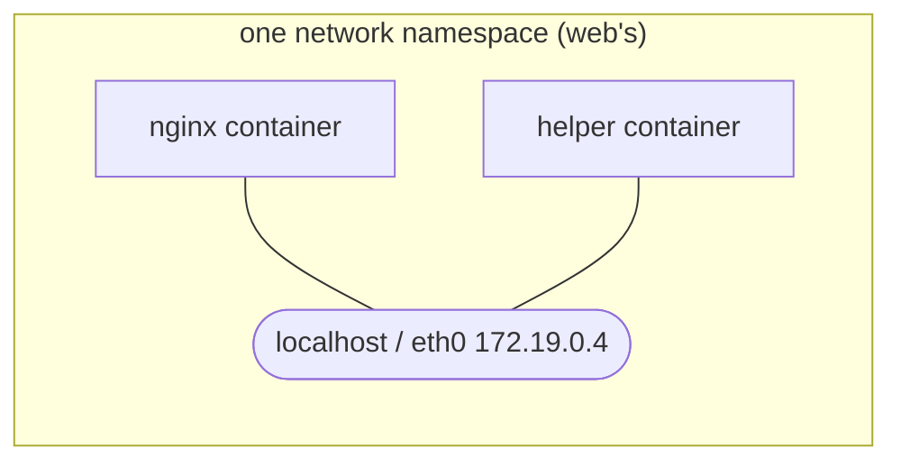
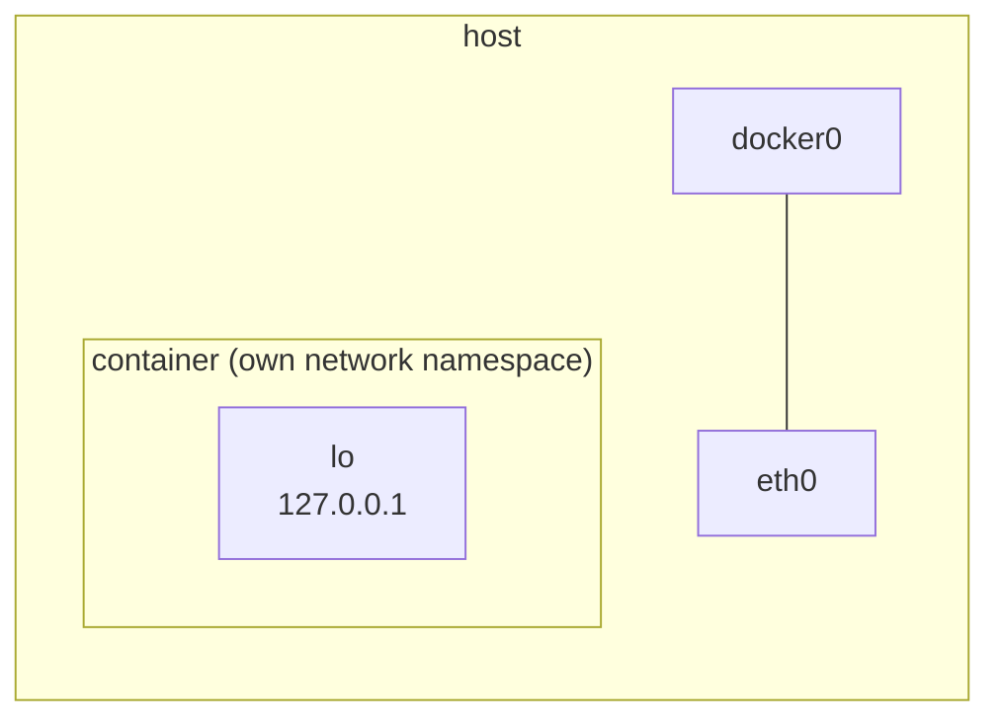

Every chapter so far has quietly relied on networking: Nginx reaching `app:3000`, an API connecting to `mysql:3306`. This chapter opens that up: how a container gets an address, how names resolve, what publishing a port really does, and when to pick each network mode.

| Mode | What the container gets | Typical use |
|---|---|---|
| **default `bridge`** | its own IP on a private network; no name resolution | quick one-off containers |
| **user-defined bridge** | its own IP, **DNS by container name**, isolation per network | almost everything on one host |
| **`host`** | no network isolation; shares the host's interfaces | network tools, extreme performance needs (Linux only) |
| **`container:<name>`** | shares another container's network stack | sidecars, debugging |
| **`none`** | only a loopback interface | jobs that must have no network |

(`overlay` for multi-host clusters appears in [Chapter 1.11](); `macvlan`, which puts containers directly on your LAN, is for special cases.)

## The default bridge: how it works

When Docker starts, it creates a virtual switch called **`docker0`** on the host, with a private subnet, `172.17.0.0/16` by default. Each container started without `--network` is plugged into it:



- Each container gets a **veth pair**: a virtual cable with one end inside the container (appearing as `eth0`) and the other end on the host, plugged into `docker0`.
- The container's default gateway is `docker0` itself, `172.17.0.1`.
- Outbound traffic is **NATed** through the host's real interface, so the internet sees the host's IP.

See it for yourself:

```bash
docker run -d --name b1 alpine sleep 3600
docker run -d --name b2 alpine sleep 3600
docker exec b1 ip addr show eth0       # 172.17.0.2
docker exec b1 ip route                # default via 172.17.0.1
docker exec b1 ping -c 2 172.17.0.3    # works by IP…
docker exec b1 ping -c 2 b2            # …but not by name: "bad address 'b2'"
```

That last line is the default bridge's big limitation: **no DNS between containers**. It exists mainly for backward compatibility. For anything with more than one container, use a user-defined network.

### What `-p` actually does

Publishing a port (`-p 8080:80`) makes Docker add NAT rules to the host's firewall (iptables or nftables): traffic arriving at host port 8080 is rewritten to the container's IP and port 80. You can see them with `sudo iptables -t nat -L DOCKER -n`.

This has a consequence that surprises many people: **those rules sit in front of host firewalls like `ufw` and firewalld.** `ufw deny 8080` does *not* block a port Docker has published; the traffic is NATed to the container before `ufw`'s rules ever see it. So:

- Publish only what must be reachable from outside.
- Bind to a specific address when you only need local access: `-p 127.0.0.1:8080:80`.
- For containers that only talk to each other, don't publish at all. They don't need it on a shared network.

## User-defined bridge networks: the one you'll use

```bash
docker network create backend
docker run -d --name api   --network backend alpine sleep 3600
docker run -d --name cache --network backend alpine sleep 3600
docker exec api ping -c 2 cache
# PING cache (172.19.0.3): 56 data bytes
# 64 bytes from 172.19.0.3: seq=0 ttl=64 time=0.081 ms
```

What you gain over the default bridge:

- **DNS by container name.** Docker runs an embedded DNS server (at `127.0.0.11` inside each container) that resolves container names, and network aliases, to their current IPs. IPs change when containers are recreated; names don't. That's why connection strings use `mysql:3306`, never an IP.
- **Isolation between networks.** Containers on different user-defined networks can't reach each other at all, which gives you a simple way to separate tiers.
- **Live attach and detach.** `docker network connect` / `disconnect` changes a running container's networks without restarting it.

### Isolating tiers

A container can be on several networks at once. That lets you build a front door that only the proxy passes through:



```bash
docker network create frontend
docker network create backend

docker run -d --name db    --network backend  -e MYSQL_ROOT_PASSWORD=… mysql:8.4
docker run -d --name api   --network backend  yourname/api:1.4.2
docker network connect frontend api
docker run -d --name proxy --network frontend -p 443:443 nginx:1.27
```

- **`api`** is on both networks: Nginx can reach it, and it can reach the database.
- **`proxy`** is only on `frontend`: even if Nginx is compromised, `db` isn't resolvable or routable from it.
- **`db`** publishes no port and sits only on `backend`: the only way in is through `api`.

Compose ([Chapter 1.9]()) creates a network like this for every project automatically, which is why services in a Compose file can reach each other by service name with no setup.

### Inspecting networks


```bash
docker network ls                                  # all networks
docker network inspect backend                     # subnet, gateway, and every attached container with its IP
docker inspect -f '{{range $k, $v := .NetworkSettings.Networks}}{{$k}}={{$v.IPAddress}} {{end}}' api
```


The last command prints every network the `api` container is on, with its IP on each: `backend=172.19.0.3 frontend=172.20.0.2`.

## Host mode: no network isolation

```bash
docker run -d --name h1 --network host nginx:1.27
curl -I http://localhost:80        # served directly on the host's port 80, no -p needed
```

The container skips network namespacing entirely: it sees the host's interfaces and binds straight to the host's ports. Filesystem, processes and users are still isolated.



Use it for tools that need to see the host's real network (monitoring agents, packet capture) or when NAT overhead genuinely matters at very high packet rates. The costs:

- **Port conflicts are back.** Two host-mode containers can't both listen on 80, and neither can a host process.
- **`-p` is ignored**, since there's nothing to publish.
- **It's a Linux feature.** On Docker Desktop, the "host" is the Desktop's Linux VM, so a host-mode container shares the VM's network, not your laptop's, unless you turn on the newer host networking option in Desktop's settings.

## Container mode: sharing another container's network

```bash
docker run -d --name web nginx:1.27
docker run -it --rm --network container:web alpine sh
/ # wget -qO- http://localhost        # that's nginx, in the other container
```

The second container joins the first one's network namespace: same interfaces, same IP, same `localhost`, same port space. Filesystems and processes stay separate.



This is the **sidecar** pattern (Kubernetes pods work exactly this way): a log shipper, a proxy or a metrics exporter that talks to the main app over `localhost`. It's also the best debugging trick for minimal images that ship no tools: attach a `busybox` or `nicolaka/netshoot` container to the target's network and use its `curl`, `dig` and `tcpdump` as if you were inside.

## None: no network at all

```bash
docker run --rm --network none alpine ip addr
# 1: lo: <LOOPBACK,UP,LOWER_UP> …    (nothing else)
```



Only a loopback interface, and nothing connects it to `docker0` or the host. It's useful for jobs that process untrusted input and must not exfiltrate anything, such as file converters, or batch jobs that read and write mounted volumes only.

## Troubleshooting

| Symptom | Check |
|---|---|
| Name doesn't resolve (`bad address`) | Both containers on the same **user-defined** network? `docker network inspect <net>`. |
| Connection refused between containers | The service listens on `127.0.0.1` inside its container; it must listen on `0.0.0.0` to be reachable from others. |
| Port reachable from the internet despite `ufw` | Docker's NAT rules bypass it; bind to `127.0.0.1` or don't publish. |
| Container can't reach the internet | `docker exec c ping -c1 1.1.1.1` (routing) vs `ping google.com` (DNS); check the host's IP forwarding and the daemon's `dns` setting. |
| Subnet clashes with your VPN or office LAN | Pick other ranges with `"default-address-pools"` in `/etc/docker/daemon.json`. |

The "listens on `127.0.0.1`" row catches almost everyone once: a dev server bound to localhost works inside its own container and nowhere else.

[Chapter 1.9]() stops typing long `docker run` and `docker network` commands and describes whole multi-container applications in one file.
