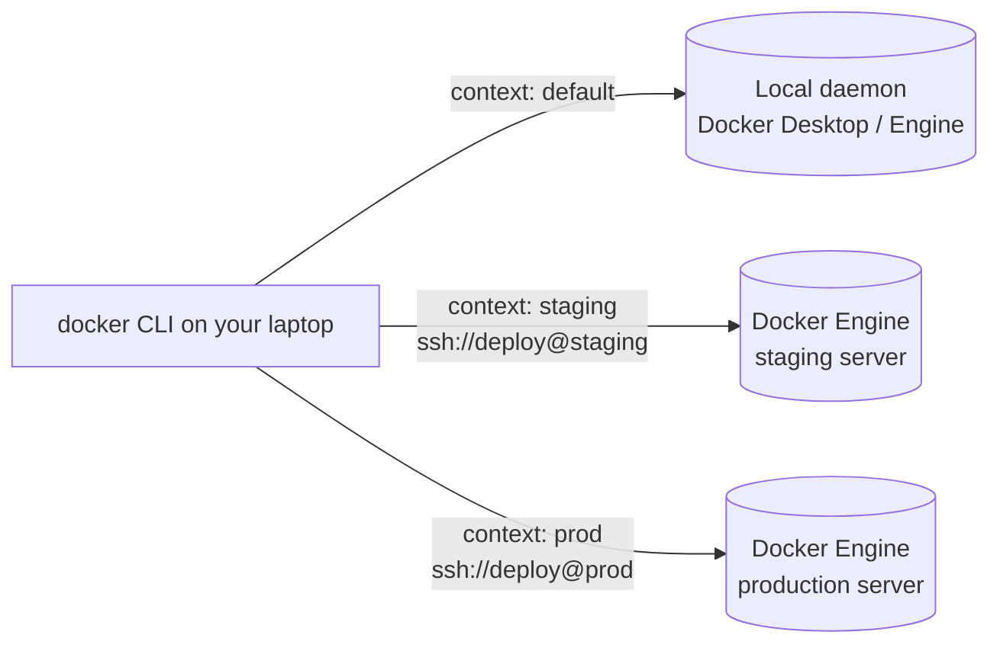

Sooner or later your containers need to run somewhere other than your laptop: a staging server, a build box, a small production host. You could SSH in and run `docker` there, but then your Compose files, scripts and muscle memory all live in two places.

A better model: **keep one Docker CLI on your laptop and point it at whichever machine you're working on.** That's what **Docker contexts** do. A context is a named connection to a Docker daemon: your local one, or one on a server over SSH. Switch the context, and every `docker` and `docker compose` command runs against that machine.

(If you remember **Docker Machine**, the `docker-machine create / env / ssh` tool: it was deprecated and archived in 2021. Its two jobs, creating machines and connecting to them, are now done by your cloud provider's tooling and by contexts respectively. There's a mapping table at the end.)



## 1. A server with Docker Engine

Any Linux VM or physical machine works. On Ubuntu, install Docker Engine from Docker's own repository (distribution packages tend to lag behind):

```bash
# Docker's signing key
sudo apt-get update
sudo apt-get install -y ca-certificates curl
sudo install -m 0755 -d /etc/apt/keyrings
sudo curl -fsSL https://download.docker.com/linux/ubuntu/gpg -o /etc/apt/keyrings/docker.asc
sudo chmod a+r /etc/apt/keyrings/docker.asc

# The repository, for this Ubuntu release and CPU architecture
echo "deb [arch=$(dpkg --print-architecture) signed-by=/etc/apt/keyrings/docker.asc] \
https://download.docker.com/linux/ubuntu $(. /etc/os-release && echo "${UBUNTU_CODENAME:-$VERSION_CODENAME}") stable" \
  | sudo tee /etc/apt/sources.list.d/docker.list > /dev/null

# Engine, CLI, containerd, and the buildx and compose plugins
sudo apt-get update
sudo apt-get install -y docker-ce docker-ce-cli containerd.io docker-buildx-plugin docker-compose-plugin
```

What the less obvious lines do:

- **`install -m 0755 -d /etc/apt/keyrings`**: create the keyring directory with the right permissions.
- **`curl … -o /etc/apt/keyrings/docker.asc`**: download Docker's GPG key; apt uses it to verify that packages really come from Docker.
- **The `echo "deb …"` line**: add the repository. `dpkg --print-architecture` fills in `amd64` or `arm64`; `/etc/os-release` supplies the release codename (`noble`, `jammy`), so the same command works across versions. `signed-by=` restricts that key to this one repository.
- **`docker-ce`**: the daemon; **`containerd.io`**: the runtime underneath it; the two plugins give you `docker buildx` and `docker compose` on the server too.

Other distributions have equivalent instructions in [Docker's install docs](https://docs.docker.com/engine/install/).

Then create a user for deployments, allow it to use Docker, and install your SSH key:

```bash
sudo adduser --disabled-password --gecos "" deploy
sudo usermod -aG docker deploy
sudo mkdir -p /home/deploy/.ssh
sudo cp ~/.ssh/authorized_keys /home/deploy/.ssh/      # or paste your public key into it
sudo chown -R deploy:deploy /home/deploy/.ssh
sudo chmod 700 /home/deploy/.ssh && sudo chmod 600 /home/deploy/.ssh/authorized_keys
```

- **`--disabled-password`**: the user can only log in with an SSH key.
- **`usermod -aG docker deploy`**: membership in the `docker` group lets `deploy` use the daemon without `sudo`. As covered in earlier chapters, that's root-equivalent on this host, so protect that key accordingly.
- **The `chmod` lines**: SSH refuses keys in directories other users can write to.

### The same thing, automatically, with cloud-init

Most cloud providers (and Multipass for local VMs) accept a **cloud-init** file that runs on first boot. That turns "create a Docker host" into a single command, which is what `docker-machine create` used to do:

```yaml
#cloud-config
users:
  - default
  - name: deploy
    shell: /bin/bash
    ssh_authorized_keys:
      - ssh-ed25519 AAAAC3Nza... you@laptop

package_update: true

runcmd:
  - curl -fsSL https://get.docker.com | sh
  - usermod -aG docker deploy
```

- **`users:`**: keep the provider's default user and add `deploy`, with your public key and no password.
- **`package_update: true`**: refresh the package lists before anything else.
- **`runcmd:`**: commands that run once, as root, at the end of the first boot. `get.docker.com` is Docker's convenience install script: it adds the same repository and packages as the manual steps above. It's fine for throwaway and test hosts; for production, pin versions using the repository steps.
- **`usermod -aG docker deploy`**: must run *after* Docker is installed, because the `docker` group doesn't exist before that.

For example, a local VM with Multipass, or a cloud VM with the provider's CLI:

```bash
multipass launch --name staging --cpus 2 --memory 4G --disk 20G --cloud-init docker.yaml
# or, e.g.: hcloud server create --name staging --type cx22 --image ubuntu-24.04 --user-data-from-file docker.yaml
```

For fleets, Terraform or your provider's templates do the same declaratively.

## 2. Connecting with a context

On your laptop:

```bash
docker context create staging --docker "host=ssh://deploy@203.0.113.10"
docker context ls
```

```text
NAME        DESCRIPTION                               DOCKER ENDPOINT
default *   Current DOCKER_HOST based configuration   unix:///var/run/docker.sock
staging                                               ssh://deploy@203.0.113.10
```

- **`host=ssh://deploy@203.0.113.10`**: the Docker CLI opens an SSH connection as `deploy` and talks to the remote daemon's socket through it. The daemon needs **no** configuration changes and no open ports beyond SSH.
- The `*` marks the active context.

Three ways to use it:

```bash
docker context use staging      # switch: everything from now on runs on staging
docker ps                       # containers on staging
docker context use default      # back to your local daemon

docker --context staging ps     # one command, without switching

DOCKER_CONTEXT=staging docker ps          # per shell or per script
```

`docker context use` is sticky, surviving across terminals and reboots, and that's the classic way to run something on production by accident. A few habits help: prefer `--context` for one-off commands, and put the current context in your shell prompt, or at least run `docker context ls` before anything destructive.

### Making SSH fast and tidy

Every `docker` command opens a new SSH connection, which adds noticeable latency. Let SSH reuse one connection, and give the host a short name, in `~/.ssh/config`:

```text
Host staging
    HostName 203.0.113.10
    User deploy
    IdentityFile ~/.ssh/id_ed25519
    ControlMaster auto
    ControlPath ~/.ssh/cm-%r@%h:%p
    ControlPersist 10m
```

- **`Host staging`**: an alias; now `ssh staging` works, and so does `host=ssh://staging` in the context.
- **`ControlMaster auto` + `ControlPath`**: the first connection opens a shared channel at that socket path; later ones ride on it.
- **`ControlPersist 10m`**: keep the shared channel open for 10 minutes after the last use, so a burst of Docker commands pays the SSH handshake once.

Then recreate the context with the alias: `docker context create staging --docker "host=ssh://staging"`.

## 3. Compose on a remote host

With a remote context, Compose works as usual; the containers simply start on the server:

```bash
docker --context staging compose up -d --build
docker --context staging compose logs -f
```

Two things behave differently, and both catch people out:

- **Builds happen on the remote daemon.** `--build` sends the build context (your project directory, minus `.dockerignore`) over SSH and builds there. That's convenient for small projects; for bigger ones, build in CI and push to a registry, and have the server only pull.
- **Bind mounts refer to the remote host's filesystem.** `./nginx/default.conf:/etc/nginx/conf.d/default.conf` in your Compose file means `./nginx/default.conf` *on the server*, relative to the same path. If the file only exists on your laptop, Docker creates an empty directory in its place on the server, and Nginx fails with a confusing error. Either copy the files over first (`rsync -av nginx/ staging:app/nginx/`), bake configuration into images, or use named volumes and Compose `configs`.

## 4. Don't open the daemon to the network

Guides from the Docker Machine era expose the daemon on TCP port 2375 so remote clients can reach it. **An unauthenticated Docker API is root on that machine for anyone who can reach the port**, and automated scanners find exposed ones within hours. SSH contexts make it unnecessary.

If SSH isn't an option, the daemon can listen on **2376 with mutual TLS**, where both sides present certificates. Contexts support that too (`--docker "host=tcp://host:2376,ca=…,cert=…,key=…"`), but managing the certificates is real work. Choose SSH whenever you can.

## 5. Local machines are contexts too

Local VM tools register their own contexts:

- **Docker Desktop** creates `desktop-linux`.
- **Colima** (macOS/Linux): `colima start --cpus 4 --memory 8` starts a VM with Docker and switches to the `colima` context.
- **Multipass** VMs set up with the cloud-init above are just SSH hosts: `docker context create lab --docker "host=ssh://deploy@$(multipass info lab | awk '/IPv4/{print $2}')"`.

So the same workflow covers a VM on your laptop, a lab server and production, and switching between them is one flag.

## Coming from Docker Machine

| `docker-machine` | Today |
|---|---|
| `create -d <driver> host` | cloud-init + provider CLI / Terraform (section 1), or `multipass launch`, `colima start` |
| `env host` + `eval $(…)` | `docker context use host`, or `--context host` |
| `ls` | `docker context ls` |
| `ssh host` | `ssh host` |
| `scp` | `scp` / `rsync` |
| `ip host` | your provider's CLI, or the context's endpoint |
| `rm host` | delete the VM with the provider's CLI; `docker context rm host` |
| TLS certs on :2376 generated for you | SSH (no certificates), or TLS contexts if you must |

[Chapter 1.11]() takes several of these hosts and joins them into one cluster with Docker Swarm.
