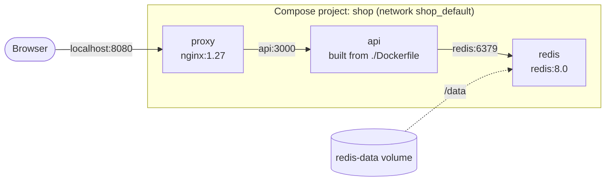

By now, running the pieces of an application means a stack of long `docker run` commands, a `docker network create`, and remembering the order to start them in. **Docker Compose** replaces all of that with one declarative file: you describe the services, networks and volumes, and `docker compose up` makes reality match.

It's the standard tool for local development, CI test environments and single-host deployments. (For several hosts you'd move to Swarm, [Chapter 1.11](), or Kubernetes.)

## Installing

Compose v2 is a plugin for the Docker CLI, invoked as `docker compose` (with a space).

- **Docker Desktop** includes it.
- **Linux with Docker Engine**: install `docker-compose-plugin` from Docker's package repository (`sudo apt install docker-compose-plugin` or `sudo dnf install docker-compose-plugin`).

```bash
docker compose version
```

If you find `docker-compose` (with a hyphen) in old scripts: that's Compose v1, a separate Python tool that reached end of life in 2023. The file format is compatible; switch the command.

## The example: proxy, app and cache

We'll extend the app from [Chapter 1.1]() to count visits in Redis, and put Nginx in front of it:



### The app

`server.js`:

```javascript
const express = require("express");
const os = require("os");
const { createClient } = require("redis");

const redis = createClient({ url: process.env.REDIS_URL });
redis.on("error", (err) => console.error("redis:", err.message));

const app = express();
app.get("/", async (req, res) => {
  const visits = await redis.incr("visits");
  res.send(`Hello from ${os.hostname()}, visit #${visits}\n`);
});

redis.connect().then(() => {
  app.listen(3000, () => console.log("listening on 3000"));
});
```

- **`createClient({ url: process.env.REDIS_URL })`**: the Redis address comes from the environment, so the same image works anywhere; Compose will set it to `redis://redis:6379`.
- **`redis.incr("visits")`**: an atomic increment, so concurrent requests, even from several app containers, never lose a count.
- **`redis.connect().then(…)`**: start accepting HTTP requests only once Redis is connected.

`package.json` adds the Redis client:

```json
{
  "name": "shop-api",
  "version": "1.0.0",
  "main": "server.js",
  "dependencies": {
    "express": "^5.1.0",
    "redis": "^4.7.0"
  }
}
```

The `Dockerfile` and `.dockerignore` are unchanged from Chapter 1.1. For the proxy, `nginx/default.conf`:

```nginx
server {
    listen 80;
    location / {
        proxy_pass http://api:3000;
        proxy_set_header Host $host;
        proxy_set_header X-Forwarded-For $proxy_add_x_forwarded_for;
    }
}
```

### The Compose file

`compose.yml`, next to the Dockerfile:

```yaml
name: shop

services:
  proxy:
    image: nginx:1.27
    ports:
      - "8080:80"
    volumes:
      - ./nginx/default.conf:/etc/nginx/conf.d/default.conf:ro
    depends_on:
      - api
    restart: unless-stopped

  api:
    build: .
    environment:
      REDIS_URL: redis://redis:6379
    depends_on:
      redis:
        condition: service_healthy
    restart: unless-stopped

  redis:
    image: redis:8.0
    command: ["redis-server", "--appendonly", "yes"]
    volumes:
      - redis-data:/data
    healthcheck:
      test: ["CMD", "redis-cli", "ping"]
      interval: 5s
      timeout: 3s
      retries: 5
    restart: unless-stopped

volumes:
  redis-data:
```

Key by key:

- **`name: shop`**: the project name. It prefixes everything Compose creates (`shop-api-1`, network `shop_default`, volume `shop_redis-data`). Without it, the directory name is used.
- **`services:`**: each entry becomes one or more containers. The service name is also its **DNS name** on the project network, which is why `proxy_pass http://api:3000` and `redis://redis:6379` work.
- **`proxy`**:
  - `image: nginx:1.27`: use a published image.
  - `ports: "8080:80"`: the only published port in the whole project; `api` and `redis` are reachable only from inside.
  - `volumes: ./nginx/default.conf:…:ro`: relative paths are relative to the Compose file, which keeps the project portable.
  - `depends_on: [api]`: start `api` first. This is start order only.
- **`api`**:
  - `build: .`: build the image from the Dockerfile in this directory instead of pulling one.
  - `environment`: variables for the container.
  - `depends_on: redis: condition: service_healthy`: don't start `api` until Redis's health check passes, not merely until its container starts.
- **`redis`**:
  - `command`: replace the image's default command, here to turn on the append-only file.
  - `volumes: redis-data:/data`: a named volume, declared at the bottom.
  - `healthcheck`: Compose runs `redis-cli ping` every 5 seconds; after it succeeds, the container counts as healthy.
- **`restart: unless-stopped`**: the same restart policy as `docker run --restart`.
- **Top-level `volumes:`**: named volumes the project owns. They survive `docker compose down`.
- **No `networks:` section**: Compose creates a default network per project and attaches every service to it. Declare networks only when you want to split tiers.
- **No `version:` key**: it's obsolete, and current Compose ignores it with a warning.

## Running it

```bash
docker compose up -d --build
curl http://localhost:8080
# Hello from 5c1f0e9ab2d3, visit #1
docker compose ps
docker compose logs -f api
```

- **`up`**: create whatever doesn't exist, start whatever isn't running, and recreate containers whose configuration or image changed. Run it again after editing the file and only the affected services are recreated.
- **`-d`**: detached; without it, logs stream to your terminal and Ctrl+C stops everything.
- **`--build`**: rebuild images for services with a `build:` key, even if one already exists.

### Scaling

```bash
docker compose up -d --scale api=3
docker compose exec proxy nginx -s reload
for i in 1 2 3 4; do curl -s http://localhost:8080; done
# Hello from 5c1f0e9ab2d3, visit #2
# Hello from a93b77c01e5f, visit #3
# Hello from 0d4e61b8f7a2, visit #4
# Hello from 5c1f0e9ab2d3, visit #5
```

Three `api` containers now share the name `api`, and Docker's DNS returns all three addresses. Nginx resolves `api` when it loads its config, so after scaling it needs a reload to pick up the new addresses; then it round-robins between them. The counter keeps climbing across containers, because the state lives in Redis, not in the app. That's the whole point of stateless services. (Scaling only works because `api` publishes no port: three containers can't all bind host port 8080.)

## The commands you'll use

| Command | What it does |
|---|---|
| `docker compose up -d` | Create/update and start everything |
| `docker compose ps` | Containers in this project, with health status |
| `docker compose logs -f [service]` | Follow logs, optionally for one service |
| `docker compose exec api sh` | A shell in a running service container |
| `docker compose run --rm api npm test` | A **new** one-off container for a task (tests, migrations) |
| `docker compose restart api` | Restart without recreating |
| `docker compose pull` | Pull newer versions of the images |
| `docker compose build` | Rebuild images (`--no-cache` for a clean build) |
| `docker compose config` | Print the final file after variables and merges are applied |
| `docker compose stop` | Stop, keeping the containers |
| `docker compose down` | Remove the containers and network; **keep volumes** |
| `docker compose down -v` | Also delete named volumes, and with them the data |

`exec` versus `run` trips people up: `exec` runs a command in a container that's already running, while `run` starts a fresh container from the service's definition, which is what you want for one-off tasks that shouldn't touch the running service.

## Configuration without editing the file

### Variables and `.env`

Compose substitutes `${VARIABLES}` in the file from your shell and from a `.env` file next to it:

```yaml
services:
  api:
    image: yourname/shop-api:${API_TAG:-latest}
    env_file: api.env
```

- **`${API_TAG:-latest}`**: the value of `API_TAG`, or `latest` if it's unset. `API_TAG=1.4.2 docker compose up -d` deploys a specific version without touching the file.
- **`.env`** (automatically read) is for these *file* variables. **`env_file: api.env`** is different: it passes a file's variables *into the container*. Keep both out of Git if they contain secrets.

`docker compose config` shows the result of all substitutions, which is the fastest way to debug "why is it using the wrong value".

### Override files for development

Compose automatically merges `compose.override.yml` on top of `compose.yml` if it exists. Put development-only changes there:

```yaml
# compose.override.yml (development only)
services:
  api:
    command: ["node", "--watch", "server.js"]
    volumes:
      - ./server.js:/app/server.js
    ports:
      - "3000:3000"
```

- **`--watch`**: Node restarts the server whenever the file changes.
- **The bind mount**: your edited `server.js` replaces the one baked into the image, so a save shows up without a rebuild.
- **`ports: "3000:3000"`**: hit the app directly while debugging, bypassing the proxy.

In production, deploy with only the base file: `docker compose -f compose.yml up -d`.

### Profiles for optional tools

```yaml
services:
  redis-ui:
    image: redis/redisinsight:latest
    ports:
      - "5540:5540"
    profiles: [tools]
```

Services with `profiles:` don't start by default. `docker compose --profile tools up -d` adds them, which suits admin UIs and debugging tools you want sometimes, but not always.

## A few habits that pay off

- **Pin image versions** (`nginx:1.27`, `redis:8.0`) so `docker compose pull` never surprises you.
- **Publish as little as possible.** Services talk over the project network by name; only the entry point needs `ports`.
- **Use health checks** plus `condition: service_healthy` for anything with a slow start, like databases.
- **Treat `down -v` as a delete command**, because it is one.
- **Commit `compose.yml`**, and keep secrets in `.env` / `env_file` files that aren't committed.

[Chapter 1.10]() takes these same commands to other machines: managing remote Docker hosts from your laptop with Docker contexts.
