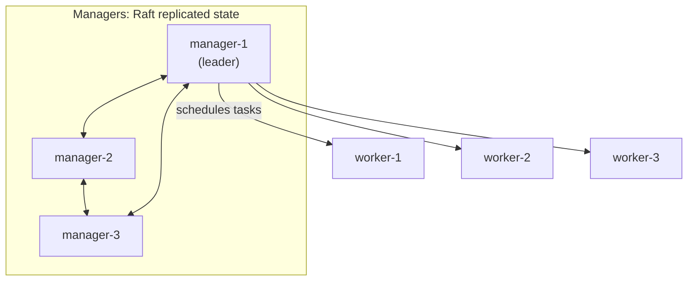
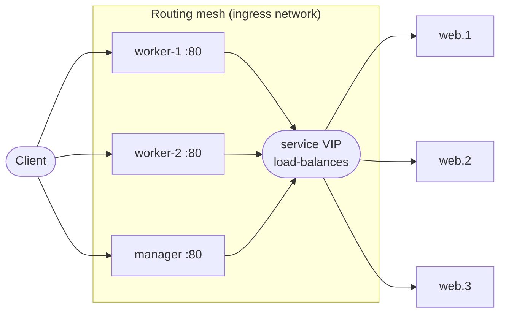

Compose runs an application on **one** host. When that host needs maintenance, or one machine isn't enough, you want a cluster: several hosts acting as one, placing containers wherever there's room and replacing them when a machine dies.

**Swarm mode** is the orchestrator built into Docker Engine. There's nothing extra to install, it reads the same Compose file format, and a working cluster takes about three commands. It's far simpler than Kubernetes; you give up Kubernetes' enormous ecosystem in exchange. For small and medium setups that's often the right trade.

## The concepts

### Nodes: managers and workers

Every Docker host in a swarm is a **node**.

- **Managers** hold the cluster state and schedule work. They replicate that state among themselves with the **Raft** consensus protocol, and one of them is the elected **leader**.
- **Workers** just run containers. By default, managers run containers too.



Raft needs a **majority** of managers to agree on any change, which gives the rule for how many to run:

| Managers | Can lose | Notes |
|---|---|---|
| 1 | 0 | fine for a lab; the cluster can't change while it's down |
| 3 | 1 | the usual production choice |
| 5 | 2 | larger clusters |

Always use an **odd** number: 4 managers tolerate no more failures than 3, and give you one more machine that can break. If a majority is lost, running containers keep running, but nothing can be scheduled or changed until quorum returns.

### Services and tasks

You don't start containers in a swarm; you declare a **service** ("run 3 replicas of `nginx:1.27`, published on port 80"), and the managers make it true. Each replica is a **task**, and each task runs one container on some node. If a node dies, its tasks are rescheduled elsewhere to get back to 3.

- **Replicated** services run a set number of tasks wherever there's capacity.
- **Global** services run exactly one task on **every** node (managers included, unless constrained), which suits monitoring agents and log shippers.

## 1. Build a lab cluster

Three VMs with Docker, using the cloud-init file from [Chapter 1.10]():

```bash
for n in manager worker-1 worker-2; do
  multipass launch --name "$n" --cpus 2 --memory 2G --disk 10G --cloud-init docker.yaml
done
multipass list          # note each VM's IPv4 address
```

Nodes talk to each other on three ports, which must be open between them (not to the internet):

| Port | Protocol | Used for |
|---|---|---|
| 2377 | TCP | cluster management (joining, Raft) |
| 7946 | TCP + UDP | node-to-node gossip, discovering who's alive |
| 4789 | UDP | overlay network traffic (VXLAN) |

### Initialize and join

On the manager:

```bash
multipass exec manager -- docker swarm init --advertise-addr 192.168.64.10
```

- **`swarm init`**: turn this Engine into a single-node swarm, with itself as the leader.
- **`--advertise-addr`**: the address other nodes should use to reach this manager. Always set it on machines with more than one network interface, or Swarm may advertise the wrong one.

The output contains a ready-made join command with a secret **token**. Run it on each worker:

```bash
multipass exec worker-1 -- docker swarm join --token SWMTKN-1-3xqa… 192.168.64.10:2377
multipass exec worker-2 -- docker swarm join --token SWMTKN-1-3xqa… 192.168.64.10:2377
```

Lost the command? `docker swarm join-token worker` prints it again (`join-token manager` for adding managers). Treat these tokens like passwords: anyone holding one can join a machine to your cluster.

From here on, run commands against the manager. A Docker context saves typing `multipass exec` every time:

```bash
docker context create swarm --docker "host=ssh://deploy@192.168.64.10"
docker context use swarm
docker node ls
```

```text
ID                            HOSTNAME   STATUS   AVAILABILITY   MANAGER STATUS   ENGINE VERSION
p1l3k9…      *                manager    Ready    Active         Leader           27.3.1
a8d2x7…                       worker-1   Ready    Active                          27.3.1
q0m5c1…                       worker-2   Ready    Active                          27.3.1
```

- **`STATUS Ready`**: the node is reachable and healthy.
- **`AVAILABILITY Active`**: it accepts new tasks. `Drain` means it's being emptied for maintenance.
- **`MANAGER STATUS`**: `Leader`, `Reachable` (another manager), or blank for workers.

## 2. Run a service

```bash
docker service create --name web --replicas 3 -p 80:80 nginx:1.27
docker service ls
docker service ps web
```

```text
ID       NAME    IMAGE        NODE       DESIRED STATE   CURRENT STATE
x1…      web.1   nginx:1.27   worker-1   Running         Running 20 seconds ago
x2…      web.2   nginx:1.27   worker-2   Running         Running 20 seconds ago
x3…      web.3   nginx:1.27   manager    Running         Running 20 seconds ago
```

- **`--replicas 3`**: the desired state. Swarm spreads the tasks across nodes.
- **`-p 80:80`**: publish through the **routing mesh**. *Every* node now listens on port 80, including nodes running no `web` task, and forwards each connection to a healthy task anywhere in the cluster. Point a load balancer or DNS at all nodes, and any of them can take traffic.



### Scaling, updating, rolling back

```bash
docker service scale web=5

docker service update \
  --image nginx:1.27.2 \
  --update-parallelism 1 \
  --update-delay 10s \
  --update-failure-action rollback \
  web

docker service rollback web
docker service logs -f web
```

- **`scale web=5`**: change the desired count; Swarm adds or removes tasks to match.
- **`service update --image`**: a **rolling update**. With `--update-parallelism 1` and `--update-delay 10s`, it replaces one task, waits 10 seconds, then moves to the next, so most replicas keep serving throughout.
- **`--update-failure-action rollback`**: if new tasks fail to start, Swarm automatically goes back to the previous version.
- **`service rollback`**: the manual version, which returns to the service's previous definition.
- **`service logs`**: the logs of every task, from whichever node each runs on, in one stream.

Take a node out for maintenance by draining it: Swarm moves its tasks elsewhere, and `active` brings it back:

```bash
docker node update --availability drain worker-1
docker node update --availability active worker-1
```

## 3. Deploy a whole application as a stack

A **stack** is a Compose file deployed to a swarm. Here's the proxy/API/Redis project from [Chapter 1.9](), adapted for a cluster, as `stack.yml`:

```yaml
services:
  proxy:
    image: nginx:1.27
    ports:
      - "80:80"
    configs:
      - source: nginx_conf
        target: /etc/nginx/conf.d/default.conf
    deploy:
      replicas: 2

  api:
    image: yourname/shop-api:1.0
    environment:
      REDIS_URL: redis://redis:6379
    deploy:
      replicas: 3
      update_config:
        parallelism: 1
        delay: 10s
        order: start-first
        failure_action: rollback
      restart_policy:
        condition: on-failure

  redis:
    image: redis:8.0
    command: ["redis-server", "--appendonly", "yes"]
    volumes:
      - redis-data:/data
    deploy:
      placement:
        constraints:
          - node.labels.redis == true

configs:
  nginx_conf:
    file: ./nginx/default.conf

volumes:
  redis-data:
```

What's different from the Compose version, and why:

- **`image: yourname/shop-api:1.0` instead of `build: .`**: Swarm doesn't build. Every node pulls images from a registry, so build and push first: `docker build -t yourname/shop-api:1.0 . && docker push yourname/shop-api:1.0`.
- **`configs:` instead of a bind mount for `default.conf`**: a bind mount points at a file on *whichever node* the task lands on, and the file won't be there. A **config** is stored in the cluster (in the managers' Raft store) and delivered into the container on any node. It's read-only and meant for non-secret files.
- **`deploy:`**: Swarm-only settings (plain `docker compose up` ignores most of them):
  - `replicas`: how many tasks.
  - `update_config`: the rolling-update behaviour from section 2, per service. `order: start-first` starts the new task *before* stopping the old one, so capacity never dips during an update.
  - `restart_policy: condition: on-failure`: restart a task that exits with an error. (The valid values are `none`, `on-failure` and `any`, with a hyphen.)
  - `placement.constraints`: only schedule `redis` on nodes with the label `redis=true`.
- **No `depends_on` with conditions**: Swarm starts services independently and restarts failing tasks until their dependencies are up. That's why the app from Chapter 1.9 waits for its Redis connection before listening.
- **Service discovery by VIP**: in a stack, `api` resolves to a single **virtual IP** that load-balances across all `api` tasks. Unlike the Compose setup, Nginx doesn't need a reload after scaling.

### Stateful services need a home

The `redis-data` volume is created on **the node where the task runs**; volumes don't move between nodes. If `redis` were rescheduled to another node, it would start with an empty volume there. That's why it's pinned: label the one node that should hold the data.

```bash
docker node update --label-add redis=true worker-2
```

For real persistence across node failures, either run the database outside the swarm (a managed service, or a dedicated host) or use a volume driver backed by shared or replicated storage.

### Deploy it

```bash
docker stack deploy -c stack.yml shop
docker stack services shop
docker stack ps shop
```

- **`stack deploy -c stack.yml shop`**: create or update everything in the file, named with the `shop_` prefix (`shop_api`, `shop_redis`). It also creates an **overlay network**, `shop_default`, spanning every node, so tasks reach each other by service name across machines.
- **Re-running the same command** after editing the file applies the changes, using each service's `update_config`.
- **`stack services`** shows replica counts per service; **`stack ps`** shows every task and its node.

## 4. Secrets

Passwords shouldn't live in stack files or environment variables, which show up in `docker inspect`. Swarm secrets are encrypted in the managers' store and mounted as files, in memory, only into the services that ask for them:

```bash
openssl rand -base64 32 | docker secret create redis_password -
```

```yaml
services:
  redis:
    image: redis:8.0
    command: ["sh", "-c", "exec redis-server --appendonly yes --requirepass \"$$(cat /run/secrets/redis_password)\""]
    secrets:
      - redis_password

secrets:
  redis_password:
    external: true
```

- **`docker secret create redis_password -`**: create a secret from standard input (the `-`), so it never touches disk or your shell history.
- **`secrets:` on the service**: the secret appears in the container as the file `/run/secrets/redis_password`.
- **`$$(cat …)`**: `$$` escapes the `$` from Compose's own variable substitution, so the container's shell sees `$(cat …)` and reads the file at startup.
- **`external: true`**: the secret already exists in the cluster; the stack file only references it.

The `api` service then needs the same secret: add `secrets: [redis_password]` to it and have the app read `/run/secrets/redis_password` when it builds its Redis URL. Many official images read secrets from files directly through `*_FILE` variables, for example `MYSQL_ROOT_PASSWORD_FILE=/run/secrets/mysql_root`.

## 5. Tearing down

```bash
docker stack rm shop              # services, networks and configs
docker volume ls                  # volumes remain, on each node where they were created
docker swarm leave                # on a worker; add --force on the last manager
```

`stack rm` deliberately leaves volumes alone. Remove them per node with `docker volume rm shop_redis-data` once you're sure.

## Troubleshooting

| Symptom | Check |
|---|---|
| Tasks stuck in `Pending` | No node satisfies the constraints or has enough resources: `docker service ps --no-trunc <service>` shows the reason. |
| Tasks stuck in `Preparing` / pull errors | Workers can't pull the image: registry login (`--with-registry-auth` on deploy) or the image doesn't exist. |
| Published port unreachable on some nodes | Ports 7946 and 4789 blocked between nodes, so the routing mesh can't forward. |
| Data "disappeared" after a restart | The task moved to another node with its own empty volume; add a placement constraint. |
| `The swarm does not have a leader` | Majority of managers lost; restore them, or rebuild from one with `docker swarm init --force-new-cluster`. |

[Chapter 1.12]() closes the chapter by shrinking the images all these nodes pull: multi-stage builds.
