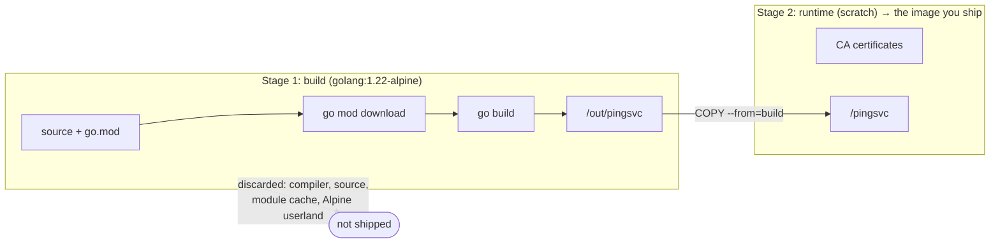

The obvious Dockerfile for a compiled program starts from the language's official image, copies the source, builds, and runs. It works, and it ships everything: the compiler, the package cache, the source code, a full Debian userland. None of it is needed at run time, all of it has to be pulled onto every server, and every package in it is something a vulnerability scanner will flag.

**Multi-stage builds** fix this inside a single Dockerfile: one stage has the full toolchain and builds the program; the final stage starts from something tiny and copies in only the finished binary.

## The starting point

A small Go service, `main.go`, using only the standard library:

```go
package main

import (
	"fmt"
	"log"
	"net/http"
	"os"
)

func main() {
	http.HandleFunc("/ping", func(w http.ResponseWriter, r *http.Request) {
		fmt.Fprintln(w, "pong")
	})

	port := os.Getenv("PORT")
	if port == "" {
		port = "8080"
	}
	log.Printf("listening on :%s", port)
	log.Fatal(http.ListenAndServe(":"+port, nil))
}
```

and a `go.mod`:

```text
module example.com/pingsvc

go 1.22
```

The naive Dockerfile:

```dockerfile
FROM golang:1.22
WORKDIR /src
COPY . .
RUN go build -o /usr/local/bin/pingsvc .
CMD ["pingsvc"]
```

Built on my machine, that image is **1.31 GB**, for a program whose binary is a few megabytes.

## The multi-stage version

```dockerfile
# syntax=docker/dockerfile:1

# ---- Stage 1: build ----
FROM golang:1.22-alpine AS build
WORKDIR /src

COPY go.mod ./
RUN --mount=type=cache,target=/go/pkg/mod go mod download

COPY . .
RUN --mount=type=cache,target=/go/pkg/mod \
    --mount=type=cache,target=/root/.cache/go-build \
    CGO_ENABLED=0 go build -ldflags="-s -w" -o /out/pingsvc .

# ---- Stage 2: runtime ----
FROM scratch
COPY --from=build /etc/ssl/certs/ca-certificates.crt /etc/ssl/certs/
COPY --from=build /out/pingsvc /pingsvc
USER 65534:65534
EXPOSE 8080
ENTRYPOINT ["/pingsvc"]
```

The result: **7.24 MB**, about 180 times smaller.



### Line by line

**Stage 1, the build:**

- **`# syntax=docker/dockerfile:1`**: use the current Dockerfile syntax through BuildKit, the default builder in modern Docker. It's needed for the `--mount` flags below.
- **`FROM golang:1.22-alpine AS build`**: start a stage from the Go toolchain on Alpine and **name it** `build`, so later stages can refer to it.
- **`COPY go.mod ./` then `RUN … go mod download`**: fetch dependencies in their own layer before copying the source. As in [Chapter 1.1](), editing code then reuses this layer. With third-party modules you'd copy `go.sum` as well.
- **`--mount=type=cache,target=/go/pkg/mod`**: a **BuildKit cache mount**. The module cache persists between builds on this machine but is never written into the image, so even when this layer has to rerun, downloads come from the local cache.
- **`--mount=type=cache,target=/root/.cache/go-build`**: the same for Go's compiler cache, so rebuilds only recompile what changed.
- **`CGO_ENABLED=0`**: build a pure-Go, statically linked binary that doesn't depend on the C library. This is what makes an empty runtime image possible: `scratch` has no libc to link against.
- **`-ldflags="-s -w"`**: strip the symbol table (`-s`) and DWARF debug information (`-w`) for a smaller binary. You lose debugger symbols, not stack traces.
- **`-o /out/pingsvc`**: write the binary to a predictable path for the next stage to copy.

(You'll still find `-a -installsuffix cgo` in many guides. Those flags date from before Go 1.10's build cache; today `-a` only forces a full rebuild of the standard library every time.)

**Stage 2, the runtime:**

- **`FROM scratch`**: an empty image: no shell, no package manager, no userland. Only what you copy in exists.
- **`COPY --from=build /etc/ssl/certs/ca-certificates.crt …`**: the CA bundle, so the service can verify certificates on outbound HTTPS calls. Without it, any `https://` request fails with `x509: certificate signed by unknown authority`. (The Alpine Go image already has the bundle installed.)
- **`COPY --from=build /out/pingsvc /pingsvc`**: the binary, and nothing else, from stage 1.
- **`USER 65534:65534`**: run as UID/GID 65534, the conventional "nobody". `scratch` has no `/etc/passwd`, but numeric IDs work without one. Otherwise the process runs as root.
- **`ENTRYPOINT ["/pingsvc"]`**: the binary is the container's process. Arguments passed to `docker run pingsvc …` are appended to it.

Build and check:

```bash
docker build -t pingsvc:1.0 .
docker image ls pingsvc
docker run --rm -p 8080:8080 pingsvc:1.0
curl http://localhost:8080/ping        # pong
```

Only the last stage becomes the image; the build stage stays behind as cache.

## What you give up with `scratch`, and the alternatives

An empty image has no shell. `docker exec -it … sh` fails with `executable file not found`, and there's no `curl` or `ps` for debugging. That's a security win, since there's nothing for an attacker to use either, but it changes how you debug: use logs and metrics, or attach a tools container to the target's namespaces ([Chapter 1.8]()'s container mode).

If `scratch` is too bare, there are two common middle grounds:

| Runtime base | Size | Includes | Choose it when |
|---|---|---|---|
| `scratch` | ~0 | nothing | static binaries (Go, Rust); you add certs yourself |
| `gcr.io/distroless/static-debian12:nonroot` | ~2 MB | CA certs, time zone data, a non-root user, no shell | static binaries, without the manual extras |
| `alpine:3.20` | ~8 MB | shell, `apk` package manager | you need a few tools, or the binary needs libc (musl) |

With distroless, stage 2 shrinks to:

```dockerfile
FROM gcr.io/distroless/static-debian12:nonroot
COPY --from=build /out/pingsvc /pingsvc
ENTRYPOINT ["/pingsvc"]
```

The certificates and the non-root user are already in the base image.

## The same idea for a JavaScript frontend

Multi-stage isn't only for compiled languages. A React or Vue app needs Node.js and hundreds of megabytes of `node_modules` to *build*, but the result is a folder of static files:

```dockerfile
# ---- build: Node, dependencies, bundler ----
FROM node:22-alpine AS build
WORKDIR /app
COPY package*.json ./
RUN npm ci
COPY . .
RUN npm run build

# ---- runtime: just a web server and the built files ----
FROM nginx:1.27-alpine
COPY --from=build /app/dist /usr/share/nginx/html
```

- **`npm ci`**: installs exactly what `package-lock.json` specifies, *including* dev dependencies, because the bundler needs them.
- **`npm run build`**: produces the static site in `dist/` (Vite's default; Create React App uses `build/`).
- **Stage 2** is stock Nginx plus the built files. No Node.js, no `node_modules` and no source code reach production.

## Tests as a build stage

Stages don't have to end up in an image. A stage that runs the test suite turns "the build passes" into "the tests pass":

```dockerfile
FROM build AS test
RUN go test ./...
```

```bash
docker build --target test .          # build up to the test stage; fails if tests fail
docker build -t pingsvc:1.0 .         # the default: the last stage, the runtime image
```

- **`FROM build AS test`**: a stage that starts from the `build` stage's result, so the source and toolchain are already there.
- **`--target test`**: stop at that stage. CI can run this first and only build and push the runtime image if it succeeds.

A normal `docker build` skips the test stage entirely: BuildKit only builds stages the final image actually depends on.

## Checklist

- Build tools in an early stage; the final stage starts from the smallest base that works.
- Copy **only** artifacts across stages: binaries, built assets, never source or caches.
- Dependency manifests before source, and cache mounts for package managers.
- Non-root `USER` in the final stage, and CA certificates if the service makes HTTPS calls.
- Pin base image versions in both stages.

That's the end of the Docker chapter. We started with `docker run hello-world`; by now you've built images, wired services together on networks, run databases and CI in containers, managed remote hosts and a cluster, and shipped images a fraction of their naive size.
