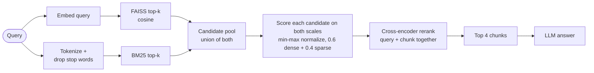

In a [previous guide](), we built a basic PDF question answering system in thirty minutes. Many developers noticed that while it handles straightforward queries well, it struggles when encountering specialized terminology, lengthy corporate documents, or phrasing that deviates from the source text. The system can pull the wrong data, miss critical context, or completely fail to surface relevant answers.

This behavior is not a flaw in your large language model. It is the natural limitation of using a single retrieval strategy. Whether you rely solely on dense retrieval using semantic vectors or sparse retrieval using keyword matching, both methods have distinct blind spots. Dense retrieval handles abstract meaning well but misses exact technical terms. Sparse retrieval nails specific keywords but fails if the user words the question differently.

This guide resolves that core pain point by upgrading your RAG architecture with advanced hybrid search combining sparse search, dense search, and cross encoder reranking to maximize precision. We will walk through the concepts and provide production ready code so your pipeline can simultaneously grasp abstract intent and lock onto exact keywords.

## Why Single Retrieval Strategies Fall Short

Relying on one retrieval method leaves clear gaps in your data architecture.

Dense retrieval converts text into vector embeddings to measure semantic similarity. Think of it as searching for a document by its overall theme rather than its exact wording. This approach shines when users ask conversational questions using synonyms. If your document states that the company offers five days of annual leave and a user asks about vacation time, dense retrieval easily bridges that gap. However, dense retrieval struggles with rare technical jargon, specific product codes, or medical terminology. These unique terms often get diluted during vector encoding. It is also highly vulnerable to typos or text abbreviations, and its accuracy drops if key information sits right on the edge of a text chunk boundary.

Conversely, sparse retrieval tools like the BM25 algorithm evaluate keyword frequency and document statistics. This is like searching for information by matching exact words in a book index. It is incredibly stable and highly sensitive to unique terms. Even if a complex legal term appears only once in your document, sparse retrieval will find it instantly. It executes rapidly because it bypasses heavy vector computations. Yet, sparse retrieval lacks semantic awareness. If a document discusses compensation packages but the user asks about salary details, sparse retrieval will flag it as irrelevant because the exact word does not match.

| **Dimension**      | **Dense Retrieval (Vector Search)**                 | **Sparse Retrieval (BM25)**                               |
| ------------------ | --------------------------------------------------- | --------------------------------------------------------- |
| **Core Logic**     | Semantic similarity matching                        | Keyword frequency and weight matching                     |
| **Key Strengths**  | Grasps context and handles synonyms                 | Locks onto specific terms and offers high speed           |
| **Key Weaknesses** | Misses rare technical terms; relies on text quality | Lacks semantic understanding; fails with altered phrasing |
| **Best Use Case**  | Conversational queries and conceptual matching      | Exact product codes and specialized jargon                |
| **Standard Tools** | FAISS, Milvus, BGE Embedding Models                 | BM25, Elasticsearch                                       |

Combining these two methodologies creates a hybrid search pipeline that blends semantic comprehension with keyword precision.

## Mechanics of Contemporary Hybrid Search and Reranking

Modern hybrid retrieval goes beyond simply stitching two lists of results together. It runs a parallel execution pipeline followed by score normalization and a secondary cross encoder validation step.

The process begins with text preprocessing for the sparse engine: the user query and the document chunks are tokenized and stripped of stop words, so BM25 scores only the terms that carry meaning. The dense engine embeds the raw text, since the embedding model was trained on natural sentences.



Next, the system executes parallel dual engine retrieval. The query is sent simultaneously to the dense vector engine to fetch the top semantic matches and to the BM25 engine to pull the top keyword matches. Running these searches concurrently preserves low latency.

The critical phase is result fusion and normalization. Because vector similarity scores and BM25 scores use completely different scales, we must normalize them before combining them. A common production strategy uses min max scaling to bring both sets of scores into a zero to one range. We then apply relative weights, such as sixty percent emphasis on dense scores and forty percent on sparse scores, to calculate a unified hybrid score. A chunk found by only one engine still gets scored by the other, so a strong keyword match isn't penalized just because it missed the vector top-k. (Reciprocal Rank Fusion, which combines ranks instead of scores, is a popular alternative that needs no normalization or weight tuning.)

The final layer introduces a cross encoder reranking model. While the initial hybrid search is fast and acts as an effective filter, it evaluates queries and documents independently. A reranker inspects the query and the retrieved text chunks together, analyzing deep contextual relationships to output an ultra precise relevance score. The system then sorts the chunks based on this final score and passes the most relevant pieces to the language model.

## Production Implementation: Code Walkthrough

We will now rebuild the RAG retrieval module. We will integrate BM25 sparse search, implement normalized hybrid fusion, and add a cross encoder reranker. The code uses the official OpenAI client package, pointed at DeepSeek's OpenAI-compatible API; any compatible endpoint, including a local Ollama server, works by changing `base_url` and `model`.

First, update your environment with the required packages.

```bash
pip install rank_bm25 faiss-cpu sentence-transformers openai pypdf langchain-text-splitters
```

Below is the complete implementation of the upgraded pipeline.


```python
import os
import re

import faiss
import numpy as np
from langchain_text_splitters import RecursiveCharacterTextSplitter
from openai import OpenAI
from pypdf import PdfReader
from rank_bm25 import BM25Okapi
from sentence_transformers import CrossEncoder, SentenceTransformer

# Global pipeline configurations
PDF_PATH = "your_document.pdf"
DENSE_WEIGHT = 0.6
SPARSE_WEIGHT = 0.4
TOP_K_RETRIEVAL = 10
TOP_K_FINAL = 4

# English setup. For Chinese documents, switch EMBED_MODEL to
# "BAAI/bge-large-zh-v1.5" and tokenize with jieba (pip install jieba):
# tokens = jieba.lcut(text), since \w+ can't split Chinese into words.
EMBED_MODEL = "BAAI/bge-large-en-v1.5"
RERANK_MODEL = "BAAI/bge-reranker-large"  # trained on English and Chinese
STOP_WORDS = {"a", "an", "and", "are", "for", "in", "is", "of", "on", "or", "the", "to", "what", "with"}

def tokenize(text):
    """Lowercases, splits into words and drops stop words (sparse index only)."""
    return [t for t in re.findall(r"\w+", text.lower()) if t not in STOP_WORDS]

def minmax(scores):
    """Scales scores into [0, 1] so dense and sparse scores are comparable."""
    lo, hi = scores.min(), scores.max()
    return (scores - lo) / (hi - lo) if hi > lo else np.ones_like(scores)

def extract_and_chunk_pdf(pdf_path):
    """Extracts raw text from PDF and splits it into manageable chunks."""
    reader = PdfReader(pdf_path)
    # Join pages with a newline so words at page boundaries don't fuse
    raw_text = "\n".join(page.extract_text() or "" for page in reader.pages)

    splitter = RecursiveCharacterTextSplitter(chunk_size=500, chunk_overlap=50)
    return [chunk for chunk in splitter.split_text(raw_text) if chunk.strip()]

class AdvancedHybridRetriever:
    """Manages dual engine search and cross encoder reranking."""
    def __init__(self, corpus):
        self.corpus = corpus
        self.dense_model = SentenceTransformer(EMBED_MODEL)
        self.reranker = CrossEncoder(RERANK_MODEL)

        # Dense index: normalized vectors, so inner product = cosine similarity.
        # Keep the vectors to score sparse-only candidates on the dense scale too.
        self.embeddings = self.dense_model.encode(
            corpus, normalize_embeddings=True, show_progress_bar=False
        )
        self.faiss_index = faiss.IndexFlatIP(self.embeddings.shape[1])
        self.faiss_index.add(self.embeddings)

        # Sparse index: BM25 over the same chunks
        self.bm25 = BM25Okapi([tokenize(doc) for doc in corpus])

    def retrieve(self, query):
        # 1. Dense semantic search
        q = self.dense_model.encode([query], normalize_embeddings=True)
        _, dense_idx = self.faiss_index.search(q, TOP_K_RETRIEVAL)

        # 2. Sparse keyword search, skipped if the query is only stop words
        q_tokens = tokenize(query)
        if q_tokens:
            sparse_scores = self.bm25.get_scores(q_tokens)
            dense_weight, sparse_weight = DENSE_WEIGHT, SPARSE_WEIGHT
        else:
            sparse_scores = np.zeros(len(self.corpus))
            dense_weight, sparse_weight = 1.0, 0.0
        sparse_idx = np.argsort(sparse_scores)[::-1][:TOP_K_RETRIEVAL]

        # 3. Fusion: score every candidate from either list on BOTH scales,
        #    min-max normalize each over the pool, then weight and sort
        candidates = sorted(
            {int(i) for i in dense_idx[0] if i != -1}
            | {int(i) for i in sparse_idx if sparse_scores[i] > 0}
        )
        dense = self.embeddings[candidates] @ q[0]
        sparse = sparse_scores[candidates]
        hybrid = dense_weight * minmax(dense) + sparse_weight * minmax(sparse)
        order = np.argsort(hybrid)[::-1][:TOP_K_RETRIEVAL]
        retrieved_chunks = [self.corpus[candidates[i]] for i in order]

        # 4. Cross encoder reranking: read query and chunk together
        rerank_scores = self.reranker.predict([(query, chunk) for chunk in retrieved_chunks])
        best = np.argsort(rerank_scores)[::-1][:TOP_K_FINAL]
        return [retrieved_chunks[i] for i in best]

def ask_llm(query, context_chunks):
    """Sends the context and query to DeepSeek via standard OpenAI client integration."""
    if not context_chunks:
        return "No relevant documentation found."

    client = OpenAI(
        api_key=os.environ["DEEPSEEK_API_KEY"],
        base_url="https://api.deepseek.com/v1",
    )

    context_text = "\n\n".join(context_chunks)
    prompt = (
        "Answer the question using only the documentation below. "
        "If the answer is not there, say so.\n\n"
        f"Context:\n{context_text}\n\nQuestion: {query}"
    )

    response = client.chat.completions.create(
        model="deepseek-chat",
        messages=[{"role": "user", "content": prompt}],
        temperature=0.1,
    )
    return response.choices[0].message.content

if __name__ == "__main__":
    print("Extracting text and chunking document...")
    document_chunks = extract_and_chunk_pdf(PDF_PATH)
    print(f"Created {len(document_chunks)} discrete text units.")

    print("Initializing hybrid retrieval engines and reranker...")
    search_engine = AdvancedHybridRetriever(document_chunks)
    print("Pipeline ready for queries.")

    user_query = "What are the specific penalty terms for contract violations?"
    matched_contexts = search_engine.retrieve(user_query)
    final_answer = ask_llm(user_query, matched_contexts)

    print(f"\nQuery: {user_query}")
    print(f"Answer:\n{final_answer}")
```

### Walking through the code

**Configuration.**
- `DENSE_WEIGHT` / `SPARSE_WEIGHT` set how much each engine counts in the final score.
- `TOP_K_RETRIEVAL = 10` is how many candidates each engine contributes.
- `TOP_K_FINAL = 4` is how many chunks reach the LLM.
- `EMBED_MODEL`, `RERANK_MODEL` and `STOP_WORDS` are the language-specific parts; everything else is language-neutral.

**`tokenize`** prepares text for BM25 only: lowercase it, split it into words, drop stop words. BM25 scores on exact term overlap, so "Penalty" and "penalty" must become the same token, and words like "the" would otherwise match everything.

**`minmax`** rescales a set of scores to 0–1. It's needed because cosine similarity lives roughly in 0.3–0.9 while BM25 scores are unbounded (8.2, 14.7, …); adding them raw would let BM25 drown out the dense score. The `hi > lo` guard avoids dividing by zero when every candidate scored the same.

**`extract_and_chunk_pdf`** extracts all pages (joined with newlines) and splits them with LangChain's `RecursiveCharacterTextSplitter`. The recursive splitter tries paragraph breaks first, then lines, then sentences, then words, so chunks end at natural boundaries whenever possible.

**`AdvancedHybridRetriever.__init__`** builds both indexes once, over the same chunk list:
- **Dense**: normalized embeddings in a FAISS inner-product index, where inner product equals cosine similarity. The embeddings are also kept in `self.embeddings`, which the fusion step needs.
- **Sparse**: `BM25Okapi` over the tokenized chunks.

**`retrieve`** works in four steps, matching the diagram above:

1. **Dense search** returns the indices of the 10 nearest chunks.
2. **Sparse search** scores *every* chunk with BM25 and takes the 10 best. If the query was nothing but stop words, there's nothing for BM25 to match, so the weights fall back to 100% dense.
3. **Fusion** is where most hybrid implementations cut corners:
   - The candidate pool is the **union** of both top-10 lists (up to 20 chunks). Chunks with a BM25 score of 0 are excluded from the sparse side.
   - Each candidate gets **both** scores. The dense one is computed directly as `self.embeddings[candidates] @ q[0]`, a single matrix-vector product, so a chunk BM25 found but FAISS didn't still gets its real similarity instead of a 0.
   - Both score sets are min-max normalized *over this pool*, then weighted and added.
   - The top 10 by hybrid score go on to reranking.
4. **Reranking**: the cross-encoder reads each `(query, chunk)` pair together, so it can judge whether the chunk actually *answers* the question, not just whether it shares words or topic. The best 4 are returned.

**`ask_llm`** sends the chunks to any OpenAI-compatible endpoint.
- The key comes from `os.environ`, so a missing key fails loudly at startup instead of sending an invalid key to the API.
- The prompt restricts the model to the provided documentation and tells it to say so when the answer isn't there.
- `temperature=0.1` keeps answers close to deterministic, which is what you want for factual Q&A.

## Optimization Strategies for Advanced Deployments

**Dynamic Parameter Tuning**

Instead of keeping your dense and sparse weights static, you can adjust them based on the incoming query structure. If the query contains highly specific technical identifiers, alphanumeric product codes, or exact serial numbers, programmatic detection can shift the sparse weight higher. If the user query is long and conversational, the system can favor the dense retrieval engine.

**Advanced Semantic Chunking**

Fixed size token chunking often breaks paragraphs mid sentence, destroying the semantic unity of the text. Upgrading to semantic chunking allows your system to monitor embedding drift between sentences. The document breaks only when a meaningful shift in topic occurs, ensuring that the dense vector representations remain pure and contextually complete.

**Cross Encoder Reranking Scaling**

While cross encoders provide exceptional accuracy, they introduce higher computational latency compared to bi encoders. To maintain high performance in production environments, implement a two tier architecture. Use the hybrid retrieval layer to filter thousands of documents down to a small candidate pool of perhaps fifteen or twenty blocks, then pass only that small pool to the reranker.

## Resolving Common Deployment Challenges

**Empty Keyword Tokens**

When a query consists purely of common stop words, the tokenization process can return an empty list, forcing the sparse engine to output flat zeros. To resolve this, implement a fallback mechanism that bypasses the sparse scoring stage completely if no valid keywords remain after filtering.

**Latency Bottlenecks**

If your database scales to millions of chunks, running unindexed keyword searches alongside dense calculations will slow down response times. Ensure that your sparse index leverages an optimized inverted index framework like Elasticsearch or Milvus sparse vectors, and limit the initial retrieval count to a tight window.

**Mismatched Reranker Scales**

Using a reranker model trained on general web text might downgrade the relevance of highly specialized internal corporate documentation. Always verify that your cross encoder matches the primary language and domain of your dataset, or consider fine tuning a lightweight open source model on your specific documentation history.

Modern RAG success relies heavily on high quality data retrieval. Moving to a hybrid architecture backed by dual engines and cross encoder validation removes the structural blind spots of single strategy systems. By implementing these patterns, you bridge the gap between abstract understanding and exact keyword tracking, giving your enterprise application production level precision.
