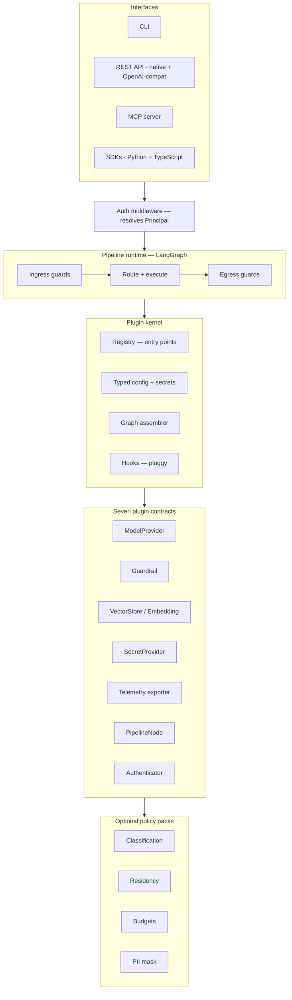
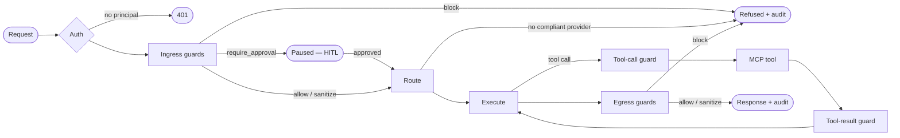

The first version of Aegis worked. It routed LLM traffic across providers, masked PII, classified data by sensitivity, and enforced per-team budgets. It also had a fixed pipeline — classify, then mask, then route, then call the provider, then scan the output — hardcoded as a single call chain inside one orchestration service. Adding a guardrail meant editing that service. Swapping the PII engine meant editing that service. Supporting a new provider meant editing that service.

That is the failure mode of building a gateway as a *product*: every capability lives in the core, so every change is a core change. It ships fast and then ossifies. The second a user wants a guardrail you didn't anticipate, they're forking you.

The rewrite started from a different question. Not "what features should the gateway have?" but "what is the smallest thing the core must know, and can everything else be a plugin?" This post is about that question and what it took to answer it honestly.

## The kernel knows nothing

The organizing principle of Aegis v2 is a sentence I kept repeating during design reviews until it stopped sounding strange: **the kernel knows nothing about what the pipeline does.**

It knows four things. How to discover plugins. How to validate typed configuration. How to resolve secrets. How to compile a request pipeline into an executable graph. That is the entire job of the core. There is no `classify()` call in it, no `mask()` step, no hardcoded list of providers, no mention of PII or budgets or residency. Those words do not appear in the kernel.

Everything with an opinion implements one of seven contracts:

| Contract                                    | Responsibility                               |
| ------------------------------------------- | -------------------------------------------- |
| `ModelProvider`                             | complete / stream / embed against a backend  |
| `Guardrail`                                 | scan content, return a verdict               |
| `VectorStoreProvider` / `EmbeddingProvider` | RAG storage and embeddings                   |
| `SecretProvider`                            | resolve a secret reference at config load    |
| Telemetry exporter                          | ship observability data somewhere            |
| `PipelineNode`                              | arbitrary middleware in the request graph    |
| `Authenticator`                             | resolve request credentials into a principal |

The whole system is layered around that contract set:



Read that diagram top to bottom and the dependency direction is the whole argument: interfaces depend on the runtime, the runtime depends on the kernel, the kernel depends on the contracts, and the governance features at the bottom depend on the contracts too, exactly like any third-party plugin would. Nothing points back up.

Discovery uses Python entry points, the same mechanism pytest and Flake8 use to find plugins. A third-party package declares an entry point in its `pyproject.toml`, and Aegis finds it at startup with zero core changes:

```toml
[project.entry-points."aegis.guardrails"]
block-competitors = "block_competitors:BlockCompetitors"
```

This is deliberately boring, and boring is the point. Entry points have worked at ecosystem scale for over a decade. A plugin author already knows the pattern. I did not want anyone learning a bespoke Aegis plugin system; I wanted them reusing one they already understood.

## The test that the abstraction is real

Here is the trap with every "everything is a plugin" architecture I've seen fail: the core team builds the real features with private, internal APIs, and the public plugin interface becomes a second-class afterthought that can't actually express anything serious. You discover this the first time an outside developer tries to build a real plugin and hits a wall the core team never hit, because the core team wasn't using the public door.

I wanted a structural defense against that, not a good intention. The rule became: **Aegis's own governance features are plugins.** Data classification, residency enforcement, budgets, PII masking and none of them live in the core. They are optional policy packs that import *only* the public `aegis` contracts. And an import-linter contract in CI fails the build if a pack reaches for anything private.

This changes the abstraction from aspiration to proof. If our own flagship features cannot be built on the public contracts, the contracts are wrong, and the build goes red before anyone merges. The policy packs are an executable, continuously-checked proof that the plugin API is sufficient for real work. The day an outside developer writes a guardrail, they are using the exact same interface that our PII pack uses because there is no other interface.

It also produced a nice side effect for installation. Because the packs are separate, the base install stays slim:

```
pip install aegis-ai            # kernel + server + CLI
pip install aegis-ai[pii]       # adds Presidio + a spaCy model
pip install aegis-ai[llm-guard] # adds the transformer scanners
pip install aegis-ai[rag]       # adds the vector libraries
```

A framework whose base `pip install` drags in torch and spaCy before you've sent a single request has already lost the argument that its kernel is small. The extras map one-to-one onto packs, so the mental model is clean: install the pack, get its dependencies, and nothing else.

## Why the pipeline is a graph

The old call chain had a subtler problem than rigidity. It couldn't express conditional flow without nesting. "If the data is classified RESTRICTED, route only to a compliant provider" became an `if` statement buried three functions deep — invisible to anyone reading the configuration, impossible to point at in an audit, and untestable in isolation.

In v2 the request lifecycle is a LangGraph `StateGraph`. The compliance rule becomes an *edge* in a graph: a thing you can draw, lint, and show an auditor. A request flows through a staged spine, ingress guards, then route, then execute, then egress guards, and each stage is populated from ordered node lists in `aegis.yaml`. The assembler compiles one graph per route at startup, so there is no per-request assembly cost and misconfiguration is caught at load, not in production.



Making the pipeline a graph bought four things that would each have been a project on its own.

**Conditional routing** as visible structure rather than nested branches — the residency branch in that diagram is a real edge, not buried logic.
**Checkpointing** which runs persist and survive a server restart.
**Human-in-the-loop** as a guardrail can *pause* a request via an interrupt instead of only blocking it, and the run resumes later.
**Streaming** first-class, with the runtime handling token flow.

It also collapsed two concepts I'd been treating as separate. A "gateway request" and an "agent run" are now the same abstraction: a traversal of a graph. Adding agentic workflows later isn't a new subsystem; it's more nodes on the same runtime. That kind of leverage only comes from picking the right core abstraction before you build features on top of it.

## Nodes talk through state, not through each other

One detail that made the plugin model actually composable: nodes never call each other. They communicate only through a typed `RunState` that flows through the graph to run id, the authenticated principal, the messages, a free-form `labels` dictionary, a mask map kept in a channel that is never serialized into model-visible text, the selected route, an append-only event log, and usage accumulators.

The `labels` field is how packs cooperate without coupling. The classification pack writes `labels.classification = "restricted"`. The residency pack *reads* `labels.classification` to decide which providers are eligible. Neither imports the other. Neither knows the other exists. They coordinate through shared state the way two Unix programs coordinate through a pipe which means you can add, remove, or replace either one without touching the other. A third-party node and a built-in node are indistinguishable to the runtime, because both are just functions from state to a state delta.

## What I'd tell someone starting this

Three things, in order of how much time they saved.

**Pick the core abstraction before the features.** The early design sessions argued about whether the pipeline was a call chain, a middleware stack, or a graph, not about which guardrails to support. The graph decision made every later decision easier and several later decisions free. Feature decisions made first would have calcified into the wrong core, and you cannot refactor your way out of a wrong core abstraction; you rewrite. I know, because v1 was that rewrite.

**Make dogfooding structural, not aspirational.** "We use our own public API" is a lovely sentiment that erodes the first time a deadline makes a private shortcut faster. An import-linter rule that fails the build does not erode under deadline pressure. If you want your plugin interface to stay honest, hand its enforcement to a machine.

**Adopt standards as interfaces where the standard is the value; wrap everything fast-moving.** Aegis programs directly against LangGraph's graph and checkpointer, the official MCP SDK, and OpenTelemetry, because adopting those interfaces means plugin authors inherit those ecosystems on purpose. But it *wraps* fast-moving libraries like LiteLLM and the guardrail engines behind its own contracts, each imported in exactly one module. When a wrapped library breaks, the fix is one file and nothing else in the codebase ever knew it existed. Knowing which dependencies to adopt and which to quarantine is most of what dependency hygiene actually is.

The next post is about the single hardest part of the build: designing a guardrail contract that is configurable, composable, *and* honest about what it can guarantee, especially when streaming and full-context scanning want exactly opposite things.
