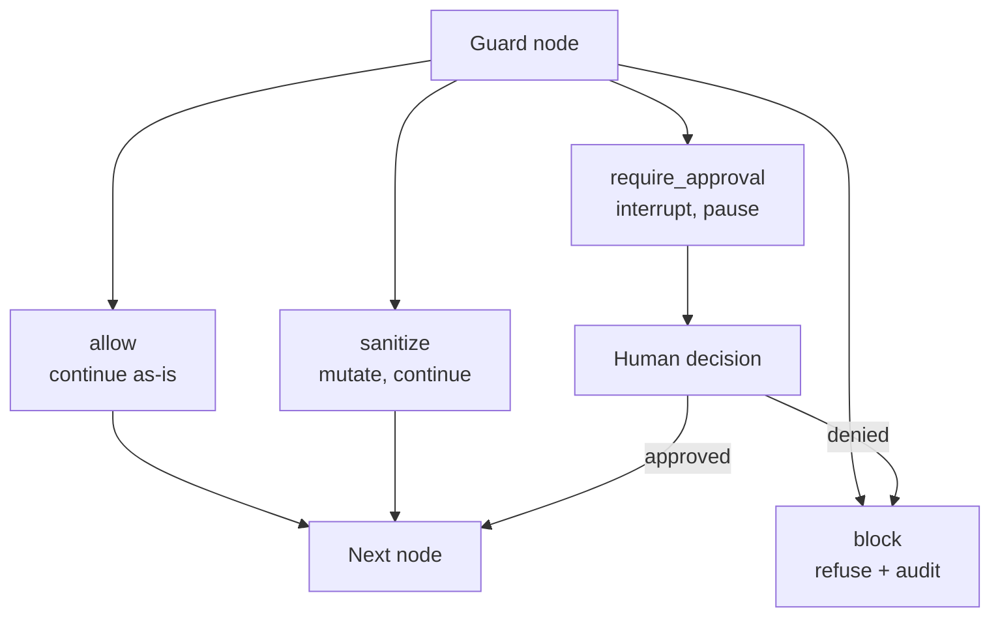
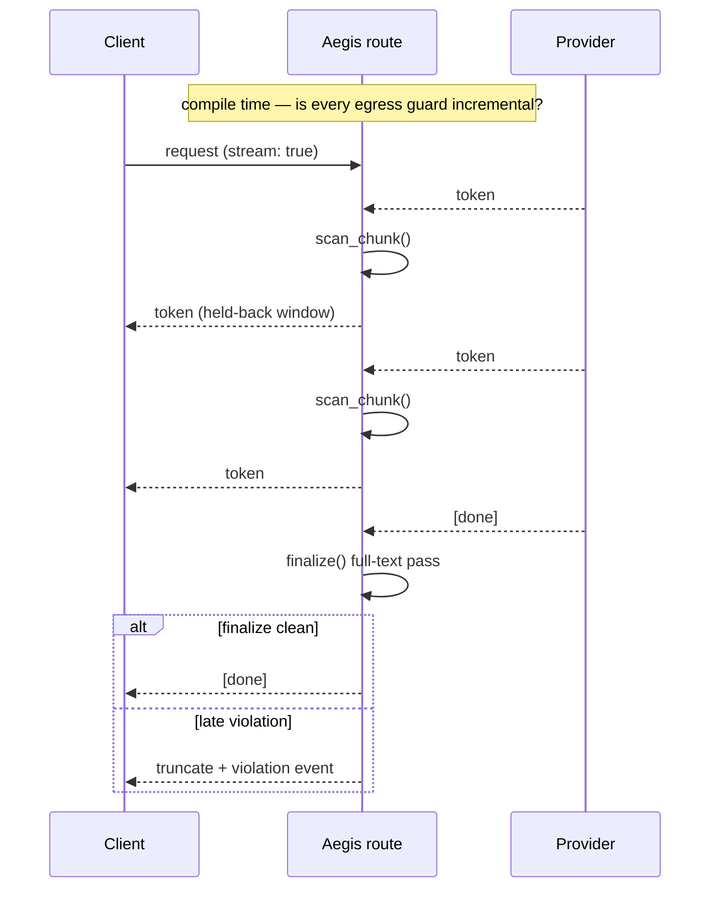
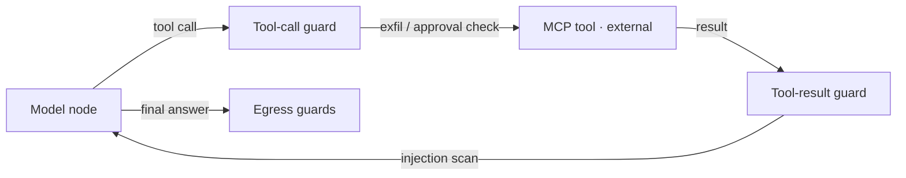

A guardrail that silently does less than you think is worse than no guardrail, because you've stopped watching the thing you believe is being watched for you. The hardest design problem in rebuilding Aegis wasn't writing scanners — good ones already exist, and reinventing them would have been hubris. It was designing a contract that stays honest about what it can actually guarantee, especially in the one place where honesty is expensive: streaming.

This post walks through the guardrail model from the verdict type up to tool governance, because the interesting decisions compound.

## Four verdicts, not a boolean

The obvious guardrail interface returns a boolean: allowed, or not. It is also wrong, because real policies need more than two outcomes. A guard in Aegis returns one of four verdicts:

- **allow** — continue unchanged.
- **sanitize** — continue, but with mutated state: mask a value, redact a span, strip a header. Sanitize deltas from multiple guards compose in order.
- **block** — terminal. The stage short-circuits, the client gets a refusal, the audit log gets the reason.
- **require_approval** — the run pauses and waits for a human.



That fourth verdict is the one most systems lack, and it quietly changes what a guardrail *is*. A guard is no longer a gate that's open or shut; it's a participant that can escalate. "This looks like a bulk export of customer records — don't block it, but pause and get a human to sign off" is now a policy you express directly, in one verdict, instead of building an approval system on the side.

A design decision that paid off repeatedly: the branching logic lives in the spine, not in the guards. A guard's only job is to look at content and return a verdict. The pipeline decides what each verdict *means* — short-circuit on block, compose on sanitize, interrupt on approval. This keeps third-party guards almost trivially small:

```python
class BlockCompetitors(Guardrail):
    streaming = "incremental"

    def __init__(self, competitors: list[str]):
        self.competitors = [c.lower() for c in competitors]

    async def scan(self, text: str, ctx: RunContext) -> Verdict:
        if any(c in text.lower() for c in self.competitors):
            return Verdict.block(reason="competitor mention")
        return Verdict.allow()
```

Every verdict — including `allow` — is written to an append-only event log. "Which guard allowed this?" is always answerable after the fact. In a governance system the audit trail isn't a feature you add; it's a property of how verdicts flow, and designing it in from the verdict type up is much cheaper than bolting it on.

## The streaming problem

Here is the tension that took the longest to resolve, and the reason this post exists.

Egress guards want the *complete* model output before they judge it. A toxicity classifier cannot score half a sentence; a groundedness check needs the whole answer to compare against sources. But streaming wants to emit each token the instant it's generated, because that's the entire reason users like streaming. These two desires are in direct opposition, and most systems resolve the conflict by quietly picking one side and never mentioning it.

I had three options and spent real time on each.

**Always buffer.** Wait for the full response, scan it, then send it all at once. This gives full guard fidelity and a product that feels broken next to every provider that streams. Acceptable as a *mode*; unacceptable as the only behavior.

**Always stream with windowed scanning.** Release tokens a small window behind generation, scan incrementally as you go, do a final pass at the end. Good UX. But it silently weakens any guard that fundamentally needs full context — and this is the part that kept me up — the user has *no idea* their policy is now running at reduced fidelity. The dangerous failure here is not the weakened scan. It's that the weakening is invisible. You think you have a groundedness guarantee; you have a guess.

**Capability negotiation.** The option I shipped, and the one consistent with the rest of the architecture.

## Making the trade-off visible

Every guardrail declares a capability as part of its contract: `streaming: none | incremental`. An incremental guard implements `scan_chunk()` for the streaming path plus a mandatory `finalize()` full-text pass at the end. A non-incremental guard implements only `scan()` and, by declaring so, states plainly that it needs the whole output.

At compile time — not per request — the graph assembler inspects each route's egress guards and computes the streaming mode for that route:

- **All egress guards incremental** → the route streams, with a hold-back window so tokens are released slightly behind generation. If `finalize()` catches a violation that the incremental passes missed, the stream truncates and a violation event is logged.
- **Any guard non-incremental** → the route buffers.



The critical property is that the trade-off is *visible*. `aegis policy lint` reports every downgrade before anything runs:

```
AEG-POL-007  Route 'default' cannot stream: guardrail 'toxicity_ml'
             declares streaming=none. Responses on this route will
             be buffered.
```

You are still completely free to put a full-context toxicity scanner on a route. You just learn, at lint time, that it costs you streaming on that route — and you decide, with the cost in front of you. The trade-off is yours, made with eyes open, instead of a silent degradation you reverse-engineer from a production incident three weeks later.

The principle generalizes well beyond streaming, and it's the through-line of the whole project: **when a configuration weakens a guarantee, the tooling should say so out loud.** Silent best-effort is the enemy of a governance tool, because the entire value proposition is that you can trust what it claims.

## Honoring the wire even when buffering

One more constraint shaped the implementation. A buffered route still has to answer clients that asked for `stream: true` — because Aegis exposes an OpenAI-compatible endpoint, and every OpenAI client in the world sends that flag and expects server-sent events back.

So a buffered route scans the full output, then emits it as valid OpenAI SSE frames after the fact. The client perceives higher latency; it never perceives a protocol error. This matters more than it sounds: compatibility is a contract you keep even when your internals can't fully honor the spirit of the request. Breaking the wire format to signal an internal limitation just converts your problem into a problem for every downstream tool that integrated against the standard. Keep the wire; pay the latency; lint the reason.

## Governing the traffic everyone ignores

The payoff for getting the contract right shows up somewhere most gateways never look: tool calls.

When the model decides to call a tool — over the Model Context Protocol, in Aegis's case — that call is model *output*. It can carry a masked PII placeholder out to an external service (an exfiltration path), or it can be a destructive action (`delete_record`). So it passes a tool-call guard on the way out. The tool's result is untrusted *input* — and tool output is the prime prompt-injection vector in agentic systems, because it's content the model will read and act on that you didn't write. So it passes a tool-result guard on the way back in.



There is no new interface for any of this. Both positions invoke the same `Guardrail` contract, just at different points in the execute subgraph. Per-tool policy — "`delete_record` requires approval" — reuses the `require_approval` verdict and the same human-in-the-loop interrupt machinery from the main pipeline, unchanged. Retrieved RAG documents flow through that same tool-result chain, because a document you indexed last month is also untrusted content the moment it re-enters a prompt.

That's the dividend of getting the verdict contract right early: governing a brand-new traffic surface became a matter of placing existing nodes in new positions, not writing new machinery. The four verdicts, the audit log, the approval interrupt — all of it composed.

The last post in this series is about the parts of the design that required saying *no*: the residency model I refused to overclaim, the multi-tenancy I deliberately didn't build, and why drawing those lines clearly was as much a part of the engineering as anything that shipped.
