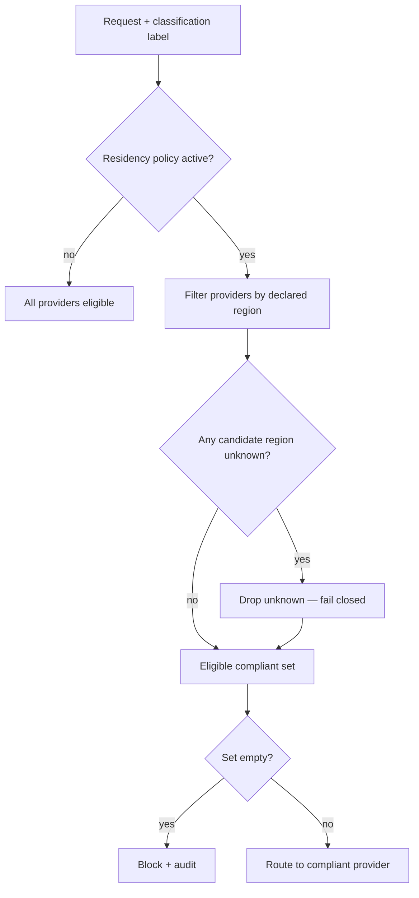

Most of building Aegis was deciding what to build. But the decisions I'm most confident about, looking back, were decisions to *not* build something — or to build it while being loud about its limits. In a governance tool, overclaiming is the cardinal sin: a guarantee you can't actually keep is worse than an absent feature, because someone will build on top of it and find out the hard way that the floor wasn't there. This post is about three places where the honest answer shaped the design more than the ambitious one would have.

## You cannot detect where inference happens

Aegis can enforce data residency — a policy like "data classified RESTRICTED must not reach a provider outside this jurisdiction." The naive implementation is to detect where each provider runs inference and block the disallowed ones. That implementation is impossible, and pretending otherwise would be the single most dangerous thing the framework could do.

Geolocating a provider's API endpoint tells you where the nearest edge node or load balancer sits, not where the GPUs that run the model actually are. Providers route internally however they like, across regions you never see. There is no request you can make from application code that returns a trustworthy "this specific inference executed in region X." Any product claiming to *detect* processing location is reporting a number it effectively invented, and a security reviewer will see through it the moment they think about the network path.

So Aegis doesn't detect. It enforces what's *declared*, verifies what's *verifiable*, and labels which is which. Four layers, fail-closed by default:

1. **Declared metadata.** Every provider profile carries `residency: {region, jurisdiction, source_url}`, sourced from the provider's own documentation. Unset means `unknown`.
2. **Endpoint validation.** Some providers encode region verifiably in the endpoint itself — Azure hostnames, Bedrock regions, Vertex locations, OpenAI's regional endpoints. `aegis policy lint` parses these and flags any mismatch between what you *declared* and what the URL actually *says*. This is the only genuinely verifiable signal, so it's used everywhere it exists.
3. **Fail-closed routing.** With a residency policy active, the router filters the candidate set before selection, and `unknown` is treated as non-compliant. A blocked route is an audited event, never a silent fallback to whatever provider happens to be healthy.
4. **Advisory runtime checks.** Optional endpoint geolocation, reported as telemetry and labeled explicitly: *advisory only — not proof of processing location.* It's a smoke detector, not a guarantee, and it says so.

And then the part most tools won't put in writing: the real enforcement boundary is your network, not the application. A hard "data never leaves this jurisdiction" guarantee ultimately lives at the DNS and egress-allowlist layer, outside anything an application framework can promise. The Aegis docs say this plainly and show you how to pair the residency pack with network egress controls.

This honesty is not a weakness in the pitch; it *is* the pitch. "We enforce what's declared, verify what's verifiable, fail closed on the unknown, and here's exactly where our boundary ends" is a paragraph a compliance reviewer can actually trust and defend. "We guarantee data residency" is a sentence they'll correctly stop trusting the instant they think about how inference routing works. **A framework that's honest about its limits is more useful for compliance than one that papers over them**, because compliance, in the end, is the business of being able to defend your claims under scrutiny.

## The multi-tenancy I didn't build

Aegis is principal-aware. Virtual API keys resolve to a `Principal` carrying an id, a team, and a set of labels, and every run is attributed to one. Budgets meter against the principal, audit attributes to it, approval authority is checked against it. That's identity level L2 on a ladder I found worth naming explicitly during design, because naming it kept the scope argument honest:

- **L0 — anonymous.** Single user, local dev, no auth. `aegis dev` on localhost.
- **L1 — authenticated.** Keys resolve to a principal attached to every run.
- **L2 — policy-per-principal.** Existing policy packs read the principal: budgets per team, allowed routes per key, residency constraints per label. **This is what v1 ships.**
- **L3 — full multi-tenancy.** Isolated organizations, tenant admins, per-tenant config and data. **Explicitly out of scope.**

The temptation was to build L3. From L2 it looks like a small step — just add a `tenant_id` column, right? It is not a small step. It is a phase change from *framework* to *platform*, and I want to lay out why, because the analysis is what justified the "no."

At L3, identity inverts: tenants self-manage their users and bring their own identity providers, so a single authenticator becomes a per-tenant authenticator multiplexer. Configuration stops being a file and becomes versioned per-tenant data behind an admin API, with platform-level policy floors that must merge with and override tenant policy. Every table, cache, checkpoint, and RAG collection grows a partition key — and that key needs *provable* isolation, because the number-one threat in a multi-tenant system is cross-tenant leakage, which means every shared cache and every reused compiled graph needs an isolation test. Fairness and quotas appear, so one tenant's batch job can't starve another's interactive traffic. Cost tracking graduates from useful telemetry to billing-grade metering with reconciliation. The test matrix roughly doubles, because every feature now needs an isolation variant.

Honest sizing: L3 is comparable in total effort to the entire rest of the framework. Bolting it on as "one more feature" is how you ship something that is neither a good framework nor a real platform — it's the worst of both, late.

So I deferred it. But — and this is the distinction that matters — I designed the *seams* rather than designing it out. `Principal.labels` is exactly where a tenant id would live and become the partition key. RAG already partitions by namespace. Policy is already evaluated per principal. Routes already compile independently of each other. If L3 ever arrives, it arrives as addition along seams that already exist, not as a rewrite. **Deferring a feature and designing it out are different acts: the first leaves seams, the second burns bridges.** Knowing which one you're doing is the difference between a roadmap and a regret.

## The non-goals list is load-bearing

Aegis's design spec has a section as long as its feature list: what it deliberately is *not*.

Not a SaaS — self-hosted by design, so your prompts and keys stay on your infrastructure. Not multi-tenant — see above. Not an inference server — no bundled local models, just a clean provider slot left open for them (Ollama and friends connect today through the OpenAI-compatible provider type). Not an observability stack — OpenTelemetry at the core, Prometheus and the rest as optional exporter plugins. Not an agent-framework competitor — it's built on LangGraph and governs agents; it doesn't try to replace the thing it stands on. Not a guardrail research project — it composes the best existing scanners behind one contract; it doesn't invent novel detectors.

For an open-source project, the non-goals are not a disclaimer you write at the end. They're the scope contract, and every line traces back to a decision that kept the kernel small. "No bundled inference" is *why* the provider contract has a clean local-model slot that nobody is forced to fill. "Not an observability stack" is *why* telemetry is a plugin family instead of a hard dependency that drags Prometheus into every install. Each "not" is a dependency that never entered the tree and a maintenance burden nobody signed up for. The feature list tells you what the project does; the non-goals tell you what it will still be able to do well in two years, because they're the reason it didn't accrete its way into an unmaintainable everything-platform.

## What this taught me

The reflex, when you're building a tool that makes guarantees, is to maximize what you promise. The opposite reflex is the correct one. The credibility of everything Aegis *does* enforce — composable guardrails, fail-closed routing, audited verdicts, principal-scoped budgets, governed tool traffic — rests on being unambiguous about the things it can't enforce and won't pretend to.

Saying no precisely is a feature. It's just one that never shows up in a changelog, which is exactly why it's easy to undervalue and worth writing down. If you're building in this space, write your non-goals before your features. The non-goals are the ones you'll be grateful for later.
