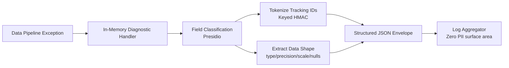
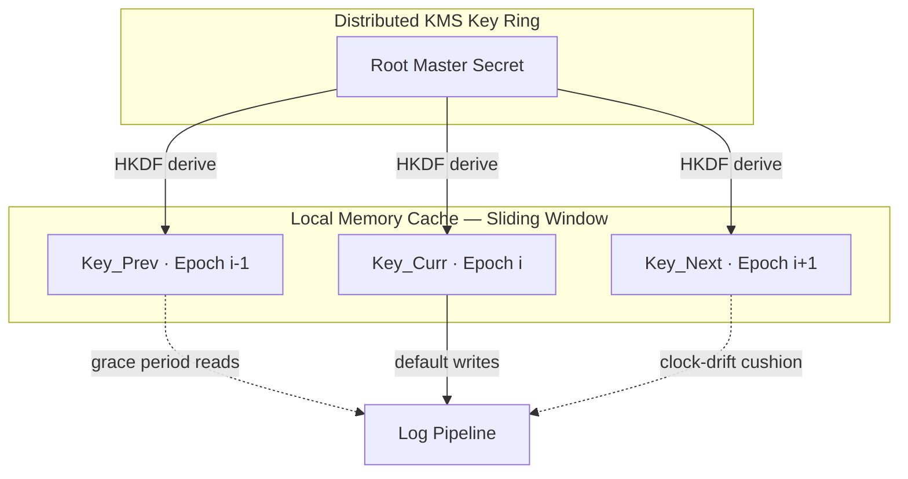
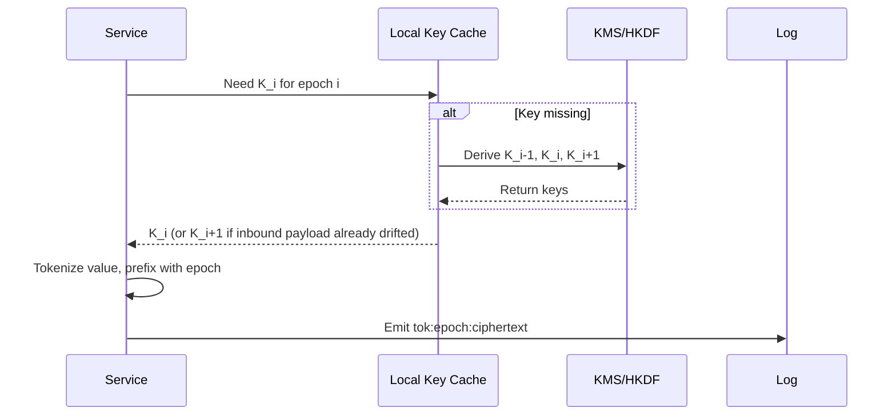
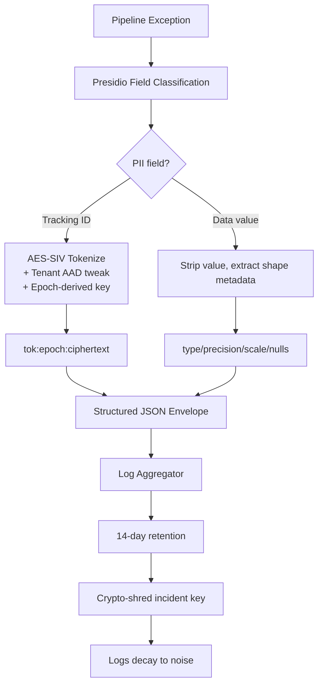

## Debugging Production Data Pipelines Without Touching PII

Every enterprise data team eventually hits this wall: a customer reports "your data loader crashed on our data," and the two standard debugging moves—asking for logs, asking for a data sample—are both illegal. If the pipeline touches financial records, health data, or SSNs, the customer legally cannot hand you a sample, and you legally cannot persist it in your logs.

This post breaks down a design philosophy for solving this: capture *diagnostic signal* without ever capturing *PII*. We'll use a real bug [Apache Arrow ADBC #2084](https://github.com/apache/arrow-adbc/issues/2824) as a case study, then build up the cryptographic architecture needed to make deterministic tracing safe at scale.

## The Core Problem

Two debugging needs collide with two compliance constraints:

- Engineers need **reproducible signal** (what shape of data broke the system?) and **traceability** (can I follow one user's request across five microservices?).
- Compliance needs **zero PII at rest** and **no way to reverse-engineer identity** from what *is* stored.

Naive masking tries to satisfy both by blanking out values it detects as sensitive. This usually destroys the signal engineers actually need.

## Case Study: Apache Arrow ADBC #2084

In this [GitHub issue](https://github.com/apache/arrow-adbc/issues/2824), a data pipeline pushed a stream into Snowflake via the ADBC driver. It crashed because the Snowflake driver didn't support binding fixed-point `DECIMAL` types in parameterized queries.

A naive masking system, terrified of leaking `transaction_amount`, would blank the query:

```sql
SELECT * FROM revenue_table WHERE customer_id = *** AND transaction_amount = ***
```

This tells the engineer nothing. The actual fix requires knowing the *shape* of the data, not its *value*. A metadata-first diagnostic system instead emits this:

```json
{
  "event": "database_bind_parameter_failed",
  "driver": "adbc_driver_snowflake",
  "error_class": "NotSupportedError",
  "param_index": 0,
  "metadata": {
    "data_type": "DECIMAL",
    "precision": 38,
    "scale": 9,
    "total_rows": 4000000,
    "null_percentage": 2.0
  }
}
```

Now the engineer immediately sees the real story: the driver chokes on a `DECIMAL(38,9)` during a 4-million-row bulk bind. Not a single financial value left memory. This is the pattern the rest of this post generalizes.

## Key Concepts, Defined Plainly

A few terms do a lot of work in this design. Worth being precise about them:

- **Structured events vs. raw text logs**: text logs are strings with variables jammed in; structured events are JSON objects with predictable keys and tightly typed values—much easier to redact selectively.
- **Data shape / metadata**: describing structure instead of content. Instead of logging `$1,234,567.89`, you log "positive decimal, precision 9, scale 2."
- **Deterministic tokenization**: the same input always produces the same token (`"Alice Smith"` → `token_94af2`, everywhere). This preserves join-ability across microservices without exposing the real value.
- **Redact-at-capture vs. redact-at-view**: capture-time redaction cleans data in memory before it touches disk; view-time redaction stores raw data and blocks it at the dashboard layer. Capture-time is safer; view-time is more forgiving of mistakes.
- **Fingerprinting via frequency analysis**: the core weakness of naive deterministic tokens. If `token_94af2` appears 1M times and every other token appears twice, and you know your biggest customer is 40% of traffic, the token is de-anonymized by pure statistics.

## The Basic Architecture



**Implementation steps:**

1. **Intercept in memory.** Wrap data execution loops in a diagnostic handler. On exception, halt before anything hits a text logger.
2. **Classify fields.** Run column headers, parameters, and variable names through a classifier like Microsoft Presidio to flag PII.
3. **Tokenize tracking IDs.** For fields you need to trace (tenant ID, session ID), run them through a keyed HMAC for a consistent, non-reversible token.
4. **Extract data shape.** For the data block that crashed, strip literal values entirely. Keep type, precision, scale, string length, null percentage.
5. **Emit the clean envelope.** Assemble tokens and shape metadata into structured JSON. Ship it—your storage layer now has zero compliance surface area.

## The Trade-Offs You're Actually Signing Up For

This design isn't free. Three tensions matter:

**1. Security vs. future visibility.** Redact-at-capture means a breached log server leaks nothing—but it also means destroyed signal is gone forever. If your classifier misclassifies a technical error code as PII and blanks it, you cannot go back and un-redact it. You never saved it.

**2. Traceability vs. cryptanalysis.** Deterministic tokens let you grep `token_a71x` across five services and follow a broken request end to end. But that same determinism leaks equality patterns—frequency analysis on a leaked log dump can reverse-engineer identity from volume alone.

**3. Execution overhead vs. simplicity.** Text logging is just `printf` to a file descriptor. This design runs classification, computes null percentages, and executes cryptographic hashes—right when your system is already under strain from the error that triggered it.

The central paradox: fully random tokens (like password salts) kill determinism, breaking join-ability. Fully deterministic tokens are traceable but statistically attackable. You need to *constrain the scope* of determinism, not eliminate it.

## Four Cryptographic Defenses Against Fingerprinting

### 1. Context-Scoped Tweaking (AES-SIV)

Standard encryption uses a random IV, so the same plaintext encrypts differently each time—killing determinism. **AES-SIV** (RFC 5297) instead derives its IV synthetically from the plaintext *plus* Additional Authenticated Data (AAD)—a "context tweak."

Use a stable boundary like `Tenant_ID` as the AAD. The same PII value tokenizes identically *within* a tenant, but differently *across* tenants. An attacker can no longer run one unified frequency analysis over your global log store—each tenant's distribution is cryptographically isolated.

### 2. Time-Bounded Sliding Windows

Frequency analysis needs volume to work. Shrink an attacker's window by deriving keys per time epoch via HKDF:

$$\text{Key}_{\text{week}} = \text{HKDF}(\text{Master\_Secret}, \text{"2026-Week-29"})$$

Tokens stay deterministic *within* the week—active incidents trace cleanly—but roll over on schedule. A multi-month leaked log dump becomes nearly useless because the statistical fingerprint shifts every seven days.

### 3. Token Pooling (Salt-Bucketing)

Low-entropy fields (`SUCCESS`/`FAILED`, gender, state codes) are trivially fingerprinted—if 95% of tokens are `token_x`, you know exactly what it means. Token pooling maps a value to a *deterministic bucket* of, say, five valid tokens for `FAILED`, chosen by a secondary stable attribute (e.g., last digit of a transaction ID). This flattens the frequency spike into a smooth curve while engineers can still query the whole pool.

### 4. Ephemeral Keys and Crypto-Shredding

For high-severity incidents, spin up an incident-specific key from your KMS. Use it to tokenize logs for the incident's lifecycle. Once the ticket closes or a retention period (e.g., 14 days) expires, **delete the key from the KMS**—permanently. The tokens remain in cold storage, but they're now mathematically decoupled from any real-world mapping. No key, no reversal, ever.

### Strategy Comparison

| Strategy                | Traceability Scope                 | Frequency Protection                  | Complexity |
| ----------------------- | ---------------------------------- | ------------------------------------- | ---------- |
| Context-Scoped Tweaking | Full, within tenant boundary       | High (blocks cross-tenant analysis)   | Medium     |
| Time-Bounded Windows    | Active during operational window   | High (breaks long-term baselines)     | Low        |
| Token Pooling           | Grouped (query the whole pool)     | Medium (flattens low-entropy spikes)  | High       |
| Crypto-Shredding        | Transient, gone after key deletion | Absolute (post-deletion = pure noise) | High       |

**The sweet spot**: combine AES-SIV (isolate per tenant) with time-bounded windows (rotate keys so history decays into noise).

## The Hard Part: Rotating Keys Without Breaking Everything

Time-bounded keys sound simple until you hit the **midnight race condition**. Server A's clock runs 3 seconds fast; Server B's runs 3 seconds slow. At a hard cutover, A is encrypting with tomorrow's key while B is still on today's. Add network delay and queued retries, and a naive rotation turns into a storm of decryption failures.

The fix rests on three principles: **epoch-based derivation**, **self-describing tokens**, and a **sliding three-key cache**.



### Epoch derivation

Given epoch length \(E\) (e.g., 86400 seconds for daily rotation) and Unix timestamp \(t\):

$$i = \left\lfloor \frac{t}{E} \right\rfloor$$

$$K_i = \text{HKDF}(\text{Root\_Master\_Secret}, \text{"log-tokenization-context"} \mathbin\Vert i)$$

Services derive \(K_i\) locally from a periodically-fetched root secret—no KMS round-trip per log line.

### Self-describing tokens

Never assume a log's timestamp tells you which key encrypted it—queued messages can sit for minutes. Instead, every token carries its epoch as a plaintext prefix:

```
tok:19532:a8f9c2d103b4e...
│    │     └─ deterministic ciphertext
│    └─────── epoch index (days since Unix epoch)
└──────────── token type identifier
```

A consumer reading `tok:19532:...` doesn't care what its own clock says—it fetches \(K_{19532}\) and moves on.

### The three-key sliding cache

Every service keeps exactly three keys warm in memory:

- \(K_{i-1}\) — past key, for late-arriving or retried logs
- \(K_i\) — current key, default for new writes
- \(K_{i+1}\) — future key, pre-warmed for clock-drifted callers



### Runtime flow at a key boundary

1. Compute current epoch \(i = \lfloor t/E \rfloor\) from local clock.
2. Check cache for \(K_{i-1}, K_i, K_{i+1}\); background-fetch any missing ones (never block the main thread).
3. If within a drift cushion (e.g., <10 seconds to boundary) and an inbound payload already uses \(K_{i+1}\), switch to \(K_{i+1}\) to match the caller.
4. Tokenize with the selected epoch's key; prefix as `tok:epoch:value`.
5. Emit the log. Even with a 10-minute queue delay, the consumer reads the epoch prefix and fetches the matching key—no ambiguity.

## Searching Across Epoch Boundaries

Key rotation creates a read-side puzzle: how do you search for one customer across a 3-day window when their token changes daily? The search client derives the target keys for the selected date range and expands into a multi-token `OR` query:

```sql
-- Searching for "Alice Smith" across epochs 19531–19533
SELECT * FROM application_logs
WHERE token IN (
  'tok:19531:8fa32...',
  'tok:19532:2bc91...',
  'tok:19533:7df40...'
);
```

The dashboard hides this complexity—user types a name, picks a date range, and the client computes the matching tokens behind the scenes. Since these are exact-match string lookups, database indices handle it at full speed.

## Putting It Together

The full stack, end to end:



None of these pieces work well alone—metadata-only logging loses traceability, deterministic tokens alone are fingerprintable, and time rotation alone breaks without epoch tagging. Stacked together, you get a system where engineers can debug real production incidents in real time, and six months later the same logs are cryptographically inert.
