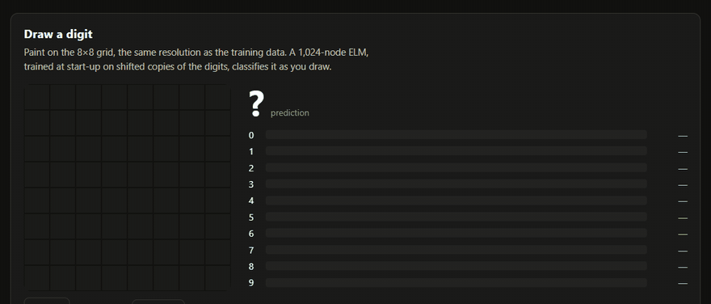

## Project Overview

**Feature ELM is a C++20 library for Extreme Learning Machines: single-hidden-layer networks whose hidden layer is random and never trained.** Learning is one regularised least-squares solve for the output weights, so there's no back-propagation and there are no epochs. On top of that core, the library adds online, drift-aware and hierarchical variants, and a CUDA backend (cuBLAS GEMM for the hidden layer, cuSOLVER QR for the solve) behind a single `Backend::kGpu` switch.

It started as an academic project and has been rebuilt around two small interfaces, `FeatureMap` and `Solver`, so every model is a feature stack plus a solver. Version 0.2.0 is the first release verified end to end on a real GPU. Before it, the CUDA path had never run successfully: 9 of 77 tests failed as soon as a GPU was present. Now CPU/GPU parity tests hold every activation and matrix shape to the CPU reference.

**Try it in your browser.** The [live demo](https://huggingface.co/spaces/echoness/cuda-feature-extraction-elm) runs the real C++/CUDA library on a Hugging Face ZeroGPU Space. Draw a digit on an 8×8 pad and watch it get classified live, train Batch ELM, OS-ELM or ML-ELM on the UCI digits dataset with accuracy and a confusion matrix, and compare CPU and GPU training time on a log-scale sweep.

## Features

- **Train in one solve**: A random hidden layer and a single ridge solve. `BatchRidgeSolver` uses Cholesky and falls back to Householder QR when float32 makes the system ill-conditioned.
- **Online and drifting streams**: OS-ELM, ReOS-ELM, FOS-ELM (forgetting factor for concept drift) and OS-CELM (class-imbalanced streams) update chunk by chunk with recursive least squares.
- **Learned multilayer features**: ELM auto-encoder layers stack into ML-ELM and its online counterpart H-OS-ELM.
- **One switch to the GPU**: The same model runs on `Backend::kCpu` or `Backend::kGpu`. cuBLAS/cuSOLVER handles are created once per process, and the hidden-layer GEMM uploads row-major data unchanged, with no host transposes.
- **Measured, not claimed**: Google Benchmark suites run identical CPU and GPU workloads. On an RTX 4080, Batch ELM training at 2,048 hidden nodes takes 55 ms against 1.48 s on the single-threaded CPU reference (~27×). The one case where the CPU wins, a tiny isolated ridge solve, is reported too.
- **Live demo, three ways to run it**: A ZeroGPU Gradio Space that loads the library through a small C API, plus CPU and GPU Docker images (`docker run -p 7860:7860 …`) with a JSON API under `/api/*`.
- **Docker-first and tested**: One dev image with CUDA 13.4, GoogleTest, Google Benchmark and clang-format/clang-tidy. 100 tests in the CPU-only build and 106 on the GPU, including CPU/GPU parity, demo accuracy floors and HTTP security tests.

## Tech Stack

### Core Library

- **Language**: C++20 for host and device code, built with CMake ≥ 3.24
- **Pipeline**: `FeatureMap` (`RandomAdditiveMap`, `RbfMap`, `ElmAutoEncoderLayer`, `StackedFeatureMap`) → `Solver` (`BatchRidgeSolver`, `RlsSolver`) → output weights
- **Models**: Batch ELM, OS-ELM, ReOS-ELM, FOS-ELM, OS-CELM, ML-ELM and H-OS-ELM with sigmoid, tanh, ReLU and RBF hidden nodes
- **Data**: CSV loader, preprocessing and drift-stream generator, with the UCI 8×8 digits dataset bundled

### CUDA Backend

- **Toolkit**: CUDA 13.4 in the dev image, default architectures from sm_75 to sm_120
- **Hidden layer**: cuBLAS GEMM with a fused activation kernel
- **Solve**: cuSOLVER QR ridge (geqrf → ormqr → trsm), matching the CPU Cholesky solve to 1e-8
- **Portability**: The GPU demo image links cuBLAS/cuSOLVER statically against CUDA 12.8, so it runs on any R525+ driver in 954 MB instead of 5.1 GB

### Demo and Serving

- **Demo server**: cpp-httplib and nlohmann/json, with a vanilla-JS drawing pad and charts (no build step)
- **C API**: `libfeature_elm_capi.so` (~2 MB) loaded with `ctypes` by a Gradio app on Hugging Face ZeroGPU
- **Images**: Multi-stage, non-root CPU and GPU images on GHCR, with SBOM and provenance attestations

### Tooling and Docs

- **Testing**: GoogleTest/CTest, Google Benchmark with JSON snapshots that feed the README tables and badge
- **Style**: clang-format and clang-tidy inside the dev container
- **CI/CD**: GitHub Actions for CPU-only tests, the C API build, versioned releases and a Hugging Face Space sync workflow
- **Docs**: A [VitePress site](https://e-choness.github.io/feature_extraction_cuda_elm/) with a model-choosing guide, per-algorithm notes, architecture diagrams and deployment options
