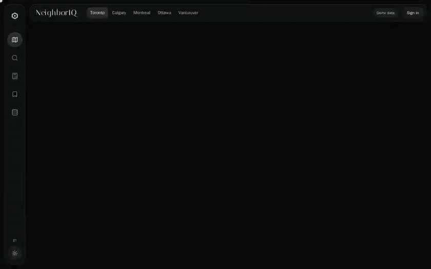

## Project Overview

**NeighborIQ helps a small investor screen a rental property in a Canadian city.** For any listing, or any property found elsewhere, it answers three questions:

| | Question | How |
|---|---|---|
| 1 | **Is the price fair?** | Asking price against the median $/sq ft of the nearest comparable listings, with the comps on a map and a confidence level |
| 2 | **Will it cash-flow?** | Monthly cash flow under Canadian rules (semi-annual compounding, CMHC insurance, land transfer tax), with every assumption editable |
| 3 | **What is the neighbourhood like?** | Census income and tenure, transit frequency, crime, new supply and assessed values from public open data, each with its source and date |

The app runs on clearly labelled **synthetic demo listings** out of the box, so no data licence is needed. Real listings need a licensed feed (such as CREA's DDF® through a brokerage); NeighborIQ does not scrape MLS® or REALTOR.ca. Neighbourhood data, rates and transit come from public open data loaded with one command.

)

A 50-second tour on the demo data: **Map** → **Explore** → **Listing** (value, cash flow) → **Analyze** → light theme.

## Features

- **Comparable-listing fair value**: median $/sq ft of the nearest comps, shown on the map with a confidence level.
- **Canadian cash flow**: semi-annual mortgage compounding, CMHC insurance and land transfer tax, with every input editable and saved per property.
- **Analyze any address**: the same analysis for a property found elsewhere, pre-filled from the assessment roll.
- **Neighbourhood open data**: loaders for boundaries, assessment rolls, census, GTFS transit, crime, permits and rates across six cities plus national sources.
- **Map-first interface**: one persistent map behind every screen, with content in docked glass sheets (Home, Explore, Analyze, Listing, Portfolio, Data). On phones the panels become a bottom sheet and a tab bar. Light and dark themes.
- **3D yield map**: gross rental yield across a city on H3 hexagons, rendered with MapLibre GL over an OpenFreeMap street basemap, or self-hosted Protomaps PMTiles.
- **Listing tabs**: value, cash flow, history and area for each listing, with its comparables highlighted on the map.
- **Portfolio**: saved properties with their own assumptions for ongoing monitoring.
- **Backtested price model**: optional XGBoost valuation with a published error band, off by default.

## Architecture

One FastAPI service handles everything request/response; two Celery workers carry the batch work that actually needs to scale.

- **api**: FastAPI over PostgreSQL + PostGIS, enqueueing jobs on Valkey.
- **ingestion-worker**: open data, OpenStreetMap and licensed partner feeds.
- **insights-worker**: yields, the valuation model and neighbourhood summaries.

## Tech Stack

- **API**: Python 3.14, FastAPI, SQLAlchemy 2, Pydantic 2, RS256 JWT in HttpOnly cookies, Argon2id passwords
- **Data**: PostgreSQL 18 + PostGIS 3.6, Alembic migrations
- **Jobs**: Celery with Valkey (Redis-compatible) as broker; Scrapy for licensed partner feeds
- **Frontend**: Vue 3.5, Vite 8, Tailwind CSS v4, Reka UI, Pinia Colada, MapLibre GL (OpenFreeMap basemap, optional self-hosted PMTiles), H3, Playwright tests
- **Docs**: VitePress, published to GitHub Pages
- **Ops**: Docker Compose, Caddy with automatic HTTPS, Ruff, pytest, Playwright, ESLint, vue-tsc, pip-audit + npm audit, Dependabot, SHA-pinned GitHub Actions

## License

All rights reserved. The source is public to read, but no licence is granted to use, copy, modify, host or distribute it without written permission.
